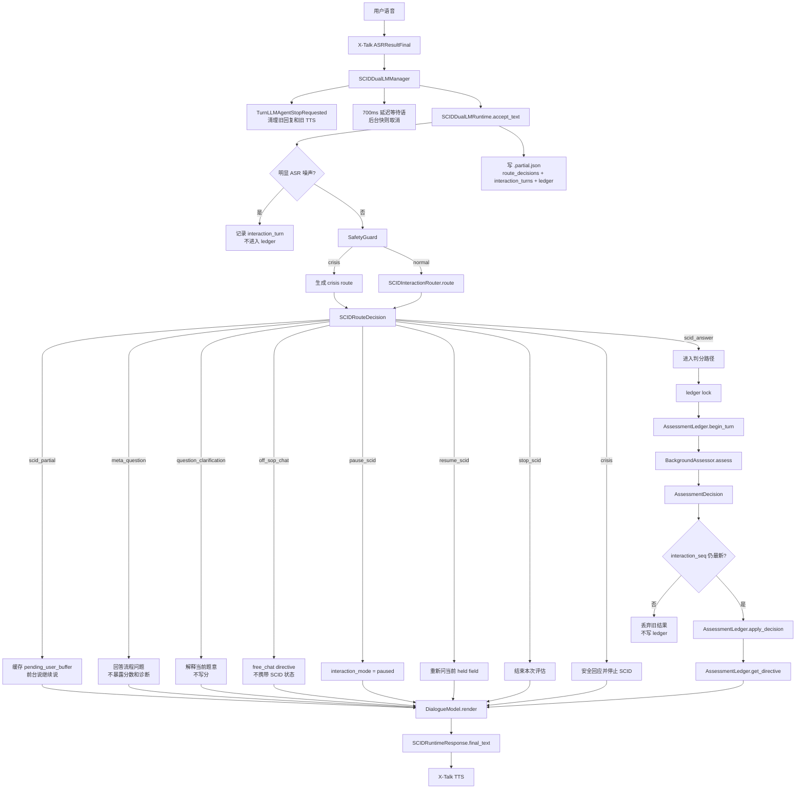

# SCID Dual-LM Runtime

这个目录实现第一版 **SCID 双 LM 语音评估系统**。它的目标是把 SCID 访谈嵌入 X-Talk 语音链路：前台小模型负责自然对话，后台诊断模型负责结构化判分与流程推进，确定性 ledger 负责保存唯一可信状态。

当前版本是工程可用原型，不是临床诊断系统。覆盖范围是 **SCID 扫描模块 + F/G/K 重点模块入口**，不是完整 346 页 SCID 全流程。

## 一句话架构

```text
X-Talk ASR
  -> SCIDDualLMManager
  -> SCIDDualLMRuntime
  -> SCIDInteractionRouter
  -> route: score | partial | meta | off-sop chat | pause/resume/stop | crisis
  -> AssessmentLedger
  -> BackgroundAssessor
  -> DialogueModel
  -> X-Talk TTS
```

核心分工：

- `AssessmentLedger` 是唯一状态写入口。
- `SCIDInteractionRouter` 先判断用户话语是否应该进入 SCID 判分。
- 后台 LM 只能提出 `AssessmentDecision`，不能直接改状态。
- 前台 LM 只能渲染 `DialogueDirective`，不能评分、诊断或改写表单；题外聊天 directive 不包含 SCID 流程或字段状态。
- `SCIDDualLMManager` 负责把 X-Talk 事件接到 runtime，并复用原有 TTS 链路。

## 接口协作总览

这一层的设计可以理解成 **manager 负责接线，runtime 负责调度，router 决定去向，assessor 只做判分建议，ledger 才能写状态，dialogue model 只负责说出来**。

| Class / Interface | 输入 | 输出 | 权限边界 |
| --- | --- | --- | --- |
| `SCIDDualLMManager` | `LLMAgentLoop`、`ASRResultFinal` | `ConsumeLLMAgentGenerationRequested` | X-Talk 事件桥接；不判分、不写 ledger |
| `SCIDDualLMRuntime` | 用户文本、`interaction_seq` | `SCIDRuntimeResponse` | 统一编排路由、判分、状态写入、前台回复和 snapshot |
| `SCIDInteractionRouter` | router context | `SCIDRouteDecision` | 只判断用户意图；不能写分，不能推进字段 |
| `BackgroundAssessor` | ledger、用户判分文本、SCID turn id | `AssessmentDecision` | 只提出结构化判分建议；不能直接修改 ledger |
| `AssessmentLedger` | 合法 `AssessmentDecision` | 新 `DialogueDirective` 和 ledger snapshot | 唯一可信状态写入口；负责字段推进、证据保存和校验 |
| `DialogueModel` | `DialogueDirective` | 用户可听文本 | 只口语化；不能评分、诊断、透露内部字段或 JSON |
| `SCIDTemplate` | SCID scan JSON / PDF fixture | 可运行字段图 | 只提供字段、顺序、模块入口等静态结构 |

关键数据对象：

- `SCIDRouteDecision`：后台路由结果，回答“这句话该不该进入 SCID 判分”。
- `AssessmentDecision`：后台判分结果，回答“当前字段应该如何填写或是否需要澄清”。
- `DialogueDirective`：runtime 给前台 LM 的安全话术指令。
- `SCIDInteractionTurn`：记录所有用户输入，包括题外聊天、暂停、恢复、过期结果和 ASR 噪声。
- `SCIDTurn`：只记录真正进入 SCID 判分的用户输入。

## 端到端流程图



端到端协作顺序：

1. `SCIDDualLMManager` 收到 `ASRResultFinal` 后先停止旧回复，给本轮输入分配 `interaction_seq`。
2. `SCIDDualLMRuntime` 过滤明显 ASR 噪声，并调用 `SafetyGuard` 做危机优先判断。
3. 非危机输入进入 `SCIDInteractionRouter`，得到 `SCIDRouteDecision`。
4. 如果 route 不是 `scid_answer`，runtime 只生成对应 `DialogueDirective`，不创建 `SCIDTurn`，不写分。
5. 如果 route 是 `scid_answer`，runtime 在 ledger lock 内创建 `SCIDTurn`，调用 `BackgroundAssessor` 得到 `AssessmentDecision`。
6. runtime 在写 ledger 前再次检查 `interaction_seq`；如果用户已打断并产生新输入，旧结果直接丢弃。
7. `AssessmentLedger` 校验并应用合法 decision，推进字段或生成澄清 directive。
8. `DialogueModel` 把 directive 转成前台语音文本，manager 交给 X-Talk TTS 播放。
9. 每轮都写 `.partial.json`，用于观察路由、判分、过期丢弃和 ledger 状态。

## 运行方式

从 `xtalk/` 目录启动：

```bash
DEEPSEEK_API_KEY=<your_key> PYTHONPATH=src python examples/psych_sop_voice_demo/server.py \
  --config ../ali_config.json \
  --mode scid \
  --backend-model deepseek-v4-pro
```

说明：

- ASR、前台小模型和 TTS 仍由 `ali_config.json` 配置。
- 后台路由模型和诊断模型默认都是 `deepseek-v4-pro`。
- DeepSeek key 只从 `DEEPSEEK_API_KEY` 环境变量读取，不应写入任何配置文件。
- 如果没有 `DEEPSEEK_API_KEY`，runtime 会自动使用 `RuleBasedSCIDInteractionRouter` 和 `RuleBasedAssessor`，方便本地测试。
- 普通聊天 smoke test 可用 `--mode chat`，此时不注册 SCID/PsychSOP manager。

## 观察后台模型行为

前端测试时，如果听到“我听到了，稍等我想一下。”但迟迟没有下一句，
通常表示 SCID manager 已经收到 ASR final，并已经发布延迟等待语，但后台 router
或 assessor 还没有成功返回可应用的结果。

建议同时看两类文件：

```bash
# 1. 看 X-Talk 运行日志，重点找 SCID 后台调用、解析和事件错误。
tail -f xtalk/logs/xtalk_YYYYMMDD_HHMMSS.log

rg -n "SCID|DeepSeek|deepseek|backend|Event handler raised|AsyncCompletions|asr.result_final" \
  xtalk/logs/xtalk_*.log

# 2. 看当前 SCID 会话的实时状态快照。
ls -lt xtalk/data/psych_sop_demo/episodes/*.partial.json | head
```

`.partial.json` 会在会话开始和每轮用户输入后更新，适合检查：

- `interaction_mode`：当前处于 `scid`、`off_sop_chat`、`paused`、`crisis` 还是 `completed`。
- `pending_user_buffer`：是否缓存了未说完的回答片段。
- `active_task_state.latest_interaction_seq`：当前最新用户输入序号，用于识别过期后台结果。
- `interaction_turns[-1].route_decision`：最新用户输入被路由成什么。
- `ledger.current_field_id`：当前进行到哪个 SCID 字段。
- `ledger.turns[-1].user_text`：真正进入 SCID 判分的用户文本。
- `ledger.turns[-1].decision`：后台 decision 或 fallback decision。
- `ledger.pending_clarification`：是否因为信息不足或后台错误进入重问。
- `ledger.field_states`：哪些字段已经真正写分。

如果日志中出现类似：

```text
AsyncCompletions.parse() got an unexpected keyword argument 'thinking'
```

说明当前 OpenAI/LangChain 解析路径不接受把 `thinking` 当作普通 chat completion
参数传入。当前实现只通过 `response_format={"type": "json_object"}` 请求 JSON mode，
并在系统 prompt 中要求后台模型内部充分推理。

## 模块职责

### `schema.py`

定义 SCID runtime 的核心数据结构。

主要类型：

- `SCIDScore`
  - 允许值：`?`、`1`、`2`、`3`。
  - `?` 表示资料不足。
  - `normalize_score()` 会把旧原型中的 `0` 规范成 `?`。

- `SCIDAction`
  - 允许值：`advance`、`clarify`、`reask`、`branch`、`crisis`。

- `SCIDInteractionRoute`
  - 允许值：`scid_answer`、`scid_partial`、`question_clarification`、`meta_question`、`off_sop_chat`、`resume_scid`、`pause_scid`、`stop_scid`、`crisis`。

- `SCIDField`
  - 表示一个可运行 SCID 字段。
  - 例如扫描题 `S1-F3`，或重点模块入口 `F3`。
  - 包含字段 ID、题目文本、所属模块、字段类型、评分选项等。

- `SCIDTemplate`
  - 表示当前可运行的 SCID 子图。
  - 当前模板包含 30 个扫描字段，以及 F/G/K 重点模块入口字段。

- `SCIDFieldState`
  - 表示一个字段已填写后的确定性状态。
  - 保存分数、置信度、证据、原始用户文本、后台简短依据和 turn id。

- `AssessmentDecision`
  - 后台诊断 LM 的结构化输出。
  - runtime 会把它交给 `AssessmentLedger` 校验后再应用。

- `SCIDRouteDecision`
  - 后台路由 LM 的结构化输出。
  - runtime 根据它决定是否进入判分、暂停、恢复、回答流程问题或进入题外聊天。

- `DialogueDirective`
  - 传给前台小模型的安全指令。
  - 不包含评分权限；`free_chat` directive 不包含 SCID 字段、进度或已填状态。

- `SCIDTurn`
  - 只记录真正进入 SCID 判分的一轮用户输入、前台回复和后台 decision。

- `SCIDInteractionTurn`
  - 记录所有用户输入、route decision、前台回复、是否过期和是否对应 SCID turn。

### `template.py`

负责构建当前可运行的 SCID 模板。

主要入口：

```python
template = load_scid_template()
```

当前行为：

1. 读取 `data/pysc/SCID-5-S.json` 中的 30 个扫描题。
2. 根据 `copy_list` 构造字段 ID，例如 `S1-F3`。
3. 对目标字段前缀为 `F`、`G`、`K` 的扫描题，生成重点模块入口字段。
4. 返回 `SCIDTemplate(template_id="scid_phase1_scan_fgk_v1")`。

还包含：

- `module_prefix(field_id)`
  - 从字段 ID 中取模块前缀，例如 `F3 -> F`。

- `SCIDPDFWidgetExtractor`
  - 只读 PDF AcroForm widget。
  - 用于 fixture、smoke check 和未来 gold label 抽取。
  - runtime 当前不依赖 PDF。

### `ledger.py`

这是 SCID 系统最重要的确定性状态机。

`AssessmentLedger` 负责：

- 维护当前字段 `current_field_id`。
- 创建 turn。
- 生成前台可用的 `DialogueDirective`。
- 构造后台 LM 输入上下文。
- 校验后台 `AssessmentDecision`。
- 应用合法 decision。
- 推进扫描题或进入重点模块入口。
- 保存所有已填字段状态、证据和 turn log。

关键原则：

- 后台 LM 输出必须经过 `_validate_decision()`。
- `advance` 和 `branch` 必须有合法分数和非空 evidence。
- `clarify` 和 `reask` 必须有澄清问题。
- 非 crisis 决策的 `field_id` 必须等于当前字段。
- 只有分数为 `3` 的 F/G/K 扫描字段会进入重点模块队列。

流程推进规则：

```text
scan_order 顺序推进
  -> 扫描结束
  -> queued_module_fields
  -> terminal_status = completed
```

如果后台或 safety guard 返回 `crisis`：

```text
terminal_status = crisis
current_field_id = None
```

### `decision.py`

负责把后台模型输出解析成 `AssessmentDecision`。

主要函数：

- `extract_json_object_text(text)`
  - 从纯 JSON、markdown code block 或夹杂文本中提取 JSON 对象。

- `parse_assessment_decision(text)`
  - 解析模型输出文本。
  - 失败时抛出 `DecisionParseError`。

- `decision_from_payload(payload)`
  - 从 dict 构造 `AssessmentDecision`。
  - 检查必需字段、action、evidence 类型、score 等。

- `fallback_reask_decision(...)`
  - 当后台 JSON 无法解析或 ledger 校验失败时，生成安全的 `reask` 决策。
  - 不会写分。

### `router.py`

负责在判分前判断用户输入属于哪类交互。

主要类型：

- `SCIDInteractionRouter`
  - 抽象接口。
  - 输入：当前节点、当前模式、用户原话、未完成回答缓存和最近交互。
  - 输出：`SCIDRouteDecision`。

- `RuleBasedSCIDInteractionRouter`
  - 离线 fallback。
  - 能识别短答、未完成片段、流程问题、题外聊天、暂停、恢复、停止和危机关键词。

- `DeepSeekSCIDInteractionRouter`
  - 使用 OpenAI-compatible `ChatOpenAI` 调用 DeepSeek。
  - 默认使用 `response_format={"type": "json_object"}`。

后台 route JSON 固定为：

```json
{
  "route": "scid_answer",
  "confidence": 0.86,
  "should_score": true,
  "normalized_user_text": "用户可用于判分的合并文本",
  "safe_frontend_content": "给前台复述的安全内容，不能含诊断或分数",
  "reasoning_summary": "非诊断性简短依据"
}
```

只有 `route=scid_answer` 且 `should_score=true` 时，runtime 才会创建 SCID ledger turn 并调用 `BackgroundAssessor`。

### `backend.py`

定义后台诊断模型接口和实现。

主要类型：

- `BackgroundAssessor`
  - 抽象接口。
  - 输入：ledger、用户原话、turn id。
  - 输出：`AssessmentDecision`。

- `RuleBasedAssessor`
  - 离线 fallback。
  - 用于无 key 开发、单元测试和 smoke test。
  - 只是关键词规则，不代表真实诊断能力。

- `DeepSeekAssessor`
  - 使用 OpenAI-compatible `ChatOpenAI` 调用 DeepSeek。
  - 默认：
    - model: `deepseek-v4-pro`
    - base_url: `https://api.deepseek.com`
    - temperature: `0.1`
    - `response_format={"type": "json_object"}`
  - key 来源：
    - 显式传入 `api_key`
    - 或环境变量 `DEEPSEEK_API_KEY`
  - 注意：当前 LangChain/OpenAI 解析路径不把 DeepSeek `thinking` 作为普通
    completion 参数透传；因此 runtime 不传该参数，避免后台调用在事件链里抛错。

后台 prompt 要求模型只输出以下 JSON：

```json
{
  "field_id": "S1-F3",
  "score": "3",
  "confidence": 0.82,
  "evidence": ["用户说..."],
  "next_action": "advance",
  "clarification_question": "",
  "reasoning_summary": "非诊断性简短依据"
}
```

JSON 解析失败时：

```text
raw output
  -> parse_assessment_decision()
  -> failed
  -> _repair_json()
  -> parse again
  -> failed
  -> fallback_reask_decision()
```

### `frontend.py`

负责把 `DialogueDirective` 转成用户可听的自然语言。

主要类型：

- `DialogueModel`
  - 前台对话模型抽象接口。

- `RuleBasedDialogueModel`
  - 确定性 fallback。
  - 直接读 directive，输出问题、流程回答、题外聊天兜底、暂停/恢复、危机回应或结束语。

- `SmallLMDialogueModel`
  - 使用 X-Talk pipeline 中已有 agent 的 chat model。
  - 只负责口语化表达，会根据 `directive_type` 区分 SCID 提问、流程回答、题外聊天和恢复评估。
  - system prompt 明确禁止：
    - 评分
    - 诊断
    - 透露字段、JSON、内部流程或表单分数
    - 在 `free_chat` 中提及 SCID、量表、评估流程或诊断

- `dialogue_model_from_pipeline_agent(agent)`
  - 从 X-Talk agent 中提取 backing chat model。
  - 如果提取失败，回退到 `RuleBasedDialogueModel`。

- `frontend_tool_names()`
  - 记录前台允许的概念工具名：
    - `get_scid_state`
    - `get_current_directive`
    - `route_user_intent`
    - `submit_patient_reply`
    - `request_clarification_style`
  - 当前第一版 manager 没有真正把这些工具暴露给 LLM，而是作为权限边界和测试表面。

### `runtime.py`

`SCIDDualLMRuntime` 是 CLI、测试和 X-Talk manager 都可以复用的核心 orchestrator。

初始化时会创建：

- `SCIDTemplate`
- `AssessmentLedger`
- `SCIDInteractionRouter`
- `BackgroundAssessor`
- `DialogueModel`
- `SafetyGuard`
- episode metadata
- interaction metadata：`interaction_mode`、`pending_user_buffer`、`interaction_turns`

主要方法：

- `start()`
  - 获取当前 directive。
  - 调用前台 dialogue model 渲染第一句话。

- `wait_text_for(user_text)`
  - 返回中性短等待语，例如“我听到了，稍等我想一下。”
  - manager 会延迟 700ms 发布，后台快速返回时不会播等待语。

- `accept_text(user_text)`
  - 接收一轮用户 ASR final text。
  - 过滤明显 ASR 噪声，例如孤立 ASCII 片段。
  - 先做 safety guard 和 `SCIDInteractionRouter.route()`。
  - 记录 `SCIDInteractionTurn` 和 route decision。
  - `scid_partial` 只缓存片段，不写 ledger。
  - `meta_question`、`question_clarification`、`off_sop_chat`、`pause_scid`、`resume_scid` 不写分。
  - 只有 `scid_answer` 才创建 SCID turn、调用后台 assessor、交给 ledger 校验和应用。
  - 每轮都会写入 `.partial.json`，方便 smoke test 时观察中间状态。
  - 若进入 terminal status，则保存 episode。

- `finish(status=...)`
  - 保存 episode JSON。
  - 默认目录来自 `EpisodeLogger` 的 `data/psych_sop_demo/episodes/`。

- `snapshot()`
  - 返回完整 runtime 状态。
  - `task` 固定为 `scid_voice_assessment_v1`。

`accept_text()` 的核心流程：

```text
user_text
  -> SafetyGuard
  -> SCIDInteractionRouter.route()
  -> interaction route
     -> scid_answer: ledger.begin_turn() -> BackgroundAssessor.assess() -> ledger.apply_decision()
     -> scid_partial/meta/off_sop/pause/resume: no ledger write
  -> DialogueDirective
  -> DialogueModel.render()
  -> SCIDRuntimeResponse
```

并发控制：

- 每个用户输入都有 `interaction_seq`。
- 新 ASR final 会成为最新 seq；旧后台结果返回后若发现已过期，会被丢弃。
- ledger 写入由 runtime lock 串行保护，避免 `Decision turn_id is stale or unknown`。

### `__init__.py`

导出常用类型，方便测试和外部模块引用。

例如：

```python
from xtalk.psych_sop.scid import SCIDDualLMRuntime, AssessmentLedger
```

## X-Talk 接入点

SCID runtime 的 X-Talk bridge 不在本目录，而在：

```text
xtalk/src/xtalk/serving/modules/scid_dual_lm_manager.py
```

`SCIDDualLMManager` 负责：

- 监听 `LLMAgentLoop`，启动 SCID runtime。
- 监听 `ASRResultFinal`，把用户文本传给 `SCIDDualLMRuntime.accept_text()`。
- 每次新 ASR final 到来时发布 `TurnLLMAgentStopRequested`，清掉正在播放的旧等待语或旧回复。
- 延迟 700ms 后才发布中性等待语；如果后台已返回则取消等待语。
- 将最终回复包装成 `ConsumeLLMAgentGenerationRequested` stream。
- 复用原有 `LLMAgentConsumptionManager`、`TTSManager` 和浏览器前端。
- shutdown 时保存未完成 episode。

voice demo server 入口：

```text
xtalk/examples/psych_sop_voice_demo/server.py
```

SCID 模式会注册：

```python
service.register_manager(SCIDDualLMManager)
```

并取消默认 `LLMAgentContextManager` 对 `ASRResultFinal` 和 `LLMAgentLoop` 的处理，避免默认 agent 与 SCID manager 双重回复。

普通 X-Talk 对话可用：

```bash
PYTHONPATH=src python examples/psych_sop_voice_demo/server.py \
  --config ../ali_config.json \
  --mode chat
```

`--mode chat` 不注册 SCID/PsychSOP manager，也不禁用默认 `LLMAgentContextManager`。

## 测试

相关测试：

```bash
cd xtalk
PYTHONPATH=src python -m pytest tests/test_psych_scid.py -q
```

覆盖内容包括：

- SCID scan template 加载。
- PDF widget extractor 读取表单字段。
- ledger 应用合法 decision。
- ledger 拒绝非法 field、空 evidence 等。
- 后台 JSON parser 处理 code block 和 `0 -> ?`。
- 前台工具权限不包含 scoring 工具。
- runtime 的 `advance`、`clarify`、`crisis` 流程。
- runtime 的 route-first 行为：partial 合并、meta 问题不写分、题外聊天不暴露 SCID 状态、resume 恢复。
- 过期后台结果丢弃和 ASR 噪声过滤。
- `SCIDDualLMManager` 发布 X-Talk TTS 消费事件。

更宽的 PsychSOP 回归：

```bash
PYTHONPATH=src python -m pytest \
  tests/test_psych_scale_engine.py \
  tests/test_psych_safety_guard.py \
  tests/test_psych_sop_navigator.py \
  tests/test_psych_memory_backend.py \
  tests/test_psych_episode_logger.py \
  tests/test_psych_runtime.py \
  tests/test_psych_sop_manager.py \
  tests/test_psych_scid.py -q
```

## 当前边界

- 当前不是临床诊断系统。
- 当前没有覆盖完整 SCID 346 页流程。
- F/G/K 重点模块现在是入口式追问，不是完整模块题图。
- `RuleBasedAssessor` 只是测试 fallback，不可用于真实评估。
- 前台概念工具名已经定义，但还没有作为真实 LLM tool 暴露。
- 当前 episode log 会保存用户原话、decision、证据和 ledger snapshot；正式数据收集前需要补充隐私、脱敏、访问控制和审计策略。
- crisis 处理仍依赖当前 `SafetyGuard` 关键词规则和后台 LM 输出，尚不是验证过的安全系统。

## 推荐下一步

1. 把 F/G/K 模块从“入口追问”扩展为真实字段图。
2. 从 SCID PDF widgets 抽取更多 field metadata 和跳转关系。
3. 将真实访谈转写与已填写 PDF 对齐，建立 gold ledger fixture。
4. 把前台概念工具升级为真实工具接口，并继续禁止评分工具。
5. 为后台 DeepSeek 调用增加超时、重试、速率限制和 request/response 审计。
6. 为 episode log 增加脱敏与可配置保存策略。
