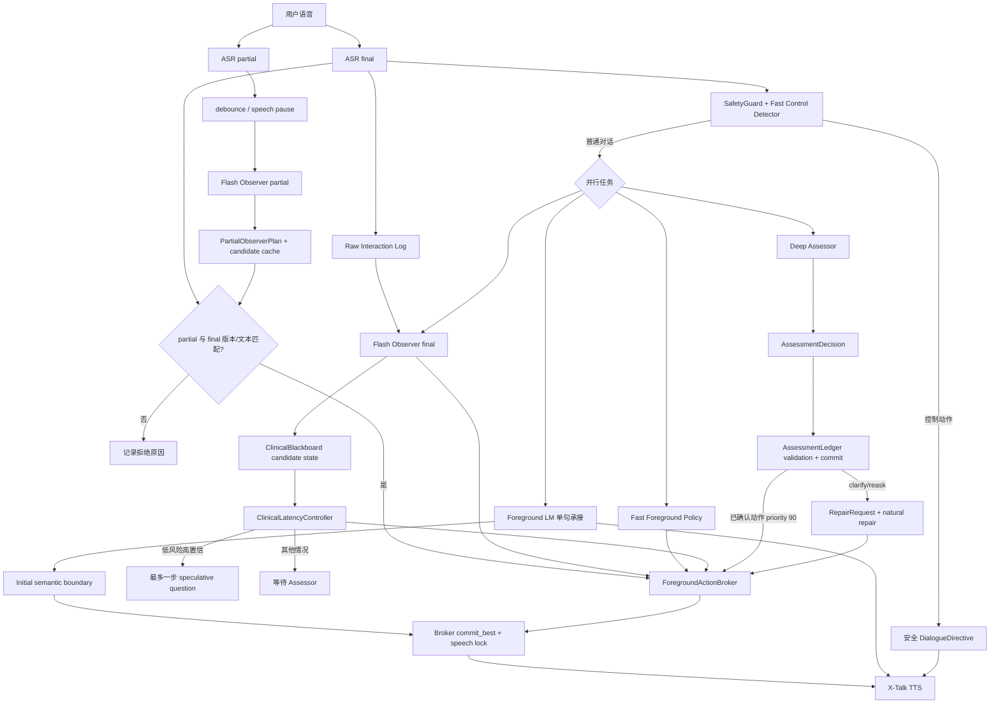
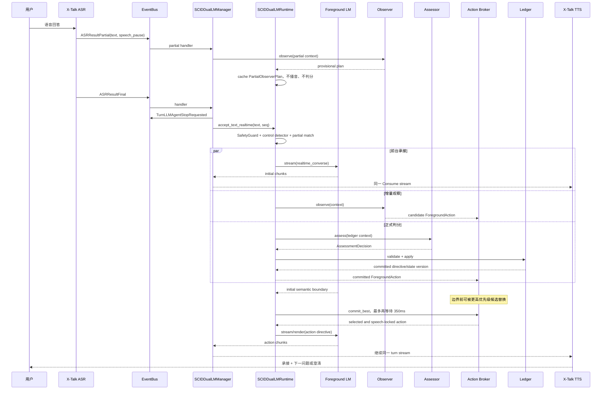

# SCID Realtime Voice Assessment Runtime

本目录实现 X-Talk 中的 SCID 语音访谈子系统。它把实时语音交互、后台增量理解、结构化判分、流程状态和可回放日志组合成一个可运行的工程原型。

本文档按 2026-07-21 的工作区代码与本地 SCID 配置核对。运行代码和测试是行为事实来源；README 描述的是当前实现，不应反过来替代代码校验。`ali_config.json` 属于本地运行 profile，后续修改配置后“当前启用行为”也会随之变化。

> **重要定位**
>
> 当前版本用于工程研究、交互原型和后续实验基础设施建设，不是经过临床验证的诊断系统，也不能替代受训临床人员。它目前只覆盖 SCID 扫描阶段和 F/G/K 重点模块的入口式追问，不等于完整 SCID。

## 文档导航

- [初心与问题定义](#初心与问题定义)
- [当前实现状态](#当前实现状态)
- [一句话架构](#一句话架构)
- [接口协作总览](#接口协作总览)
- [运行模式](#运行模式)
- [端到端流程图](#端到端流程图)
- [运行方式](#运行方式)
- [配置参考](#配置参考)
- [观察后台模型行为](#观察后台模型行为)
- [模块职责](#模块职责)
- [X-Talk 接入点](#x-talk-接入点)
- [测试](#测试)
- [当前不足](#当前不足)
- [未来工程规划](#未来工程规划)

## 初心与问题定义

### 我们为什么做这个系统

标准化心理访谈存在一个天然矛盾：一方面，SCID 的字段、证据、时间范围和流程跳转需要尽可能严谨；另一方面，真实用户并不会像填写网页表单一样逐题给出格式整齐的答案。用户可能停顿、修正、插话、询问流程、讲一段看似题外但后来有价值的经历，也可能在回答中同时包含当前症状、既往病史和生活背景。

如果只使用一个模型，它需要同时承担以下职责：

- 低延迟语音回应；
- 自然地理解打断和题外问题；
- 维持访谈关系与语气；
- 对 SCID criterion 做高精度推理；
- 维护字段状态和分支；
- 处理并发、过期结果和危机中断。

这些目标在延迟、算力、上下文和安全边界上彼此冲突。因此本系统最初采用“双 LM”思想：

- 前台小模型贴近用户，负责自然、快速、适合 TTS 的表达；
- 后台大模型贴近 SCID，负责证据理解、候选评分和下一步建议；
- 确定性代码掌握正式状态，任何模型都不能直接写表单。

随着架构演进，我们又加入了 Observer。当前系统更准确的描述是“一个前台模型、两个后台推理角色、一个确定性状态核心”：

```text
Foreground Dialogue LM
  + Incremental Observer
  + Deep Assessor
  + Blackboard / Broker / Ledger
```

Observer 和 Assessor 复用同一个 DeepSeek API endpoint 与凭据，但使用不同模型实例、prompt、JSON schema 和权限。当前默认是 `deepseek-v4-flash` Observer 与 `deepseek-v4-pro` Assessor；在 `realtime + active` 下若两个模型名相同，runtime 会拒绝启动，避免把两个角色意外配置成同一模型。因此：

- 从逻辑角色看，系统有三个模型角色；
- 从模型供应商看，两者都由 DeepSeek 提供；从当前模型配置看，它们必须是不同模型；
- 从通信与延迟看，启用 Observer 时通常至少存在两次独立后台调用；
- ASR 和 TTS 属于语音链路，不计入这里的 LM 数量。

### 核心产品目标

我们希望用户感受到的是一段自然、可打断、允许补充的语音对话，而不是“语音版网页问卷”。与此同时，系统内部仍要保留可审计的 SCID 字段、原话证据、状态版本和推进记录。

目标可以概括为：

```text
自然对话体验
  + SCID 证据约束
  + 低用户感知延迟
  + 保守状态提交
  + 全流程可回放
```

其中最重要的架构原则是：

```text
用户感知延迟 != 后台临床判断延迟
```

前台可以先回应用户，Observer 可以提前理解和提出候选动作，Assessor 可以继续进行较慢的判断，但正式分数和字段推进必须经过 Ledger。

### 我们明确不做什么

当前系统不声称实现以下能力：

- 不给出正式临床诊断；
- 不替代精神科医生、心理治疗师或受训访谈员；
- 不把语气、性格印象或宽泛闲聊直接转换成 SCID 分数；
- 不允许前台 LM 自行判分或宣布字段完成；
- 不允许 Observer 直接写 Ledger；
- 不保证后台 LM 的 `next_action` 在临床上一定正确；
- 不声称已经覆盖完整 SCID 手册和全部跳转逻辑；
- 不在在线会话中自动修改生产 prompt；
- 暂未实现长期个性化记忆、持续学习或 RL。

## 当前实现状态

### 能力矩阵

| 能力 | 当前状态 | 说明 |
| --- | --- | --- |
| X-Talk ASR/TTS 接入 | 已实现 | 复用 X-Talk 的 ASR、TTS、VAD、turn-taking 和浏览器前端 |
| SCID 扫描题 | 已实现 | 读取 `SCID-5-S.json` 中 30 个扫描字段 |
| F/G/K 重点模块 | 部分实现 | 生成 21 个模块入口字段，仅做入口式综合追问，不是完整 criterion 图 |
| 前台小模型自然表达 | 已实现 | 使用 X-Talk pipeline 中的 `llm_agent` backing model；失败时回退规则表达 |
| Deep Assessor 结构化判分 | 已实现 | 输出 `AssessmentDecision` JSON；解析失败时修复一次，再回退 `reask` |
| Incremental Observer | 已实现，实验性 | 可运行 `off / shadow / active`，理解 partial/final 并产生候选动作 |
| Fast Control Detector | 已实现 | 本地识别暂停、恢复、结束、流程问题、题意澄清、partial 和危机 |
| Blackboard 候选状态 | 已实现 | 保存候选证据、背景记忆、同字段追问、一步推测和返工状态 |
| Ledger 正式状态 | 已实现 | 唯一分数写入口，校验字段、turn、state version、score、evidence 和 action |
| Realtime progressive speech | 已实现 | 一轮 TTS stream 中先输出自然承接，再追加 Broker 选择的动作 |
| 一步 speculative advance | 已实现，实验性 | 最多一个未提交字段；后台否决时进入 repair |
| 延迟 telemetry | 已实现 | 记录 ASR、Observer、Assessor、前台、Broker 和 Ledger 时间点 |
| 会话回放 | 已实现 | 每轮写 `.partial.json`，终止后写正式 episode JSON |
| 完整 SCID 346 页流程 | 未实现 | 当前模板不是完整诊断流程图 |
| criterion 级完整 rubric | 未实现 | 后台主要依赖当前字段文本、通用评分提示和有限历史 |
| 长期个性化记忆 | 未实现 | contextual memory 只存在于当前 session Blackboard |
| 系统化评测环境 | 未完成 | 有测试和 telemetry，但还没有临床 gold benchmark 与完整指标平台 |
| 持续学习 / RL | 未实现 | 仍属于后续研究阶段 |

### 当前模板范围

当前 `SCIDTemplate` 的标识是：

```text
scid_phase1_scan_fgk_v1
```

运行时字段总数为 51：

- 30 个按顺序执行的扫描字段；
- 21 个由 F/G/K 阳性扫描结果可能触发的模块入口字段。

扫描字段 ID 形如 `S1-F3`：

- `S1` 是扫描题 qid；
- `F3` 是该扫描题指向的目标字段；
- 当目标属于 F/G/K 且扫描分数为 `3` 时，目标入口字段会加入 `queued_module_fields`；
- H/I/J 等扫描题仍会执行，但当前不会展开对应完整模块。

扫描结束后，Ledger 依次处理 `queued_module_fields`，然后进入 `completed`。所谓“重点模块支持”目前只表示入口字段闭环，不表示完整模块覆盖。

### 当前本地运行配置

仓库顶层 `ali_config.json` 当前启用的 SCID 行为是：

```json
{
  "scid_runtime_mode": "realtime",
  "scid_observer_mode": "active",
  "scid_frontend_streaming": true,
  "scid_fast_policy_enabled": true,
  "scid_candidate_pregeneration": true,
  "scid_realtime_observer_planning_enabled": true,
  "scid_observer_model": "deepseek-v4-flash",
  "scid_backend_model": "deepseek-v4-pro",
  "scid_partial_plan_max_age_seconds": 3.0,
  "scid_post_initial_action_wait_seconds": 0.35
}
```

API key 和 token 不应出现在 README、日志或提交记录中，因此这里不展示真实值。

需要区分“代码默认值”和“当前本地配置”：

- 代码默认 `scid_runtime_mode=sequential`；当前本地配置覆盖为 `realtime`。
- 代码默认 `scid_observer_mode=shadow`；当前本地配置覆盖为 `active`。
- 代码默认 `scid_fast_policy_enabled=true`。
- 代码默认 Observer 为 `deepseek-v4-flash`、Assessor 为 `deepseek-v4-pro`；两者共享凭据但不共享模型实例或调用上下文。
- 代码默认 `scid_optimistic_scan=false`，当前本地配置也没有显式打开它。
- 即便 `scid_optimistic_scan=false`，Fast Policy 仍可在明确短答上独立提出一个 speculative candidate question；该开关只约束 Observer 的 `ask_next_field` 路径。两条路径最终都受 `speculative_depth <= 1`、field/state/version 校验和后台 repair 约束。

最后一条是当前实现事实，也是需要后续统一配置语义的工程债务。不能把 `scid_optimistic_scan=false` 理解为“系统绝不会提前问下一扫描题”；若需要完全关闭本地乐观候选，还必须同时设置：

```json
{
  "scid_fast_policy_enabled": false,
  "scid_optimistic_scan": false
}
```

## 一句话架构

```text
ASR partial/final
  -> Fast Control Detector: 只处理暂停、恢复、结束、危机和系统控制
  -> Foreground Dialogue: 立即回应或播放预生成候选问题
  -> Incremental Observer: 对全部对话做多标签候选理解
  -> Deep Assessor: 异步提出正式 SCID decision
  -> AssessmentLedger: 校验并提交唯一可信状态
```

核心分工：

- `AssessmentLedger` 是唯一状态写入口。
- `SCIDInteractionRouter` 现在只做快速控制意图检测，不再作为“临床证据准入门”。
- 当 Observer 未关闭时，所有非噪声对话都会进入 `IncrementalObserver`；看似题外的背景叙述不会被 Router 提前丢弃。
- Observer 只能写 `ClinicalBlackboard` 的候选证据和背景记忆，不能写 Ledger。
- `ClinicalLatencyController` 只控制 Observer 建议的乐观推进；Fast Policy 是另一条独立候选路径。两者都最多允许一步，关键模块字段继续等待 Assessor。
- 后台 LM 只能提出 `AssessmentDecision`，不能直接改状态。
- 前台 LM 只能渲染 `DialogueDirective`，不能评分、诊断或改写表单。
- `SCIDDualLMManager` 负责把 X-Talk 事件接到 runtime，并复用原有 TTS 链路。

## 接口协作总览

这一层的设计可以理解成：**Router 路由系统动作，不路由哪些话值得理解；Observer 理解全部对话，Assessor 提出正式判断，Ledger 才能提交状态，前台模型只负责说出来。**

| Class / Interface | 输入 | 输出 | 权限边界 |
| --- | --- | --- | --- |
| `SCIDDualLMManager` | `LLMAgentLoop`、`ASRResultPartial`、`ASRResultFinal` | `ConsumeLLMAgentGenerationRequested` | X-Talk 事件桥接；不判分、不写 ledger |
| `SCIDDualLMRuntime` | 用户文本、`interaction_seq` | `SCIDRuntimeResponse` / `SCIDProgressiveRuntimeResponse` / `SCIDRealtimeRuntimeResponse` | 统一编排控制检测、判分、状态写入、前台回复和 snapshot |
| `SafetyGuard` | 用户原话 | safety classification | 位于 control detector 之前的同步危机预检查；当前实现来自 `psych_sop/safety_guard.py` |
| `SCIDInteractionRouter` | control context | `SCIDRouteDecision` | 只识别暂停、继续、停止、危机、meta、澄清、partial；不能决定临床价值 |
| `IncrementalObserver` | 当前字段、有限对话上下文、每个 partial/final | `TurnInterpretation` | 多标签理解、候选证据和 next-action 预测；不能评分或写 ledger |
| `ClinicalBlackboard` | Observer 候选、推测字段、返工状态 | candidate snapshot | 严格区分 candidate 与 committed state；最多保存一个推测字段 |
| `ForegroundActionBroker` | Fast Policy、Observer、Assessor 的 `ForegroundAction` | 当前轮最多一个前台动作 | 校验 interaction/state/field，去重并拒绝过期动作；不写 ledger |
| `CandidateUtteranceCache` | field、state version、action directive | 预生成前台话术 | 只缓存安全表达；state version 变化后失效 |
| `ClinicalLatencyController` | 字段风险级别、Observer 结果、推测深度 | `LatencyPlan` | 决定等待 Assessor 还是允许一步 optimistic scan |
| `BackgroundAssessor` | ledger、用户判分文本、SCID turn id | `AssessmentDecision` | 只提出结构化判分建议；不能直接修改 ledger |
| `AssessmentLedger` | 合法 `AssessmentDecision` | 新 `DialogueDirective` 和 ledger snapshot | 唯一可信状态写入口；负责字段推进、证据保存和校验 |
| `DialogueModel` | `DialogueDirective` | 用户可听文本 | 只口语化；不能评分、诊断、透露内部字段或 JSON |
| `SCIDTemplate` | SCID scan JSON | 可运行字段图 | 只提供字段、顺序、模块入口等静态结构；PDF extractor 不参与 runtime |

关键数据对象：

- `SCIDRouteDecision`：控制平面结果，回答“这句话是否改变系统动作”。非控制输入默认进入后台理解。
- `TurnInterpretation`：Observer 的多标签候选理解，可同时包含回答、自我披露、题意问题、相关模块和候选证据。
- `AssessmentDecision`：后台判分结果，回答“当前字段应该如何填写或是否需要澄清”。
- `DialogueDirective`：runtime 给前台 LM 的安全话术指令。
- `SCIDInteractionTurn`：记录所有用户输入，包括背景叙述、闲聊、暂停、恢复、过期结果和 ASR 噪声。
- `SCIDTurn`：记录进入后台 assessor/ledger 路径的用户输入；ledger 可能保守 reask，而不是写分。

### 三层状态边界

系统把“听到了什么”“可能意味着什么”“正式提交了什么”分成三层：

```text
Raw Interaction History
  -> ClinicalBlackboard candidate state
  -> AssessmentLedger committed state
```

#### 1. Raw interaction

`SCIDInteractionTurn` 保存全部用户交互，包括控制命令、流程问题、背景叙述、partial、噪声和最终进入判分的回答。它用于调试和回放，但不等于临床证据。

#### 2. Candidate state

`ClinicalBlackboard` 保存 Observer 的候选证据、`context_only` 背景、同字段追问、一步 speculative field 和 repair。候选状态可以影响下一句怎么问，但没有正式分数效力。

#### 3. Committed state

`AssessmentLedger` 保存当前字段、已填分数、原话证据、未决澄清、模块队列和 `state_version`。只有 Ledger 的内容才是当前程序认可的正式状态。

这条边界对应一个核心原则：

```text
所有对话都可以被理解，但不是所有对话都可以被计分。
```

### Ledger 能保证什么，不能保证什么

Ledger 能确定性保证：

- decision 的 `field_id` 与当前字段一致；
- decision 基于当前 `state_version`；
- turn id 是当前可应用的 turn；
- action 属于允许枚举；
- `advance/branch` 有合法 score 和非空 evidence；
- `clarify/reask` 有澄清问题；
- 正式写入和遍历在 lock 内串行执行；
- 过期结果不会任意覆盖新状态。

Ledger 不能保证：

- 后台选择的 score 在临床上正确；
- evidence 是否真的足以支持该 score；
- `next_action` 是否是临床人员会选择的最佳动作；
- 用户原话是否被 ASR 准确识别；
- 当前简化模板是否忠实覆盖完整 SCID 手册。

当前 `next_action` 仍由 Assessor 提议。Ledger 做结构和状态一致性校验，不会重新进行临床推理。这是有意保留的模型责任，也是未来评测、监督微调和策略优化的主要对象。

## 目录结构

SCID 子系统现在按职责分包，根目录同名 `.py` 文件保留为兼容 shim，旧 import 仍可用；新代码优先从子包导入。

```text
scid/
├── core/             # schema.py, template.py；核心类型和静态 SCID 模板
├── assessment/       # backend.py, decision.py；后台 assessor 和 JSON decision 解析
├── state/            # ledger.py, blackboard.py, telemetry.py；正式状态、候选状态和延迟追踪
├── dialogue/         # frontend.py, foreground.py, candidate_cache.py, repair.py；前台话术、动作 broker、候选问题和返工
├── policy/           # router.py, observer.py, latency_controller.py；控制检测、增量观察和延迟策略
├── orchestration/    # runtime.py；SCID runtime 编排
├── *.py              # 兼容层：从上述子包 re-export
└── README.md
```

维护约定：

- 新增核心数据结构放在 `core/`。
- 正式判分、后台模型调用和 decision parser 放在 `assessment/`。
- Ledger、Blackboard、Telemetry 这类状态容器放在 `state/`。
- 前台 LM、前台动作、候选话术和 repair 文案放在 `dialogue/`。
- Router、Observer、LatencyController 这类策略组件放在 `policy/`。
- 跨组件异步编排只放在 `orchestration/runtime.py`。
- 根目录 shim 只做兼容导出，不写业务逻辑。

## 运行模式

`SCIDDualLMRuntime` 保留三种模式，用于兼容、对照实验和渐进迁移。

| 模式 | 前台首段 | 后台路径 | 候选动作 | 适用场景 |
| --- | --- | --- | --- | --- |
| `sequential` | 等后台后输出最终回复；超过 700ms 可播等待语 | Router -> Assessor -> Ledger -> Frontend | 不使用 Broker | 稳定回退和行为基线 |
| `parallel` | 先生成完整 non-committal bridge 文本 | Observer、candidate generation、Assessor 并发 | 可由 Observer + cache 做一步候选推进 | Phase 0-2/3-5 对照模式 |
| `realtime` | 前台小模型以 `astream()` 流式承接 | Fast Policy、Observer、Assessor 并发 | Broker 每轮最多选择一个 action | 当前推荐交互模式 |

### `sequential`

```text
ASR final
  -> local control detector
  -> Deep Assessor
  -> Ledger apply
  -> Foreground DialogueModel.render
  -> TTS
```

特点：

- 行为最容易理解；
- 后台 Assessor 延迟直接进入用户感知延迟；
- manager 在 700ms 后可以发送固定等待语；
- Observer 即使启用也主要作为异步记录，不驱动本轮 Broker，因为该模式没有 Broker。

### `parallel`

```text
ASR final
  -> local control detector
  -> Foreground bridge render
  -> Observer || candidate pre-generation || Assessor
  -> follow-up text
  -> one combined X-Talk stream
```

特点：

- 首段是完整文本，不是真正 token streaming；
- `scid_frontend_initial_timeout_seconds` 在这个模式控制 bridge render 的等待时间，超时后使用本地 fallback；
- `CandidateUtteranceCache` 主要服务于这个模式的 action-conditioned 预生成；
- 只有 `scid_optimistic_scan=true`、Observer 可用且 latency controller 放行时，才会使用 Observer + cache 提前问下一扫描题。

### `realtime`

```text
ASR stable partial -> Flash Observer -> provisional action/cache only

ASR final
  -> SafetyGuard + local control detector
  -> Foreground realtime_converse short stream -----------> TTS
  -> promoted partial plan --\
  -> Fast Policy -------------> ForegroundActionBroker
  -> final Flash Observer ----/       ^
  -> Deep Assessor -> Ledger --------/
                         initial semantic boundary
                                   -> commit_best()
                                   -> one action stream -> TTS
```

特点：

- 前台首段使用 X-Talk `llm_agent` 背后的 chat model `astream()`；
- 首段严格限制为一个完整、短、非承诺性句子，只能回应和克制复述，不能提出新问题或宣布字段完成；
- stable ASR partial 可提前调用 Flash Observer，但只生成 `PartialObserverPlan` 和候选话术，不调用 Assessor、不写 Ledger、也不触发 TTS；
- final 到达后只有在 seq、field、state、3 秒时效和文本覆盖条件都满足时，partial 计划才会进入 Broker；final Observer 仍会并行运行并可在播出前覆盖 partial 候选；
- Broker 校验 `interaction_seq + state_version + field_id`，在首段结束前只收集和替换候选，不立即消费；
- 首段抵达语义边界后，Broker 提交当前最高优先级动作并锁定，每轮最多选择一个主动 follow-up；若当时没有候选，最多再等待 350ms；
- 优先级为 Assessor committed/repair `90`、final Observer probe `65`、partial Observer probe `60`、Observer speculative next `55`、Fast Policy `40`、timeout fallback `20`；
- Fast Policy 可对规则认为明确的扫描短答提出 candidate next question；
- active Observer 可提出一个同字段安全追问，或在 `scid_optimistic_scan=true` 时建议下一扫描题；
- Assessor 返回后由 Ledger 决定正式提交、澄清、返工、分支建议或危机；
- Assessor 在首段语义边界前返回时会替换低优先级 Observer/Fast 候选；Observer 问题一旦提交播出，迟到的普通 Assessor 不会硬中断该句；
- 350ms 后仍无动作时，runtime 取消未提交判分、保留原话并生成同字段安全追问，不让前台只说承接句后永久静默；
- 当前 realtime streaming 没有单独使用 `scid_frontend_initial_timeout_seconds` 包裹首 token 等待，这是一个待补齐的可靠性缺口。

### 一轮可能发生多少次模型调用

调用数量不是固定的“两次”或“三次”。在当前 `realtime + active` 配置中，一次普通最终回答通常涉及：

1. 前台小模型流式生成承接；
2. Observer 对 final 发起一次后台结构化理解；如果 stable partial 足够早，还可能额外有一次可取消的 partial Observer 请求；
3. Assessor 发起一次后台结构化判分；
4. Candidate pre-generation 或 Fast Policy action 可能额外调用前台小模型；已缓存的 Observer 追问会直接进入 stream，避免选择后再次等待；
5. Assessor 提交后的下一 directive 也会由前台模型渲染。

其中 2 和 3 是独立后台请求，但应并行运行；1 位于用户感知关键路径。JSON repair、调用失败回退或 candidate pre-generation 还可能增加额外请求。因此评估延迟和成本时应按“每类调用次数与并发关系”记录，而不是只按模型角色数量估算。

## 端到端流程图



端到端协作顺序：

1. `SCIDDualLMManager` 收到 `ASRResultFinal` 后先停止旧回复，给本轮输入分配 `interaction_seq`。
2. `SCIDDualLMRuntime` 过滤明显 ASR 噪声，并调用 `SafetyGuard` 做危机优先判断。
3. stable partial 经过 debounce 后可提前送给独立 Flash Observer；它只生成临时候选。final 到来时，runtime 按 seq、field、state、时效和文本覆盖率决定是否提升该计划。
4. 非危机 final 进入本地 control detector；当 Observer 模式不是 `off` 时，所有非噪声 final 也会异步送给 Observer。
5. Observer 把背景、候选证据和建议动作写入 Blackboard；这些内容保持 `candidate/context_only`，不进入正式分数。
6. realtime 模式让前台 LM 只生成一个完整、非承诺性的自然承接句，同时启动 final Observer、Fast Policy 和 Assessor；首段不能提出新问题或推进字段。
7. 首段结束之前，Broker 允许 Assessor、final Observer、partial Observer 和 Fast Policy 按固定优先级互相替换；到语义边界时才锁定一个动作。
8. shadow 模式只记录 Observer 预测；active 模式会把高置信 Observer 动作交给 Broker。同字段 duration/frequency/time-window/impairment 等安全追问会先保留原回答并取消尚未提交的旧判分；用户补充后再合并交给 Assessor。
9. Observer 的 `ask_next_field` 只有在 active + optimistic 模式、低风险扫描字段、高置信、无返工且推测深度为 0 时才可提前问下一题。Fast Policy 则由独立开关控制明确短答的候选推进。
10. 若用户在上一题提交前回答了推测题，该回答暂存在 Blackboard；上一题提交后才会进入下一字段判分。
11. 后台否决推测推进时，Ledger 不写下一字段，runtime 生成自然返工问题。
12. `state_version`、`field_id`、`interaction_seq` 和 Observer version 共同校验异步结果；过期候选直接丢弃。

### Realtime 时序图



控制、meta、pause、resume 等非 `scid_answer` 路径不会启动本轮 Assessor action stream。当前实现会先完整 `render()` 这类控制回复，再作为单段文本交给 X-Talk stream，因此“realtime”并不意味着所有 route 都是 token-level streaming。普通更新不会中途截断已经提交播放的问题；只有用户 barge-in、危机或严重错误推进才走 hard stop。

## 运行方式

先在你的本地配置文件里写入 DeepSeek key。示例放在顶层
`service_config` 下；请使用本地私有配置，不要把真实 key 提交到仓库：

```json
{
  "service_config": {
    "scid_deepseek": {
      "api_key": "<your_deepseek_key>",
      "base_url": "https://api.deepseek.com"
    },
    "scid_runtime_mode": "realtime",
    "scid_observer_mode": "active",
    "scid_observer_model": "deepseek-v4-flash",
    "scid_backend_model": "deepseek-v4-pro",
    "scid_frontend_streaming": true,
    "scid_fast_policy_enabled": true,
    "scid_realtime_observer_planning_enabled": true,
    "scid_partial_plan_max_age_seconds": 3.0,
    "scid_post_initial_action_wait_seconds": 0.35
  }
}
```

也可以使用扁平字段：

```json
{
  "service_config": {
    "scid_deepseek_api_key": "<your_deepseek_key>",
    "scid_deepseek_base_url": "https://api.deepseek.com"
  }
}
```

当 `ali_config.json` 按上例配置为 `realtime + active` 后，从 `xtalk/` 目录启动时
只需要：

```bash
PYTHONPATH=src python examples/psych_sop_voice_demo/server.py \
  --config ../ali_config.json \
  --mode scid
```

CLI 参数只在显式传入时覆盖配置文件。需要对照 shadow 模式时可运行：

```bash
PYTHONPATH=src python examples/psych_sop_voice_demo/server.py \
  --config ../ali_config.json \
  --mode scid \
  --backend-model deepseek-v4-pro \
  --scid-runtime-mode parallel \
  --scid-observer-mode shadow
```

验证 shadow 数据后，显式开启一步乐观扫描：

```bash
PYTHONPATH=src python examples/psych_sop_voice_demo/server.py \
  --config ../ali_config.json \
  --mode scid \
  --backend-model deepseek-v4-pro \
  --scid-runtime-mode parallel \
  --scid-observer-mode active \
  --scid-optimistic-scan
```

不修改配置文件，直接通过 CLI 启用实时前台承接、Observer-to-Broker 安全追问和一步乐观扫描：

```bash
PYTHONPATH=src python examples/psych_sop_voice_demo/server.py \
  --config ../ali_config.json \
  --mode scid \
  --backend-model deepseek-v4-pro \
  --scid-runtime-mode realtime \
  --scid-observer-mode active \
  --scid-optimistic-scan
```

说明：

- ASR、前台小模型和 TTS 仍由 `ali_config.json` 配置。
- 后台诊断模型默认是 `deepseek-v4-pro`，使用 JSON Output 与 enabled/max thinking；独立 Observer 默认是 `deepseek-v4-flash`，使用 JSON Output 且关闭 thinking；控制检测走本地 fast control detector，不占用远端 router 调用。
- DeepSeek key 优先从 `service_config.scid_deepseek.api_key` 或 `service_config.scid_deepseek_api_key` 读取；如果配置里没有，再回退到 `DEEPSEEK_API_KEY` 环境变量。
- CLI 未提供 SCID 选项时会尊重 `service_config`；配置和 CLI 都未指定时，runtime 才回退到 `sequential + shadow`。
- `parallel` 启用两段式 progressive response；`realtime` 使用 streaming 前台承接和 `ForegroundActionBroker` 异步产生后续动作。
- `--scid-observer-mode shadow` 让 Observer 只记录预测；`active` 才允许 latency controller 使用其动作。
- `--scid-observer-model <model>` 可覆盖 Observer 模型；省略时使用 `deepseek-v4-flash`。在 `realtime + active` 下不能与 Assessor 模型名相同，否则启动失败并给出配置错误。
- `--scid-frontend-initial-timeout <seconds>` 当前只控制 `parallel` 模式的完整 bridge render；`realtime` 首段走 `astream()`，尚未接入同一个首 token timeout。
- `scid_post_initial_action_wait_seconds` 控制首段语义边界后、尚无候选时的额外等待，默认 0.35 秒。已有候选时 Broker 会在边界立即选择当前最高优先级动作。
- `scid_partial_plan_max_age_seconds` 控制 stable partial 计划可被 final 提升的最长年龄，默认 3 秒。
- `scid_realtime_action_timeout_seconds` 和 `scid_realtime_action_grace_seconds` 仍为兼容旧配置保留，但当前 semantic-boundary realtime 仲裁不再使用它们作为 8+1 秒等待窗口。
- `--scid-optimistic-scan` 只有与 `active` Observer 一起使用时才影响 Observer 的 `ask_next_field`，适用于 `parallel` 或 `realtime`，且 `max_speculative_depth=1`。它不会关闭独立的 Fast Policy 路径。
- `--no-scid-candidate-pregeneration` 可关闭候选话术预生成，用于延迟或成本对照实验。
- 如果配置和环境变量里都没有 DeepSeek key，runtime 会自动使用 `RuleBasedAssessor`，方便本地测试。
- 普通聊天 smoke test 可用 `--mode chat`，此时不注册 SCID/PsychSOP manager。

## 配置参考

以下字段由 `SCIDDualLMManager` 从 X-Talk `service_config` 读取。

| 配置项 | 代码默认值 | 生效位置 | 说明 |
| --- | --- | --- | --- |
| `data_dir` | `data` | manager | episode 写入 `<data_dir>/psych_sop_demo/episodes/` |
| `scid_experiment_id` | `scid_voice_demo` | runtime metadata | 写入 episode，便于区分实验条件 |
| `scid_backend_model` | `deepseek-v4-pro` | Assessor | 原样传给 OpenAI-compatible client，代码不验证供应商是否存在该模型名 |
| `scid_observer_model` | `deepseek-v4-flash` | Observer | 独立低延迟模型；`realtime + active` 下不得与 backend model 相同 |
| `scid_prefer_deepseek` | `true` | model factory | `false` 时强制使用 rule-based fallback |
| `scid_deepseek_api_key` | 无 | manager/model factory | 扁平 key；优先于 nested `scid_deepseek.api_key` |
| `scid_deepseek.api_key` | 无 | manager/model factory | nested key；两处都没有时回退环境变量 `DEEPSEEK_API_KEY` |
| `scid_deepseek_base_url` | `https://api.deepseek.com` | Observer/Assessor | 扁平 base URL；优先于 nested 值 |
| `scid_deepseek.base_url` | 同上 | Observer/Assessor | nested base URL |
| `scid_runtime_mode` | `sequential` | runtime/manager | `sequential / parallel / realtime` |
| `scid_observer_mode` | `shadow` | Observer/runtime | `off / shadow / active` |
| `scid_enable_wait_text` | `true` | sequential manager | 是否允许 700ms 后发布固定等待语；parallel/realtime 不依赖它 |
| `scid_candidate_pregeneration` | `true` | parallel/realtime | 是否按 action 预生成安全话术；partial Observer 计划也可提前填充 cache |
| `scid_optimistic_scan` | `false` | latency controller | 只放行 active Observer 的低风险 `ask_next_field` |
| `scid_observer_confidence_threshold` | `0.9` | latency controller/runtime | Observer optimistic advance 与主动 evidence-slot probe 的最低置信度 |
| `scid_frontend_initial_timeout_seconds` | `1.2` | parallel bridge | 完整 bridge render 超时时使用本地 fallback；当前不包裹 realtime 首 token |
| `scid_frontend_streaming` | `true` | realtime frontend | `true` 使用 `DialogueModel.stream()`；`false` 先完整 render 再作为单段输出 |
| `scid_fast_policy_enabled` | `true` | realtime Fast Policy | 对明确扫描短答提出本地 candidate next question；独立于 `scid_optimistic_scan` |
| `scid_realtime_observer_planning_enabled` | `true` | realtime Observer | 是否允许 partial 生成临时动作计划；关闭后 final Observer 仍可按 mode 运行 |
| `scid_partial_plan_max_age_seconds` | `3.0` | realtime runtime | partial 计划提升到 final 仲裁的最长年龄 |
| `scid_post_initial_action_wait_seconds` | `0.35` | realtime Broker | 首段语义边界时没有候选，最多再等待多久才使用安全 fallback |
| `scid_realtime_action_timeout_seconds` | `8.0` | legacy compatibility | 保留旧配置兼容；当前 semantic-boundary 仲裁不使用该长窗口 |
| `scid_realtime_action_grace_seconds` | `1.0` | legacy compatibility | 保留旧配置兼容；当前由 post-initial wait 取代 |
| `scid_partial_observer_debounce_seconds` | `0.5` | manager | stable partial 触发 Observer 前的 debounce；`speech_pause=true` 时缩短到最多 50ms，新 partial/final 会取消旧 task |

### 配置优先级

```text
显式 CLI 参数
  > service_config 中的 scid_* 配置
  > 代码默认值
```

API key 的解析顺序是：

```text
service_config.scid_deepseek_api_key
  > service_config.scid_deepseek.api_key
  > DEEPSEEK_API_KEY
  > RuleBasedAssessor / RuleBasedObserver fallback
```

不要把真实 key 提交到 Git。当前代码允许从配置文件读取 key，是开发便利能力，不代表适合生产环境。生产部署应改用环境变量或密钥管理服务，并限制日志与配置文件访问权限。

### 推荐配置组合

#### 当前交互实验配置

```json
{
  "scid_runtime_mode": "realtime",
  "scid_observer_mode": "active",
  "scid_observer_model": "deepseek-v4-flash",
  "scid_backend_model": "deepseek-v4-pro",
  "scid_frontend_streaming": true,
  "scid_fast_policy_enabled": true,
  "scid_optimistic_scan": false,
  "scid_realtime_observer_planning_enabled": true,
  "scid_partial_plan_max_age_seconds": 3.0,
  "scid_post_initial_action_wait_seconds": 0.35
}
```

该组合允许 Fast Policy 明确短答的一步候选推进，也允许 Observer 提出同字段安全追问；Observer 不可提前问下一题，因为 `scid_optimistic_scan=false`。

#### 保守 realtime 配置

```json
{
  "scid_runtime_mode": "realtime",
  "scid_observer_mode": "active",
  "scid_observer_model": "deepseek-v4-flash",
  "scid_backend_model": "deepseek-v4-pro",
  "scid_frontend_streaming": true,
  "scid_fast_policy_enabled": false,
  "scid_optimistic_scan": false
}
```

该组合仍让前台立即流式承接，也允许 Observer 做同字段安全追问，但不会由 Fast Policy 或 Observer 提前进入下一扫描题。

#### Observer 离线评估配置

```json
{
  "scid_runtime_mode": "parallel",
  "scid_observer_mode": "shadow",
  "scid_fast_policy_enabled": false,
  "scid_optimistic_scan": false
}
```

该组合用于收集 Observer 与 Assessor 的一致率、延迟和错误类型，不授予 Observer 前台控制权。

#### 完全离线开发配置

```json
{
  "scid_prefer_deepseek": false,
  "scid_runtime_mode": "sequential",
  "scid_observer_mode": "off"
}
```

这会使用规则 fallback，只适合单元测试、UI 联调和无网络 smoke test，不能用于判断系统的真实临床能力。

### CLI 能覆盖的选项

voice demo server 当前暴露：

- `--mode psych | scid | chat`
- `--backend-model`
- `--scid-observer-model`
- `--scid-runtime-mode sequential | parallel | realtime`
- `--scid-observer-mode off | shadow | active`
- `--scid-candidate-pregeneration / --no-scid-candidate-pregeneration`
- `--scid-optimistic-scan / --no-scid-optimistic-scan`
- `--scid-observer-confidence-threshold`
- `--scid-frontend-initial-timeout`

Fast Policy、post-boundary wait、partial plan/debounce 和 frontend streaming 当前没有对应 CLI 参数，需要在 `service_config` 中配置。

## 观察后台模型行为

前端测试时，如果听到“我听到了，稍等我想一下。”但迟迟没有下一句，
通常表示 SCID manager 已经收到 ASR final，并已经发布延迟等待语，但后台 assessor
还没有成功返回可应用的结果。固定等待语只属于 `sequential` 回退路径；`parallel`
先生成 non-committal first segment，`realtime` 则让前台流式承接，并让 Broker 并行等待
Fast Policy、Observer 或 Assessor 动作。

建议同时看两类文件：

```bash
# 以下命令假设当前目录是 xtalk/。

# 1. 看 X-Talk 运行日志，重点找 SCID 后台调用、解析和事件错误。
tail -f logs/xtalk_YYYYMMDD_HHMMSS.log

rg -n "SCID|DeepSeek|deepseek|backend|Event handler raised|AsyncCompletions|asr.result_final" \
  logs/xtalk_*.log

# 2. 看当前 SCID 会话的实时状态快照。
ls -lt data/psych_sop_demo/episodes/*.partial.json | head
```

如果当前目录是仓库外层 `xtalk_agent/`，则给上述路径加 `xtalk/` 前缀。

`.partial.json` 会在会话开始和每轮用户输入后更新，适合检查：

- `interaction_mode`：当前处于 `scid`、`off_sop_chat`、`paused`、`crisis` 还是 `completed`。
- `pending_user_buffer`：是否缓存了未说完的回答片段。
- `active_task_state.latest_interaction_seq`：当前最新用户输入序号，用于识别过期后台结果。
- `interaction_turns[-1].route_decision`：最新用户输入被路由成什么。
- `interaction_turns[-1].observer_decision`：Observer 对该轮的多标签理解和候选动作。
- `clinical_blackboard.latest_partial_plan / partial_plan_history`：stable partial 产生的计划、是否被 final 提升或拒绝，以及拒绝原因。
- `clinical_blackboard.spoken_action`：本轮已经锁定准备播放的动作；一旦存在，普通迟到候选不会再替换。
- `clinical_blackboard` 的其他字段：候选证据、背景记忆、当前推测字段和返工状态；这些都不是正式分数。
- `candidate_utterance_cache`：按 `field_id + state_version + action` 保存的候选前台话术。
- `progressive_turns`：parallel 模式下前台 LM 生成的 first segment 和后台提交后的 follow-up 文本。
- `realtime_turns`：realtime 模式下每轮的 initial directive、实际 initial 文本、action 文本、selected action、selection reason 和 Broker snapshot。
- `foreground_actions`：Broker 最终选中并准备发布的 action，包括来源、kind、priority、field/state/version 和 speculative 标记。
- `latency_traces`：每轮 ASR、control detector、Observer、candidate、Assessor、frontend、speculation 和 ledger commit 的内部时间点。
- `ledger.state_version`：每次正式 decision 应用后的状态版本，用于拒绝过期后台结果。
- `ledger.current_field_id`：当前进行到哪个 SCID 字段。
- `ledger.turns[-1].user_text`：真正进入 SCID 判分的用户文本。
- `ledger.turns[-1].decision`：后台 decision 或 fallback decision。
- `ledger.pending_clarification`：是否因为信息不足或后台错误进入重问。
- `ledger.field_states`：哪些字段已经真正写分。

### 如何沿一轮 interaction 排查

先找到目标 `interaction_seq`，然后按以下顺序检查：

1. `interaction_turns` 中是否存在该 seq。不存在通常表示 ASR final 没有进入 manager，或会话已经结束。
2. 检查 `route_decision.route`。控制语义错误应先修 control detector，不应误归因于前台 LM。
3. 检查 `realtime_turns.initial_text` 和 latency 中的 `frontend_first_token_at`。前者为空说明前台没有产生文本；后者存在但没有声音时应继续查 X-Talk TTS 链路。
4. 检查 `observer_decision`、`observer_stale`、`latest_partial_plan` 和 Blackboard。Observer 输出存在但 stale，说明它基于旧 seq/version；partial 被拒绝时直接查看 `partial_plan_rejected_reason`。
5. 检查 `assessor_started_at / assessor_finished_at / assessor_action`。开始后长时间没有结束通常是远端调用延迟或网络问题。
6. 检查 `foreground_actions`。有 action 但 `followup_segment_published_at` 为空，说明 action 在发布前被新 ASR final 取消或判定 stale。
7. 检查 `ledger_committed_at`、`ledger.state_version` 和 `field_states`。Assessor 有结果但 Ledger 没变，说明 decision 被拒绝、取消，或只产生 `clarify/reask`。
8. 最后对照 X-Talk 日志中的 `ConsumeLLMAgentGenerationRequested`、TTS start/finish 和 `TurnLLMAgentStopRequested`，判断文本已经发布但音频未完成，还是文本根本没有进入 TTS。

### 常用延迟指标

`latency_traces` 保存 wall-clock 时间戳，可以离线计算：

```text
Control latency
  = pre_router_finished_at - pre_router_started_at

Observer latency
  = observer_action_ready_at - observer_started_at

Assessor latency
  = assessor_finished_at - assessor_started_at

Frontend TTFT
  = frontend_first_token_at - asr_final_at

Action-ready latency
  = foreground_action_ready_at - asr_final_at

Action speech latency
  = foreground_action_first_token_at - asr_final_at

Partial planning lead time
  = asr_final_at - partial_plan_ready_at

Post-boundary wait
  = post_boundary_wait_finished_at - post_boundary_wait_started_at

Commit latency
  = ledger_committed_at - asr_final_at
```

部分字段在特定模式下会是 `null`。例如 sequential 没有 Broker，parallel 也不一定记录 realtime action 字段。不要把 `null` 自动解释为故障，要先结合 `runtime_mode`。

### 常见症状与定位

| 现象 | 优先检查 | 常见原因 |
| --- | --- | --- |
| 用户回答后完全没有前台声音 | `frontend_first_token_at`、manager/TTS 日志 | 前台 model stream 未产出、事件未消费、TTS 错误或新 turn 立即取消旧 stream |
| 只听到承接句，之后长时间没有问题 | `initial_semantic_boundary_at`、`post_boundary_wait_*`、Observer、Assessor | initial stream 没有结束、manager 没继续消费同一 stream，或 350ms fallback 路径异常；正常情况下不会再等待 8+1 秒 |
| 浏览器显示问题但 TTS 没读 | `followup_segment_published_at`、TTS start/finish、stop event | 新 ASR final 打断旧 stream，或 TTS 对极短分句提前结束；manager 已对短逗号分句做合并但仍需日志确认 |
| 用户问“为什么不继续”，系统却继续问量表 | `route_decision.route` | control detector 误把包含“继续”的流程问句识别为 resume；当前规则已覆盖常见否定和插入语，但仍可能漏掉表达变体 |
| 用户说“先不继续”，系统反而恢复 | `route_decision.route`、`interaction_mode` | 暂停/恢复否定语义识别失败；应归入 `pause_scid` |
| 重复出现同一句前台承接 | `realtime_turns.initial_directive`、前台 model 是否 fallback | 小模型输出模式化，或前台调用失败后落到规则 fallback |
| 出现“后台流程出现技术问题” | trace `error`、后台调用和 Ledger 校验日志 | API 异常、JSON repair 失败、decision 字段不匹配、fallback 也无法应用，或 runtime 未捕获异常 |
| 当前字段被错误推进 | `ledger.turns[-1].decision`、`field_states` | Assessor 给出错误 score/action，或 Fast/Observer speculative 问题先播出；Ledger 只能保证结构一致，不能判断临床正确性 |
| `Decision turn_id is stale or unknown` | seq、field/state version、并发 task | 旧任务返回、重复应用或 turn 已被取消；当前 runtime 会丢弃 stale 并用 lock 串行写入，但历史日志仍可能包含旧版本错误 |

### Episode 生命周期

- 会话开始后，runtime 创建 `<episode_id>.partial.json`。
- partial snapshot 会在交互、Observer 更新、前台 stream 完成、判分提交等多个阶段重写。
- 正常完成、危机、用户停止或 manager shutdown 时会写 `<episode_id>.json`。
- manager shutdown 时，未完成会话以 `status=aborted` 保存。
- 当前 runtime 不会从 `.partial.json` 自动恢复会话；它是调试和回放材料，不是持久化 checkpoint。
- partial 文件使用直接 `write_text()` 更新，尚未实现临时文件加原子 rename，进程异常退出时理论上可能留下不完整 JSON。

如果日志中出现类似：

```text
AsyncCompletions.parse() got an unexpected keyword argument 'thinking'
```

说明调用方把 `thinking` 错误地作为顶层 SDK 参数传入。当前实现把它放在
`extra_body` 中：Observer 使用 `type=disabled`，Assessor 使用
`type=enabled + reasoning_effort=max`；两者都通过 `response_format` 请求 JSON mode。

## 模块职责

### `core/schema.py`

定义 SCID runtime 的核心数据结构。

主要类型：

- `SCIDScore`
  - 允许值：`?`、`1`、`2`、`3`。
  - `?` 表示资料不足。
  - `normalize_score()` 会把旧原型中的 `0` 规范成 `?`。

- `SCIDAction`
  - 允许值：`advance`、`clarify`、`reask`、`branch`、`crisis`。

| Assessor action | 当前 Ledger 行为 |
| --- | --- |
| `advance` | 要求合法 score 与非空 evidence，写入当前字段并调用顺序推进 |
| `branch` | 与 advance 使用相同结构校验和推进函数；当前没有显式 branch target |
| `clarify` | 不写字段分，设置 `pending_clarification`，留在当前字段 |
| `reask` | 与 clarify 相同地留在当前字段，语义上表示重新询问 |
| `crisis` | 设置 terminal status，清空当前字段并停止普通 SCID 流程 |

- `SCIDInteractionRoute`
  - 允许值：`scid_answer`、`scid_partial`、`question_clarification`、`meta_question`、`off_sop_chat`、`resume_scid`、`pause_scid`、`stop_scid`、`crisis`。

- `SCIDField`
  - 表示一个可运行 SCID 字段。
  - 例如扫描题 `S1-F3`，或重点模块入口 `F3`。
  - 包含字段 ID、题目文本、所属模块、字段类型、评分选项和 `latency_mode`。

- `SCIDTemplate`
  - 表示当前可运行的 SCID 子图。
  - 当前模板包含 30 个扫描字段，以及 F/G/K 重点模块入口字段。

- `SCIDFieldState`
  - 表示一个字段已填写后的确定性状态。
  - 保存分数、置信度、证据、原始用户文本、后台简短依据和 turn id。

- `AssessmentDecision`
  - 后台诊断 LM 的结构化输出。
  - runtime 会把它交给 `AssessmentLedger` 校验后再应用。

- `SCIDRouteDecision`
  - 控制检测器的结构化输出。
  - runtime 根据它处理暂停、恢复、停止、危机、流程问题、题意澄清和未完成回答。
  - 它不再回答“这句话有没有临床价值”；非控制输入默认进入后台 assessor/observer 路径。

- `TurnInterpretation`
  - Observer 的多标签结构化输出。
  - 包含 dialogue acts、当前字段相关度、跨模块候选、背景记忆、候选证据、missing slots 和 recommended action。
  - 没有 score 字段，也没有 ledger 写权限。

- `DialogueDirective`
  - 传给前台小模型的安全指令。
  - 不包含评分权限；`free_chat` directive 不包含 SCID 字段、进度或已填状态。

- `SCIDTurn`
  - 只记录真正进入 SCID 判分的一轮用户输入、前台回复和后台 decision。

- `SCIDInteractionTurn`
  - 记录所有用户输入、route decision、前台回复、是否过期和是否对应 SCID turn。

### `core/template.py`

负责构建当前可运行的 SCID 模板。

主要入口：

```python
template = load_scid_template()
```

当前行为：

1. 读取 `src/xtalk/psych_sop/data/pysc/SCID-5-S.json` 中的 30 个扫描题。
2. 根据 `copy_list` 构造字段 ID，例如 `S1-F3`。
3. 对目标字段前缀为 `F`、`G`、`K` 的扫描题，生成重点模块入口字段。
4. 返回 `SCIDTemplate(template_id="scid_phase1_scan_fgk_v1")`。

还包含：

- `module_prefix(field_id)`
  - 从字段 ID 中取模块前缀，例如 `F3 -> F`。

- `SCIDPDFWidgetExtractor`
  - 只读 PDF AcroForm widget。
  - 用于 fixture、smoke check 和未来 gold label 抽取。
  - runtime 当前不依赖 PDF。

### `state/ledger.py`

这是 SCID 系统最重要的确定性状态机。

`AssessmentLedger` 负责：

- 维护当前字段 `current_field_id`。
- 创建 turn。
- 生成前台可用的 `DialogueDirective`。
- 构造后台 LM 输入上下文。
- 校验后台 `AssessmentDecision`。
- 应用合法 decision。
- 推进扫描题或进入重点模块入口。
- 保存所有已填字段状态、证据和 turn log。
- 维护单调递增的 `state_version`，拒绝基于旧 field/version 的异步 decision。
- 通过 `preview_next_scan_field_id()` 只读预览下一扫描字段，不提前修改正式状态。

关键原则：

- 后台 LM 输出必须经过 `_validate_decision()`。
- `advance` 和 `branch` 必须有合法分数和非空 evidence。
- `clarify` 和 `reask` 必须有澄清问题。
- 非 crisis 决策的 `field_id` 必须等于当前字段。
- 只有分数为 `3` 的 F/G/K 扫描字段会进入重点模块队列。

还需要注意两个当前实现细节：

- `?` 属于 `VALID_SCORES`，因此从纯结构校验看，`advance + score="?" + 非空 evidence` 可以通过。后台 prompt 要求资料不足时使用 `clarify/reask`，但 Ledger 尚未把这条语义变成硬约束。
- `branch` 当前与 `advance` 走同一条提交和 `_advance_current_field()` 路径，没有携带显式 branch target。实际模块入队由“扫描字段 score 为 3 且 target 属于 F/G/K”决定，不是由任意 LLM branch 字符串决定。

流程推进规则：

```text
scan_order 顺序推进
  -> 扫描结束
  -> queued_module_fields
  -> terminal_status = completed
```

如果后台或 safety guard 返回 `crisis`：

```text
terminal_status = crisis
current_field_id = None
```

### `assessment/decision.py`

负责把后台模型输出解析成 `AssessmentDecision`。

主要函数：

- `extract_json_object_text(text)`
  - 从纯 JSON、markdown code block 或夹杂文本中提取 JSON 对象。

- `parse_assessment_decision(text)`
  - 解析模型输出文本。
  - 失败时抛出 `DecisionParseError`。

- `decision_from_payload(payload)`
  - 从 dict 构造 `AssessmentDecision`。
  - 必需 key 是 `field_id`、`confidence`、`evidence`、`next_action`、`clarification_question` 和 `reasoning_summary`。
  - `score` 在 parser 层允许缺失或为空，适用于 `clarify/reask/crisis`；存在时会规范成 `?/1/2/3`。
  - 检查 action 枚举和 evidence list 类型；更严格的 action/score/evidence 组合由 Ledger 校验。

- `fallback_reask_decision(...)`
  - 当后台 JSON 无法解析或 ledger 校验失败时，生成安全的 `reask` 决策。
  - 不会写分。

### `policy/router.py`

负责在判分前做快速控制意图检测。它不再判断一段话是否有临床价值，也不再把自然对话排除在后台理解之外。

主要类型：

- `SCIDInteractionRouter`
  - 抽象接口。
  - 输入：当前节点、当前模式、用户原话、未完成回答缓存和最近交互。
  - 输出：`SCIDRouteDecision`。

- `RuleBasedSCIDInteractionRouter`
  - 当前默认 fast control detector。
  - 能识别未完成片段、流程问题、题意澄清、暂停、恢复、停止和危机关键词。
  - 暂停/恢复会结合否定和问句语境判断：例如“为什么你不继续问”是流程提问，“先不继续这个”是暂停，“我们继续”才是恢复。
  - 对非控制输入统一返回 `scid_answer`，交给后台 assessor 保守判断。

- `DeepSeekSCIDInteractionRouter`
  - 保留为实验性控制检测器。
  - 默认使用 `response_format={"type": "json_object"}`。
  - 当前 factory 默认不把远端 router 放在关键路径。

后台 route JSON 固定为：

```json
{
  "route": "scid_answer",
  "confidence": 0.86,
  "should_score": true,
  "normalized_user_text": "用户可用于判分的合并文本",
  "safe_frontend_content": "给前台复述的安全内容，不能含诊断或分数",
  "reasoning_summary": "非诊断性简短依据"
}
```

`route=scid_answer` 表示“这不是控制动作”，runtime 会创建 SCID ledger turn 并调用 `BackgroundAssessor`。后台可以返回 `clarify/reask`，此时 ledger 记录该 turn 但不写字段分。

本地 detector 的优先顺序和语义如下：

| Route | 触发意图 | 是否进入本轮判分 | 状态影响 |
| --- | --- | --- | --- |
| `crisis` | 自伤、自杀、伤害他人等明显安全词 | 否，进入 crisis 处理 | 终止普通评估 |
| `stop_scid` | 明确结束或退出 | 否 | 保存 `stopped` episode |
| `meta_question` | 询问题量、流程或“为什么没继续” | 否 | 字段保持不变 |
| `pause_scid` | 暂停、先不继续、打断 | 否 | `interaction_mode=paused` |
| `resume_scid` | 明确“继续、接着问”且没有否定 | 否 | 清理 pending buffer/probe，重问当前字段 |
| `question_clarification` | 问当前题是什么意思 | 否 | 解释当前题，字段保持不变 |
| `scid_partial` | 话语明显未完成 | 否 | 合并进 `pending_user_buffer` |
| `off_sop_chat` | paused 状态下的普通聊天 | 否 | 暂时保持非评估对话 |
| `scid_answer` | 其他非控制输入 | 是 | 交给 Observer/Assessor 理解，不保证一定写分 |

### `policy/observer.py`

实现 Router 第二步：把“内容是否值得后台理解”的二元门控改为对全部对话的异步多标签标注。

- `IncrementalObserver`：统一接口，输入有限上下文，输出 `TurnInterpretation`。
- `RuleBasedObserver`：测试和无 key 环境的启发式 fallback；使用关键词和字段类型生成候选，不代表真实 Observer 准确率。
- `DeepSeekObserver`：默认独立使用 `deepseek-v4-flash`；开启 JSON Output，temperature 为 0、输出上限约 600 token，并通过 `extra_body` 关闭 thinking。它输出候选证据、背景记忆、missing slots 和 action，不输出分数。
- ASR partial 稳定 500ms 后触发一次 Observer；若 ASR 标记 `speech_pause=true`，等待缩短到最多 50ms。新的 partial/final 会取消旧 task，并通过 `observer_version` 让晚到结果失效。
- partial 只有在语义已足够完整时才生成动作；明显未说完时返回 `hold_for_assessor`。partial 结果不能调用 Assessor、不能写 Ledger、不能直接触发 TTS。
- 主动 evidence-slot 追问只允许 duration、frequency、most-of-day、impairment 和 time-window，且 action 与 `missing_slots` 必须对应、`commit_required=false`、字段非 safety、相关度与置信度达标。
- `shadow` 只记录预测，`active` 才可把预测交给 latency controller。

Observer action 语义：

| Observer action | 用途 | 是否可直接写分 |
| --- | --- | --- |
| `ask_next_field` | 建议低风险扫描题进入下一候选字段 | 否 |
| `ask_duration` | 追问持续时间 | 否 |
| `ask_frequency` | 追问频率 | 否 |
| `ask_most_of_day` | 追问一天中大部分时间 | 否 |
| `ask_impairment` | 追问功能损害 | 否 |
| `clarify_time_window` | 澄清最近、既往或终生时间范围 | 否 |
| `repeat_current_question` | 以当前字段重新确认 | 否 |
| `hold_for_assessor` | 不抢占，等待正式判断 | 否 |
| `request_safety_review` | 要求正式安全复核 | 否 |

### `state/blackboard.py`

`ClinicalBlackboard` 保存所有未提交状态：

- `candidate_evidence`：带原话与来源 turn 的候选证据。
- `contextual_memories`：成长经历、关系、压力源等 `context_only` 背景。
- `observer_updates`：包括 stale 预测在内的 Observer 轨迹。
- `latest_partial_plan` / `partial_plan_history`：partial 文本、Observer 版本、候选话术、ready/promoted/rejected 状态与拒绝原因。
- `pending_foreground_probe`：Observer 已提出同字段安全追问、等待用户补充的状态；原回答保存在 `pending_user_buffer`，不会丢失或提前推进。
- `spoken_action`：当前轮已经在语义边界锁定的前台动作。
- `speculative_advance`：最多一个前台已问、Ledger 尚未确认的下一字段。
- `repair_pending`：后台否决后等待自然返工的状态。

Blackboard 不是第二个 Ledger。它的内容可以帮助追问和选择表达，但不能直接形成 `?/1/2/3`。

Blackboard 也不是消息队列。它保存当前候选状态和版本快照；真正负责“等待动作并唤醒前台”的组件是 `ForegroundActionBroker`。

### `dialogue/foreground.py`

定义 realtime 前台动作协议。

- `ForegroundAction`
  - 包含 `interaction_seq`、`based_on_state_version`、`field_id`、`kind`、`source`、`priority`、`directive`、`evidence_slot`、`provisional`、`source_observer_version`、`speculative` 和 `terminal`。
  - `kind` 当前可以由 runtime 使用为 `ask_candidate`、`ask_committed`、`clarify`、`repair` 等。

- `ForegroundActionBroker`
  - 接收 Fast Policy、Observer 和 Assessor 候选。
  - 在 initial 语义边界前按 priority 排序并允许更高优先级候选替换；同内容的 final Observer 可以覆盖 partial Observer。
  - 拒绝 seq、state version 或 field 不匹配的 action。
  - 按 `(kind, question_text)` 去重。
  - `commit_best()` 在语义边界锁定一个动作；锁定后普通晚到结果记录为 rejected，不再打断正在播放的话。
  - snapshot 保存 queued、superseded、speech committed 和 rejected stale。
  - 当前每轮 `max_followups=1`，不是无限自治对话循环。

- `FastForegroundPolicy`
  - 只在 `realtime` 普通 SCID answer 路径被 runtime 调用。
  - 对 `optimistic_scan` 的明确短答生成一个本地 `ask_candidate`。
  - 对包含“应该、好像、可能、大概、也许、似乎、未必、吧、不确定”等标记的回答不做明确推进。
  - 它不能评分或写 Ledger，但可能在 Assessor 完成前让用户听到下一扫描问题。
  - 当前它由 `scid_fast_policy_enabled` 单独控制，并不读取 `scid_optimistic_scan`，这是需要后续统一的配置边界。

### `dialogue/candidate_cache.py`

`CandidateUtteranceCache` 按以下 key 预生成安全前台话术：

```text
(source_field_id, ledger_state_version, observer_action)
```

parallel optimistic scan 会预生成 `ask_next_field`。realtime partial/final Observer 也可为 evidence-slot action 提前生成候选，Broker 选择后直接使用，减少选择动作后的第二次前台等待。Ledger 版本变化后旧候选失效，避免使用基于旧状态的话术。

### `policy/latency_controller.py`

`ClinicalLatencyController` 是 action arbiter，不做临床判断。只有同时满足以下条件才返回 `optimistic_advance`：

- 字段是 `latency_mode=optimistic_scan` 的扫描题。
- Observer action 是 `ask_next_field`。
- 当前字段相关度和 Observer confidence 达到阈值。
- `commit_required=false`。
- 没有安全标记、返工或已有推测字段。

当前模板实际使用 `optimistic_scan` 和 `cautious_module` 两类；重点模块入口会等待 Assessor。代码还检查 `safety_sensitive`，为未来安全字段留出阻断位置，但当前模板没有完整的 conservative/safety gate 标注体系。

### `dialogue/repair.py`

定义 `RepairRequest` 和 `build_repair_directive()`。后台认为上一题证据不足时，系统会自然回到上一点确认，不会向用户暴露“模型出错”“判分失败”或字段编号。

### `assessment/backend.py`

定义后台诊断模型接口和实现。

主要类型：

- `BackgroundAssessor`
  - 抽象接口。
  - 输入：ledger、用户原话、turn id、有限 `observer_context`。
  - 输出：`AssessmentDecision`。

- `RuleBasedAssessor`
  - 离线 fallback。
  - 用于无 key 开发、单元测试和 smoke test。
  - 只是关键词规则，不代表真实诊断能力。

- `DeepSeekAssessor`
  - 使用 OpenAI-compatible `ChatOpenAI` 调用 DeepSeek。
  - 默认：
    - model: `deepseek-v4-pro`
    - base_url: `https://api.deepseek.com`
    - temperature: `0.1`
    - `response_format={"type": "json_object"}`
    - `extra_body.thinking.type=enabled`
    - `extra_body.thinking.reasoning_effort=max`
  - key 来源：
    - `service_config.scid_deepseek_api_key`
    - `service_config.scid_deepseek.api_key`
    - 环境变量 `DEEPSEEK_API_KEY`
    - standalone 构造 `DeepSeekAssessor` 时也可显式传入 `api_key`
  - `thinking` 通过 `extra_body` 透传，不作为顶层 `ChatOpenAI` 参数，避免 SDK 参数校验错误。

后台 prompt 要求模型只输出以下 JSON：

```json
{
  "field_id": "S1-F3",
  "score": "3",
  "confidence": 0.82,
  "evidence": ["用户说..."],
  "next_action": "advance",
  "clarification_question": "",
  "reasoning_summary": "非诊断性简短依据"
}
```

JSON 解析失败时：

```text
raw output
  -> parse_assessment_decision()
  -> failed
  -> _repair_json()
  -> parse again
  -> failed
  -> fallback_reask_decision()
```

如果 `_repair_json()` 的远端调用本身抛出异常，异常会回到 runtime 的 assessor error handler，再转换为保守 `reask`，而不是直接写分。

`observer_context` 只包含最近的 `context_only` 背景和与当前字段关联的 candidate evidence。后台 prompt 明确要求：候选内容只能帮助澄清，不能在缺少原话、criterion 对齐或时间范围时独立支撑评分。

Assessor 实际拿到的 ledger context 是受限窗口：

- 当前 node 和 field；
- 当前用户判分文本；
- 最近 12 个已填 field state；
- 最近 8 个 SCID turn；
- `pending_clarification`；
- `queued_module_fields`；
- 通用 `?/1/2/3` 评分标签；
- 有限 Observer candidate/context。

它当前没有拿到完整 346 页手册、criterion 级详细 rubric、全部 episode transcript 或检索增强的 SCID 原文。这是“后台尽量遵循 SCID”和“程序已经完整编码 SCID”之间最重要的差别。

### `dialogue/frontend.py`

负责把 `DialogueDirective` 转成用户可听的自然语言。

主要类型：

- `DialogueModel`
  - 前台对话模型抽象接口。

- `RuleBasedDialogueModel`
  - 确定性 fallback。
  - 直接读 directive，输出问题、流程回答、题外聊天兜底、暂停/恢复、危机回应或结束语。

- `SmallLMDialogueModel`
  - 使用 X-Talk pipeline 中已有 agent 的 chat model。
  - 只负责口语化表达，会根据 `directive_type` 区分 SCID 提问、流程回答、题外聊天和恢复评估。
  - `realtime_converse` 严格生成一个完整短句，目标约 1.5 到 2.5 秒朗读长度；首段禁止提出新问题。
  - `observer_probe` 只口语化 Broker 已批准的一个同字段追问，不能自行增加第二个问题。
  - system prompt 明确禁止：
    - 评分
    - 诊断
    - 透露字段、JSON、内部流程或表单分数
    - 在 `free_chat` 中提及 SCID、量表、评估流程或诊断

- `dialogue_model_from_pipeline_agent(agent)`
  - 从 X-Talk agent 中提取 backing chat model。
  - 如果提取失败，回退到 `RuleBasedDialogueModel`。

- `frontend_tool_names()`
  - 记录前台允许的概念工具名：
    - `get_scid_state`
    - `get_current_directive`
    - `route_user_intent`
    - `submit_patient_reply`
    - `request_clarification_style`
  - 当前第一版 manager 没有真正把这些工具暴露给 LLM，而是作为权限边界和测试表面。

### `state/telemetry.py`

`SCIDLatencyTrace` 为每个 `interaction_seq` 保存阶段性 wall-clock 时间点和结果标签，覆盖：

- ASR partial first / ASR final；
- control detector start/finish；
- Observer start/action ready/action/confidence/stale；
- partial plan ready/promoted/rejected reason；
- candidate generation start/finish；
- Assessor start/finish/action；
- Observer 与 Assessor action 是否一致；
- frontend initial/follow-up/stream first token；
- Fast Policy start/finish；
- Broker wait、action ready、selected 和 first token；
- initial semantic boundary、post-boundary wait、candidate superseded count 和 speech action committed；
- Ledger commit；
- speculative advance/cancel、repair、stale、realtime cancel 和 error。

Telemetry 目前只记录原始时间点，不内置聚合、百分位、trace export 或 dashboard。指标需要从 episode JSON 离线计算。

### `orchestration/runtime.py`

`SCIDDualLMRuntime` 是 CLI、测试和 X-Talk manager 都可以复用的核心 orchestrator。

初始化时会创建：

- `SCIDTemplate`
- `AssessmentLedger`
- `SCIDInteractionRouter`
- `IncrementalObserver`
- `ClinicalBlackboard`
- `CandidateUtteranceCache`
- `ClinicalLatencyController`
- `BackgroundAssessor`
- `DialogueModel`
- `SafetyGuard`
- episode metadata
- interaction metadata：`interaction_mode`、`pending_user_buffer`、`interaction_turns`
- latency/progressive metadata：`latency_traces`、`progressive_turns`、`realtime_turns`、`foreground_actions`

主要方法：

- `start()`
  - 获取当前 directive。
  - 调用前台 dialogue model 渲染第一句话。

- `wait_text_for(user_text)`
  - 返回中性短等待语，例如“我听到了，稍等我想一下。”
  - manager 会延迟 700ms 发布，后台快速返回时不会播等待语。

- `accept_text(user_text)`
  - 接收一轮用户 ASR final text。
  - 过滤明显 ASR 噪声，例如孤立 ASCII 片段。
  - 先做 safety guard 和 fast control detector。
  - 记录 `SCIDInteractionTurn` 和 route decision。
  - `scid_partial` 只缓存片段，不写 ledger。
  - `meta_question`、`question_clarification`、`pause_scid`、`resume_scid` 不写分。
  - `off_sop_chat` 只在 paused 状态下表示普通对话，不作为内容准入判断。
  - 非控制输入默认是 `scid_answer`，会创建 SCID turn、调用后台 assessor、交给 ledger 校验和应用。
  - 后台若认为内容只属于背景或不足以映射当前字段，应返回 `clarify/reask`，ledger 不写字段分。
  - 每轮都会写入 `.partial.json`，方便 smoke test 时观察中间状态。
  - 若进入 terminal status，则保存 episode。

- `accept_text_progressive(user_text)`
  - parallel 模式下使用。
  - 对普通输入先让前台 LM 生成非承诺性 bridge first segment；超时才使用本地短 fallback。
  - Observer、candidate generation 和 Assessor 并发启动。
  - shadow/保守节点等待 Assessor；active 低风险扫描题可以先选择缓存候选问题。
  - 若下一字段回答先到，先暂存，上一字段提交后才开始下一字段判分。
  - control/meta/pause/resume/crisis 等路线仍是单段回复。

- `accept_text_realtime(user_text)`
  - 立即返回前台 streaming 承接，并在后台并行运行 Observer、Fast Policy 和 Assessor。
  - final 到来时验证并提升匹配的 `PartialObserverPlan`，同时启动新的 final Observer；partial 与 final 可以在 Broker 中竞争。
  - initial stream 只输出第一个完整句子；结束时设置 semantic boundary event，取消/stale 时不开放动作提交。
  - `ForegroundActionBroker` 对候选动作校验 `interaction_seq + state_version + field_id`，边界前允许替换，边界后 `commit_best()` 锁定，每轮最多发布一个 follow-up。
  - 边界时没有候选才等待 `scid_post_initial_action_wait_seconds`；超时会取消未提交判分、保留用户原话，并产生同字段安全追问。
  - Observer 的同字段安全追问被选中时，尚未提交的 Assessor 会被取消，原回答进入 `pending_user_buffer`；用户补充后两段文本合并判分。
  - Observer 的 `ask_next_field` 仍必须通过 `ClinicalLatencyController`，只允许低风险扫描题一步 speculation。
  - 已确认的 speculative 字段会在处理其回答前释放占用，并把暂存回答并入当前字段，避免旧状态继续阻塞 Observer/Fast Policy。
  - Observer 不写分，Assessor decision 最终仍必须由 Ledger 校验和提交。

- `observe_asr_partial(user_text, interaction_seq=...)`
  - 只运行增量 Observer，不判分、不触发 TTS；符合主动追问约束时保存带 field/state/version 的临时计划和候选话术。

- `finish(status=...)`
  - 保存 episode JSON。
  - standalone runtime 使用默认 episode 路径；X-Talk manager 会显式设为 `<data_dir>/psych_sop_demo/episodes/`。

- `snapshot()`
  - 返回完整 runtime 状态。
  - `task` 固定为 `scid_voice_assessment_v1`。

runtime 的统一编排骨架：

```text
user_text
  -> SafetyGuard + fast control detector
  -> raw interaction + async Observer
  -> mode-specific foreground path
     -> sequential: wait for Assessor
     -> parallel: bridge + candidate/Observer/Assessor
     -> realtime: stream + Fast/Observer/Assessor/Broker
  -> ledger commit / repair
  -> DialogueModel / TTS
```

并发控制：

- 每个用户输入都有 `interaction_seq`，每次 Observer 请求还有 `observer_version`。
- Ledger decision 还必须匹配 `field_id + state_version`。
- 普通旧结果会被丢弃；唯一例外是已经明确建立的一步 speculative scan，其上一字段 Assessor 可以在用户回答下一题后保守提交。
- ledger 写入由 runtime lock 串行保护，避免 `Decision turn_id is stale or unknown`。
- `max_speculative_depth=1`；第二个未提交字段绝不会继续向前推测。
- crisis/stop control 会抢占并取消尚未提交的 assessment，安全回应不等待慢速后台调用。

### 子包 `__init__.py` 与根目录兼容 shim

`core/`、`assessment/`、`state/`、`dialogue/`、`policy/`、`orchestration/` 各自的 `__init__.py` 导出本职责域类型。根目录 `scid/__init__.py` 继续导出常用公共接口，方便测试和外部模块引用：

例如：

```python
from xtalk.psych_sop.scid import SCIDDualLMRuntime, AssessmentLedger
```

根目录还保留 `backend.py`、`decision.py`、`frontend.py`、`ledger.py`、`router.py`、`runtime.py`、`schema.py`、`template.py` 等兼容 shim。它们只 re-export 新子包中的实现，避免旧 import 立即失效。新业务逻辑不应继续写入 shim。

## X-Talk 接入点

SCID runtime 的 X-Talk bridge 不在本目录，而在：

```text
xtalk/src/xtalk/serving/modules/scid_dual_lm_manager.py
```

对于已经了解 X-Talk 的读者，可以这样映射：

| X-Talk 概念 | SCID 模式中的行为 |
| --- | --- |
| `DefaultPipeline` | 继续提供 ASR、前台 `llm_agent` backing model、TTS 等基础能力 |
| `EventBus` | 继续承载 ASR final/partial、stop 和 generation consumption 事件 |
| `LLMAgentContextManager` | SCID 模式取消其对 `ASRResultFinal` 和 `LLMAgentLoop` 的订阅，避免默认 agent 双回复 |
| `SCIDDualLMManager` | 成为 SCID 模式的 session manager，拥有 runtime 并桥接事件 |
| `ConsumeLLMAgentGenerationRequested` | 接收 SCID initial + action 的统一异步文本 stream，复用现有 TTS consumer |
| `TurnLLMAgentStopRequested` | 新 ASR final 到来时停止旧回复和旧 TTS 播放 |

SCID 没有改造 X-Talk 的通用 EventBus 或 TTS 架构。Observer、Assessor、Broker 和 Ledger 目前都由 `SCIDDualLMRuntime` 内部的 `asyncio` task 协调，没有分别注册成独立 X-Talk Manager，也没有让前台轮询 Blackboard。

`SCIDDualLMManager` 负责：

- 监听 `LLMAgentLoop`，启动 SCID runtime。
- 监听 `ASRResultPartial`，记录时间并以默认 500ms debounce 触发 incremental Observer；`speech_pause=true` 时缩短到最多 50ms。结果只保存 provisional plan，不触发判分或 TTS；`observer_mode=off` 时不启动该 task。
- 监听 `ASRResultFinal`，按 runtime mode 分别调用 `accept_text()`、`accept_text_progressive()` 或 `accept_text_realtime()`。
- ASR final handler 本身只分配 seq 并创建后台 task，使浏览器的 ASR final 展示 handler 可以先完成，不把后台判分放在 ASR 展示关键路径上。
- 每次新 ASR final 到来时发布 `TurnLLMAgentStopRequested`，清掉正在播放的旧等待语或旧回复。
- `sequential` 回退模式在后台超过 700ms 时才发布中性等待语；后台已返回则取消等待语。
- 当 `scid_runtime_mode=parallel` 时，调用 `accept_text_progressive()`；initial 与后台 follow-up 依次写入同一个持续 turn stream。
- 当 `scid_runtime_mode=realtime` 时，调用 `accept_text_realtime()`；自然承接抵达语义边界后，Broker 才锁定 Observer/Fast Policy/Assessor 中的一个动作，并把两段写入同一个持续 turn stream。
- 同一轮只发布一个 `ConsumeLLMAgentGenerationRequested`，因此浏览器会累积显示完整回复，TTS 也不会把后续问题当作新的回复替换前一段。
- SCID 输出边界会合并“我想再确认一下，”这类不足 12 个字符的逗号短分句，避免 TTS 先播放极短片段后把整轮误判为结束；正常长分句和问句含义不变。
- 新 ASR final 会通过 `TurnLLMAgentStopRequested` 取消旧 turn stream；已建立的单步 speculative assessment 仍由 runtime 按 field/version 保守校验。
- 复用原有 `LLMAgentConsumptionManager`、`TTSManager` 和浏览器前端。
- shutdown 时保存未完成 episode。

voice demo server 入口：

```text
xtalk/examples/psych_sop_voice_demo/server.py
```

SCID 模式会注册：

```python
service.register_manager(SCIDDualLMManager)
```

并取消默认 `LLMAgentContextManager` 对 `ASRResultFinal` 和 `LLMAgentLoop` 的处理，避免默认 agent 与 SCID manager 双重回复。

普通 X-Talk 对话可用：

```bash
PYTHONPATH=src python examples/psych_sop_voice_demo/server.py \
  --config ../ali_config.json \
  --mode chat
```

`--mode chat` 不注册 SCID/PsychSOP manager，也不禁用默认 `LLMAgentContextManager`。

## 测试

相关测试：

```bash
cd xtalk
PYTHONPATH=src python -m pytest tests/test_psych_scid.py -q
```

覆盖内容包括：

- SCID scan template 加载。
- PDF widget extractor 读取表单字段。
- ledger 应用合法 decision。
- ledger 拒绝非法 field、空 evidence 等。
- 后台 JSON parser 处理 code block 和 `0 -> ?`。
- 前台工具权限不包含 scoring 工具。
- runtime 的 `advance`、`clarify`、`crisis` 流程。
- runtime 的 control-first 行为：partial 合并、meta 问题不写分、非控制聊天进入后台但不直接写分。
- telemetry 记录 control detector、assessor、frontend 和 ledger commit 时间点。
- ASR partial debounce Observer 不触发判分或 TTS。
- 新 ASR final 在等待 stop/TTS 清理前立即使旧评估过期，防止旧 Assessor 误提交到下一轮字段。
- DeepSeek Observer/Assessor 的 flash/pro 模型、JSON mode 与 thinking 参数彼此独立。
- partial 计划只有在 seq/field/state/时效/文本匹配时才能提升；不匹配时记录拒绝原因。
- initial 语义边界前 Assessor 可以覆盖 Observer，边界后每轮只播放一个已锁定动作。
- Observer shadow 保存所有对话，并将宽泛背景标记为 `context_only`。
- candidate cache 按 state version 失效。
- conservative gate 禁止 optimistic advance。
- 扫描题在 delayed Assessor 前最多提前问一题。
- 推测题回答会暂存，上一题提交后才进入正确字段。
- 后台否决推测推进时不会误写下一字段，并生成自然 repair。
- progressive response 在同一个 turn stream 中先输出前台 LM initial segment，再等待 delayed assessor 的 follow-up。
- realtime 首段使用有内容但不提问的自然承接；固定 fallback 不再作为小模型的 `question_text`，且会区分“没有”和“应该没有吧”等不确定回答。
- Observer active 模式可以向 Broker 提交同字段安全追问；旧 Assessor 被取消，原回答与补充回答合并后再判分。
- Observer 低风险 `ask_next_field` 继续受一步 speculation、field/version 和置信度约束。
- “为什么你不继续问”“先不继续”“我们继续”等控制意图的否定和问句语境。
- Broker semantic boundary、350ms post-boundary wait 和无后台动作时的安全同字段 fallback。
- 已确认 speculation 的释放与暂存回答合并，避免旧推测状态阻塞后续 Observer/Fast Policy。
- 过期后台结果丢弃和 ASR 噪声过滤。
- `SCIDDualLMManager` 为每轮回复只发布一个 X-Talk TTS 消费事件，覆盖 initial 和 follow-up/action 两段。

更宽的 PsychSOP 回归：

```bash
PYTHONPATH=src python -m pytest \
  tests/test_psych_scale_engine.py \
  tests/test_psych_safety_guard.py \
  tests/test_psych_sop_navigator.py \
  tests/test_psych_memory_backend.py \
  tests/test_psych_episode_logger.py \
  tests/test_psych_runtime.py \
  tests/test_psych_sop_manager.py \
  tests/test_psych_scid.py -q
```

最近一次本地验证结果：

```text
tests/test_psych_scid.py: 64 passed
PsychSOP regression set: 117 passed
```

这些测试以 unit/integration mock 为主，证明状态机和并发约束符合当前代码预期，不等于远端 DeepSeek、真实 ASR/TTS、临床评分或真实用户体验已经得到验证。

## 当前不足

以下内容描述代码当前真实边界，不是对未来能力的否定。明确不足是为了避免把研究目标误写成已经实现的系统保证。

### 1. SCID 覆盖与流程 fidelity 不足

- 当前只运行 30 个扫描字段和 21 个 F/G/K 入口字段。
- F/G/K 入口只是综合追问，没有展开完整 criterion、时间窗、排除项、鉴别诊断和跳转图。
- H/I/J 等扫描目标不会展开对应模块。
- PDF widget extractor 只读表单值，不会自动把 346 页手册变成可执行流程。
- 当前字段缺少 criterion-specific rubric、evidence slots、明确 branch target、skip condition 和排除规则。
- `branch` 在 Ledger 中尚未实现显式目标跳转，其提交行为基本等同 `advance`。
- Ledger 结构上允许 `score="?"` 与 `advance` 同时出现，虽然 Assessor prompt 要求资料不足时澄清。

因此“最大化按照 SCID 执行”目前主要依赖：当前扫描题文本、通用 prompt、有限历史和后台模型能力，而不是完整的确定性 SCID 执行引擎。

### 2. Ledger 保证一致性，不保证临床正确性

Ledger 能阻止非法 field、旧 state、空 evidence 和无问题的 clarify，但它不会重新判断：

- 用户是否真的达到阈值；
- evidence 是否覆盖 duration、frequency、distress、impairment 等必要槽位；
- Assessor 是否忽略了反证或时间窗；
- `advance/clarify/reask/branch` 哪一个最符合临床访谈经验。

`next_action` 和 score 仍是 LM policy 的输出。后续优化 Assessor、蒸馏 clinician trajectory 或研究 RL 是合理方向，但必须先建立可审计的 rubric、gold trajectory 和错误成本定义。

### 3. 自然对话仍是“每轮最多两段”，不是永续前台代理

当前 realtime 结构是：

```text
一个 ASR final
  -> 一个 initial stream
  -> 最多一个 Broker follow-up
```

前台 LM 不会每几百毫秒轮询 Blackboard，也不会在没有新用户输入或 Broker action 时无限自主聊天。Blackboard 是状态容器，Broker 是一次性 action 协调器。这样做有利于 turn-taking 和防止前台失控，但也意味着 initial 与 follow-up 之间仍可能有可感知间隔。

当前首段被明确禁止主动提新问题，主要依靠后台 action 接续。这能减少误推进，却限制了前台独立维持长对话的能力。未来需要更成熟的 action budget、safe probe policy 和可取消分段生成，而不是简单让前台无限说话。

### 4. 控制检测仍可能漏掉自然表达

当前 control detector 是本地规则：

- 已覆盖常见暂停、恢复、停止、流程问题、题意澄清和否定语境；
- 不再决定一句话是否“值得后台看”；
- 但规则仍可能漏掉方言、ASR 错字、隐含拒绝、复杂反问或一句话中的多个意图；
- paused 状态下，如果一句话看起来像 SCID answer，当前规则可能重新进入判分路径，暂停状态还不是严格的显式会话协议；
- `DeepSeekSCIDInteractionRouter` 虽然保留，但 factory 当前固定返回本地 router，远端 router 不在生产关键路径。

后续应把控制意图做成多标签、可测试、可回退的 control plane，而不是继续无限添加裸关键词。

### 5. Observer 仍是实验组件

- active Observer 的同字段追问目前只支持固定动作集合：duration、frequency、most-of-day、impairment、time-window、repeat 和 next-field suggestion。
- Observer candidate evidence 没有 criterion 级强验证，也没有长期检索机制。
- RuleBasedObserver 只是启发式 fallback。
- DeepSeekObserver 默认使用 `deepseek-v4-flash`，Assessor 使用 `deepseek-v4-pro`；两者仍共享同一供应商 endpoint，同时调用会增加成本并可能产生相关的服务端拥塞风险。
- `observer_confidence` 是模型自报置信度，尚未校准。
- 当前只记录简单的 Observer/Assessor action agreement，尚未建立 action accuracy、false-safe 和 downstream utility benchmark。

部署 active/optimistic 行为前，应先在 shadow 模式积累 replay 数据并单独验证高风险字段表现。

### 6. Fast Policy 与 optimistic 配置语义尚未统一

`scid_fast_policy_enabled` 和 `scid_optimistic_scan` 当前控制两条不同路径：

- Fast Policy 可以在 realtime 明确短答上独立提出下一扫描题；
- `scid_optimistic_scan` 只放行 Observer 的 `ask_next_field`。

这会让“关闭 optimistic scan”的直觉与实际行为不一致。虽然两条路径都有一步深度、stale 校验和 repair，但配置模型应在下一轮架构硬化中统一。

### 7. Broker 已有语义边界仲裁，但还不是完整的全局策略器

- Broker 现在会在 initial 语义边界前保留候选，并允许 Assessor、final Observer、partial Observer 和 Fast Policy 按固定优先级替换，不再是 first-ready selection。
- action 一旦在边界提交就会锁定；普通迟到 Assessor 不会中途截断已播语句，因此纠正仍需要后续 repair。
- 当前每轮只允许一个 follow-up，没有跨轮 action budget、长期规划或多动作效用比较。
- 350ms 后使用的 timeout fallback 是通用同字段追问，不一定是最有信息价值的问题。
- priority 和 confidence threshold 仍是人工设定，尚未经过临床数据校准。

未来需要风险分级、action utility benchmark、late correction 协议和可审计的策略学习，而不是无限扩大 Broker 权限。

### 8. 延迟与远端调用可靠性仍不足

- realtime 前台 `astream()` 尚无独立首 token timeout。
- Assessor/Observer client 没有完整的 request timeout、重试、退避、限流、circuit breaker 和 request id 审计。
- JSON repair 会增加一次远端调用；repair 请求本身失败时只能由 runtime fallback。
- Python task cancellation 不保证远端服务端一定停止计算或计费。
- `_score_scid_answer()` 当前在整个远端 Assessor 调用期间持有 `_ledger_lock`，而不是只在最终 mutation 时加锁；这保证了简单串行一致性，但会让后续评分 task 排队，放大长尾延迟。
- Observer 和 Assessor 使用不同模型，但共享 DeepSeek endpoint，尾延迟仍可能相关。
- telemetry 有原始时间点，但没有自动生成 p50/p95、成本和失败率报告。
- TTS 对分句、打断和流结束仍依赖 X-Talk 下游行为；manager 目前只对短逗号分句做了局部合并。

### 9. 前台能力和个性化有限

- 前台 LM 只有有限 recent turns 和安全 context，不拥有完整 Ledger 或诊断信息。
- `DialogueDirective` 仍包含当前 `field_id`，action context 也可能包含嵌套 action snapshot；“不得透露字段”目前主要由数据最小化和 system prompt 约束，不是强隔离沙箱。
- `_safe_context_snapshot()` 只移除顶层 `score/diagnosis/decision/raw_payload`，还不是递归隐私过滤器。
- `frontend_tool_names()` 目前只是概念权限表，不是真实 tool calling。
- 前台不能主动读取 Blackboard，也没有长期 persona/profile memory。
- contextual memory 仅在当前 session 中保存，尚无检索、冲突消解、过期、用户更正和删除协议。
- 系统没有验证前台是否产生诱导性追问、过度共情、错误复述或不必要自我诊断暗示。

个性化可以从非临床表达偏好、称呼、节奏和已确认背景开始，但必须与正式 criterion evidence 分开保存和授权。

### 10. 安全与临床治理不足

- 当前不是临床诊断系统。
- crisis 处理依赖 `SafetyGuard` 规则和后台输出，尚未经过系统安全验证。
- 没有地区化危机资源、人工接管、升级确认、误报/漏报基准和值班流程。
- 没有 clinician review UI、人工覆盖 decision、审计签名和责任归属机制。
- 没有明确的适用人群、排除条件、知情同意和停止规则实现。

涉及真实患者前，必须把 safety gate、人工监督和部署治理作为独立系统，而不是只靠 prompt。

### 11. 隐私、存储与恢复能力不足

- episode 保存用户原话、模型 decision、证据、候选记忆和完整 Ledger，属于高敏感数据。
- 当前没有默认脱敏、字段级加密、访问控制、保存期限、删除请求和审计日志。
- API key 可以从本地 JSON 读取，适合开发但不适合生产密钥治理。
- `.partial.json` 直接重写，不是原子 checkpoint。
- runtime 不能从 partial snapshot 恢复中断会话。
- 没有多实例并发共享存储或数据库事务。

### 12. 评测和数据闭环尚未完成

当前已有单元测试、mock 并发测试、episode 和 latency trace，但仍缺少：

- 临床人员标注的 field score gold set；
- evidence span gold set；
- next-action trajectory gold set；
- Router/Control、Observer、Assessor、Frontend 分组件 benchmark；
- 真实 ASR 错误和语音打断 replay；
- 跨模型、跨 prompt version、跨 runtime mode 的实验注册；
- 用户体验、自然度、诱导性和信任指标；
- 数据质量、隐私同意和标注一致性流程。

在这些基础设施完成前，不应直接进入在线持续学习或 RL。

## 未来工程规划

总体顺序仍然坚持最初约定：

```text
第一阶段：先建立真正可用且可靠的系统
  -> 第二阶段：建立系统化指标和可收集指标的环境
  -> 第三阶段：再做持续学习、模型训练和 RL
```

### Phase A：当前原型可靠性收口

目标：让现有 30 + 21 字段原型稳定、可解释、不会静默或写错状态。

工程任务：

1. 统一 Fast Policy 与 Observer optimistic 的总开关和风险策略。
2. 为 realtime frontend 增加首 token timeout、fallback 和 telemetry。
3. 用 replay 数据校准现有 Broker priority、350ms window 和 late correction 规则，并区分不同节点风险。
4. 为 Observer/Assessor 增加 request timeout、有限重试、退避、限流和 circuit breaker。
5. 为每次远端调用记录 request id、model、prompt version、开始/结束、token/cost 和错误分类，不记录 secret。
6. 修复 paused 状态协议，明确暂停期间什么内容可以恢复评估。
7. 将 snapshot 改为原子写入，并实现 session resume 或明确禁止恢复。
8. 把异常 fallback 统一成结构化 failure reason，避免散落技术文案。

建议验收：

```text
Ledger inconsistency = 0
关键 gate wrong speculative advance = 0
无响应 turn = 0
所有 backend failure 都有结构化日志和用户可理解回退
realtime TTFT / action latency 可稳定计算
```

### Phase B：完整 SCID 图与确定性流程约束

目标：把“依赖模型理解 SCID”推进到“模型在版本化 SCID 图上工作”。

工程任务：

1. 从合法可用的 SCID 来源中构建 versioned field graph。
2. 为每个 criterion 结构化记录 question、rubric、time window、duration、frequency、distress、impairment、exclusion 和 branch target。
3. 把 F/G/K 从入口字段扩展为完整模块，再逐步覆盖其他模块。
4. 将 `branch` 改为带显式 target 的 transition proposal，并由规则引擎验证。
5. 禁止 `score="?" + advance`，除非节点 schema 明确允许跳过。
6. 为 evidence 定义 quote、source turn、temporality、slot、supports/opposes 和 confidence schema。
7. 建立手册版本、模板版本和迁移工具，确保 episode 可解释。
8. 由受训人员审核 graph 和 transition tests。

建议验收：

```text
每个可运行字段都有明确 rubric 和合法 transition
非法 branch / time-window / score-action 组合被确定性拒绝
完整模块 fixture 可以离线重放到预期 ledger
```

### Phase C：自然访谈、全量理解与可控个性化

目标：在不削弱证据边界的前提下，让用户自然叙述能够跨轮次被利用。

工程任务：

1. 建立 Raw Conversation Store、Clinical Formulation Memory 和 SCID Evidence Ledger 三层数据模型。
2. Observer 对所有对话做增量多标签理解，并按 criterion 检索历史候选证据。
3. 将前台概念工具变成真实只读/提交工具，继续不暴露评分写权限。
4. 增加可取消的 safe probe、meta answer、free chat 和 resume action，而不是让前台无限自治。
5. 为用户更正、否认、撤回和冲突证据建立状态协议。
6. 个性化只先覆盖称呼、语言风格、节奏和用户授权的背景，不直接影响 score。
7. 对诱导性、复述错误、机械重复、过度共情和 conversation repair 做专门测试。

建议验收：

```text
看似题外但后续相关的证据可被检索
context-only 信息不会直接写分
用户可暂停、提问、闲聊、纠正并自然回到原字段
前台无评分权限泄漏
```

### Phase D：系统化评测与指标环境

目标：把每个架构判断转成可重复实验，而不是依赖少量人工 smoke test。

数据与工具：

1. 将真实或合成访谈轨迹与已填写表单对齐，建立 gold ledger fixture。
2. 建立 deterministic replay runner，可切换 model、prompt、mode、threshold 和 policy version。
3. 为每轮保存 route、observer、assessor、committed action、repair、latency、token 和人工反馈。
4. 建立隐私审查、脱敏、同意、标注规范和双人一致性流程。
5. 输出自动回归报告和 dashboard。

核心指标：

```text
Clinical
  field score agreement
  evidence precision / recall
  next-action agreement
  branch accuracy
  unsupported inference rate
  critical gate false-safe rate

Conversation
  task completion
  clarification success
  repair rate
  repetition rate
  interruption recovery
  naturalness / empathy / non-leading ratings

Systems
  TTFT / TTFA p50 p95
  Observer / Assessor / commit latency
  stale rate
  cancellation rate
  backend failure rate
  token and monetary cost

Safety
  crisis recall / precision
  unsafe continuation count
  privacy leakage count
  human escalation success
```

建议验收：

```text
任何 prompt/policy/model 变更都能离线 replay
每次 PR 都能看到正确性、延迟、成本和安全回归
实验数据可追溯到版本和同意状态
```

### Phase E：模型优化与蒸馏

目标：在有 benchmark 后降低延迟和成本，提高分组件可靠性。

建议顺序：

1. 优化 prompt、context builder 和 few-shot/RAG exemplar。
2. 校准 Observer confidence，按字段风险设置阈值。
3. 训练或蒸馏本地 Control Detector。
4. 用 gold trajectory 对 Observer/Policy 做 behavior cloning 或 SFT。
5. 对 Assessor 做 evidence-grounded SFT 和 clinician preference optimization。
6. 对 Frontend 做自然度、非诱导性和 repair 表达的 SFT/DPO。
7. 根据 profile 动态选择模型和是否调用 Deep Assessor，而不是每轮固定调用所有模型。

任何优化都必须保留 Rule Engine/Ledger 的状态权限边界。

### Phase F：Heuristic Learning 与持续改进

目标：使用真实错误和反馈更新规则、prompt、RAG 和策略，但不在生产会话中直接自改。

闭环：

```text
版本化日志与反馈
  -> 错误聚类
  -> 候选 prompt/rule/policy patch
  -> 离线 replay
  -> 自动回归
  -> 临床与工程审批
  -> 灰度发布
```

必须版本化：

- frontend prompt；
- Observer prompt；
- Assessor prompt；
- control rules；
- SCID template；
- latency policy；
- model/provider；
- repair policy。

### Phase G：RL 与高级策略学习

RL 应当是最后阶段，而不是弥补当前流程图和评测缺失的捷径。

进入条件：

- 有可靠 next-action 和 evidence reward；
- 有 clinician-reviewed trajectory；
- 能区分自然度收益与错误推进成本；
- 能对关键 gate 设置硬约束；
- 有离线 policy evaluation 和回滚机制；
- 有安全、隐私和人工监督方案。

可研究方向：

- constrained next-action policy；
- latency-aware action selection；
- clarification value of information；
- repair minimization；
- adaptive model routing；
- clinician preference optimization。

Observer、Assessor 或 RL policy 仍不能绕过 Ledger 直接提交状态。

### Phase H：真实部署准备

目标：从研究原型转向受控临床研究或专业辅助工具。

至少需要：

1. 明确 intended use、适用人群和禁用场景。
2. 完成知情同意、数据治理、访问控制、加密和删除流程。
3. 增加 clinician review、人工接管、decision override 和审计界面。
4. 建立地区化 crisis escalation 和运营响应。
5. 完成模型供应商、数据出境、日志保留和合规评估。
6. 做真实用户可用性研究和受训人员一致性研究。
7. 建立生产监控、版本冻结、事故响应和回滚机制。

## 近期优先级

在当前代码基础上，最合理的近期顺序是：

1. 收口 realtime 可靠性与配置语义。
2. 建立 criterion schema 和 F/G/K 的真实字段图。
3. 建立 replay + gold fixture + 指标报告。
4. 在 shadow 数据上评估 Observer，再决定扩大 active 权限。
5. 完成隐私与安全基础设施。
6. 之后再进入个性化、蒸馏、持续学习和 RL。

这条路线保留了项目最初的方向：让前台维持自然交互，让后台获得充分推理时间，让正式状态始终可审计；同时避免把“模型能给出一个 JSON”误认为“系统已经完成临床级 SCID”。
