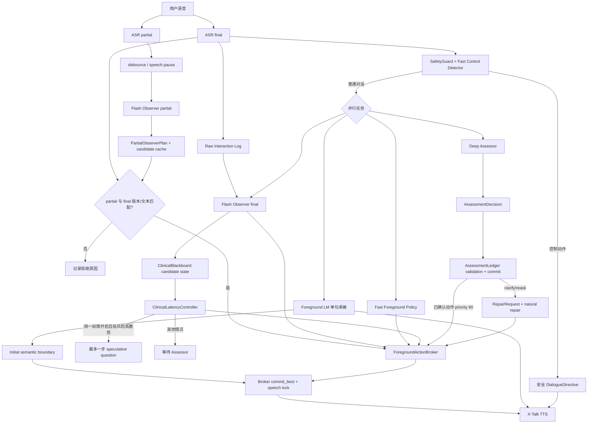
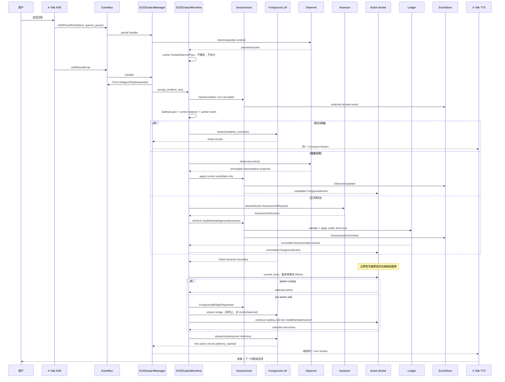

# SCID-Informed Realtime Voice Support Runtime

本目录实现 X-Talk 中受 SCID 结构化访谈方法启发的非诊断性语音支持子系统。它把实时语音交互、后台增量理解、结构化研究状态、流程控制和可回放日志组合成一个可运行的工程原型。

本文档按 2026-07-23 的工作区代码与本地 SCID 配置核对。运行代码和测试是行为事实来源；README 描述的是当前实现，不应反过来替代代码校验。`ali_config.json` 属于本地运行 profile，后续修改配置后“当前启用行为”也会随之变化。

> **重要定位**
>
> 当前版本用于工程研究、交互原型和后续实验基础设施建设，不是经过临床验证的诊断、筛查、分诊或治疗系统，也不能替代精神科医生、心理治疗师或受训访谈员。我们的目标是用 SCID 的结构化专业水准帮助用户非诊断性地梳理体验；普通烦躁、压力和短暂情绪波动不应被自动病理化或直接导向精神科就诊。它目前只覆盖 SCID 扫描阶段和 F/G/K 重点模块的入口式追问，不等于完整 SCID。

## 文档导航

- [初心与问题定义](#初心与问题定义)
- [当前实现状态](#当前实现状态)
- [一句话架构](#一句话架构)
- [Runtime v3 编排契约](#runtime-v3-编排契约)
- [接口协作总览](#接口协作总览)
- [唯一运行路径：realtime](#唯一运行路径realtime)
- [端到端流程图](#端到端流程图)
- [运行方式](#运行方式)
- [配置参考](#配置参考)
- [观察后台模型行为](#观察后台模型行为)
- [模块职责](#模块职责)
- [X-Talk 接入点](#x-talk-接入点)
- [测试](#测试)
- [开发范式与工程门禁](#开发范式与工程门禁)
- [Gate 0 治理制品](../../../../docs/psych_sop/scid/gate0/README.zh.md)
- [当前不足与风险登记](#当前不足与风险登记)
- [未来工程规划](#未来工程规划)
- [Gate 1.5：Captioner、Observer 与 Talker 融合的话语编排原型](#gate-15captionerobserver-与-talker-融合的话语编排原型)
- [近期优先级](#近期优先级)

## 初心与问题定义

### 我们为什么做这个系统

标准化心理访谈存在一个天然矛盾：一方面，SCID 的字段、证据、时间范围和流程跳转需要尽可能严谨；另一方面，真实用户并不会像填写网页表单一样逐题给出格式整齐的答案。用户可能停顿、修正、插话、询问流程、讲一段看似题外但后来有价值的经历，也可能在回答中同时包含当前症状、既往病史和生活背景。

如果只使用一个模型，它需要同时承担以下职责：

- 低延迟语音回应；
- 自然地理解打断和题外问题；
- 维持访谈关系与语气；
- 对 SCID criterion 做高精度推理；
- 维护字段状态和分支；
- 处理并发、过期结果和危机中断。

这些目标在延迟、算力、上下文和安全边界上彼此冲突。因此本系统最初采用“双 LM”思想：

- 前台小模型贴近用户，负责自然、快速、适合 TTS 的表达；
- 后台大模型贴近 SCID，负责证据理解、候选评分和下一步建议；
- 确定性代码掌握正式状态，任何模型都不能直接写表单。

随着架构演进，我们又加入了 Observer。当前系统更准确的描述是“一个前台模型、两个后台推理角色、一个确定性状态核心”：

```text
Foreground Dialogue LM
  + Incremental Observer
  + Deep Assessor
  + Blackboard / Broker / Ledger
```

Observer 和 Assessor 复用同一个 DeepSeek API endpoint 与凭据，但使用不同模型实例、prompt、JSON schema 和权限。当前默认是 `deepseek-v4-flash` Observer 与 `deepseek-v4-pro` Assessor；在 `realtime + active` 下若两个模型名相同，runtime 会拒绝启动，避免把两个角色意外配置成同一模型。因此：

- 从逻辑角色看，系统有三个模型角色；
- 从模型供应商看，两者都由 DeepSeek 提供；从当前模型配置看，它们必须是不同模型；
- 从通信与延迟看，启用 Observer 时通常至少存在两次独立后台调用；
- ASR 和 TTS 属于语音链路，不计入这里的 LM 数量。

### 核心产品目标

我们希望提供一段自然、可打断、允许补充、门槛足够低的专业体验，而不是“语音版网页问卷”，更不是一个假装成精神科医生的系统。用户可能只是心情烦躁、承受压力或想把近期状态说清楚；系统首先应该帮助其结构化梳理，而不是把负面情绪本身等同于精神障碍或自动要求就医。与此同时，系统内部仍要保留可审计的 SCID 字段、原话证据、状态版本和推进记录。

目标可以概括为：

```text
自然对话体验
  + SCID 证据约束
  + 非诊断、非替代、不过度医疗化
  + 低用户感知延迟
  + 保守状态提交
  + 全流程可审计（原文回放须显式 opt-in）
```

其中最重要的架构原则是：

```text
用户感知延迟 != 后台结构化评估延迟
```

前台可以先回应用户，Observer 可以提前理解和提出候选动作，Assessor 可以继续进行较慢的判断，但正式分数和字段推进必须经过 Ledger。

### 我们明确不做什么

当前系统不声称实现以下能力：

- 不给出正式临床诊断；
- 不替代精神科医生、心理治疗师或受训访谈员；
- 不把普通烦躁、压力、悲伤或短暂情绪波动自动病理化或强制导向精神科；
- 不保证用户“无需寻求帮助”，也不以内部 score 替代人类专业判断；
- 不提供用药、停药、剂量、住院或其他医疗处置建议；
- 不把语气、性格印象或宽泛闲聊直接转换成 SCID 分数；
- 不允许前台 LM 自行判分或宣布字段完成；
- 不允许 Observer 直接写 Ledger；
- 不保证后台 LM 的 `next_action` 在临床上一定正确；
- 不声称已经覆盖完整 SCID 手册和全部跳转逻辑；
- 不在在线会话中自动修改生产 prompt；
- 暂未实现长期个性化记忆、持续学习或 RL。

## 当前实现状态

### 能力矩阵

| 能力 | 当前状态 | 说明 |
| --- | --- | --- |
| X-Talk ASR/TTS 接入 | 已实现 | 复用 X-Talk 的 ASR、TTS、VAD、turn-taking 和浏览器前端 |
| SCID 扫描题 | 已实现 | 读取 `SCID-5-S.json` 中 30 个扫描字段 |
| F/G/K 重点模块 | 部分实现 | 生成 21 个模块入口字段，仅做入口式综合追问，不是完整 criterion 图 |
| 前台小模型自然表达 | 已实现 | 使用 X-Talk pipeline 中的 `llm_agent` backing model；失败时回退规则表达 |
| Deep Assessor 结构化判分 | 已实现 | 输出 `AssessmentDecision` JSON；解析失败时修复一次，再回退 `reask` |
| Incremental Observer | 已实现，实验性 | 可运行 `off / shadow / active`，理解 partial/final 并产生候选动作 |
| Fast Control Detector | 已实现 | 本地识别暂停、恢复、结束、流程问题、题意澄清、partial 和危机 |
| Blackboard 候选状态 | 已实现 | 保存候选证据、背景记忆、同字段追问、一步推测和返工状态 |
| Ledger 正式状态 | 已实现 | 唯一分数写入口，校验字段、turn、state version、score、evidence 和 action |
| Session Actor / typed graph | 已实现 | 每 session 单写、因果 envelope、显式 phase transition、双 mailbox 与普通输入背压 |
| Turn Supervisor / Model Gateway | 已实现 | AnyIO 结构化取消与绝对 deadline；模型优先级准入、并发上限、health/circuit 投影 |
| Realtime 分段语音 | 已实现 | 唯一公开运行路径；一轮 TTS stream 中先输出自然承接，再追加 Broker 选择的动作 |
| 一步 speculative advance | 已实现，默认关闭 | 由统一权限控制；最多一个未提交字段，后台否决时进入 repair |
| 延迟 telemetry | 已实现 | 记录 ASR、Observer、Assessor、前台、Broker 和 Ledger 时间点 |
| 严格边界校验 | 已实现 | 配置、ASR、Router/Observer/Assessor JSON、template 和 PDF 均有类型与大小上限，malformed 输入 fail closed |
| Episode 持久化 | 已实现 | schema v4 / `realtime_v3`；redacted append-only 事件、latest-wins projection、flush/failure 语义、私有权限；默认不写对话原文 |
| 500 轮长会话 | 已实现，进程内认证 | 单会话及 3 个并发 session × 500 轮 soak；热状态有界，完整审计历史进入分页事件日志 |
| 完整 SCID 346 页流程 | 未实现 | 当前模板不是完整诊断流程图 |
| criterion 级完整 rubric | 未实现 | 后台主要依赖当前字段文本、通用评分提示和有限历史 |
| 长期个性化记忆 | 未实现 | contextual memory 只存在于当前 session Blackboard |
| 系统化评测环境 | 未完成 | 有测试和 telemetry，但还没有临床 gold benchmark 与完整指标平台 |
| 持续学习 / RL | 未实现 | 仍属于后续研究阶段 |

### 当前模板范围

当前 `SCIDTemplate` 的标识是：

```text
scid_phase1_scan_fgk_v1
```

运行时字段总数为 51：

- 30 个按顺序执行的扫描字段；
- 21 个由 F/G/K 阳性扫描结果可能触发的模块入口字段。

扫描字段 ID 形如 `S1-F3`：

- `S1` 是扫描题 qid；
- `F3` 是该扫描题指向的目标字段；
- 当目标属于 F/G/K 且扫描分数为 `3` 时，目标入口字段会加入 `queued_module_fields`；
- H/I/J 等扫描题仍会执行，但当前不会展开对应完整模块。

扫描结束后，Ledger 依次处理 `queued_module_fields`，然后进入 `completed`。所谓“重点模块支持”目前只表示入口字段闭环，不表示完整模块覆盖。

### 当前本地运行配置

仓库顶层 `ali_config.json` 当前启用的 SCID 行为是：

```json
{
  "scid_observer_mode": "active",
  "scid_allow_one_step_speculation": false,
  "scid_persist_raw_transcript": false,
  "scid_observer_model": "deepseek-v4-flash",
  "scid_backend_model": "deepseek-v4-pro",
  "scid_partial_plan_max_age_seconds": 3.0,
  "scid_post_initial_action_wait_seconds": 0.35
}
```

API key 和 token 不应出现在 README、日志或提交记录中，因此这里不展示真实值。

代码固定使用 realtime 编排，不再通过配置选择运行模式。Observer 默认模式为 `shadow`，本地配置显式启用 `active`；非法模式会在启动时直接报错。Candidate Cache、active partial planning、Fast Policy 候选生成和前台 streaming 是 realtime 内部固定组件，不再分别暴露开关。

`scid_allow_one_step_speculation=false` 表示 Fast Policy 和 Observer 都不能提前询问下一字段。active Observer 仍可提出 duration、frequency、time-window、impairment 等同字段安全追问。只有显式改为 `true`，且所有风险、置信度、深度与版本条件同时满足时，两个候选来源才可请求一步 speculative advance。

长会话容量、turn deadline 与事件分页上限由 Python API 的版本化 `RuntimePolicy`/`RetentionPolicy` 注入；当前 Manager 不把这些内部可靠性参数暴露为 `service_config`，默认值为 30 秒 turn deadline、control/work mailbox `64/128`、event queue `256` 和事件分页 `100`（最大 `500`）。

## 一句话架构

```text
兼容 Runtime Facade
  -> 每会话单写 Session Actor / 双 lane mailbox
  -> Typed Turn Graph / AnyIO Turn Supervisor
  -> Assessment Transaction / Speculation Saga
  -> Action Policy / Delivery Coordinator
  -> Event Store / bounded projections
```

Runtime façade 继续暴露 `SCIDDualLMRuntime`、`accept_text()`、partial Observer、delivery marker、`snapshot()`、`current_directive()` 和 `aclose()`。内部正式状态由每个 session 独立的 `SessionActor` 串行修改：worker 只返回不可变 proposal，Actor 负责 Ledger mutation、typed phase、Saga transition、delivery phase 和 domain event sequence。

每个评分轮只有一个 `TurnSupervisor`。它以 AnyIO task group 统一拥有 Assessor、final Observer、候选提交和 action stream，并共享绝对 monotonic deadline。deadline 的创建和消费统一使用 `time.monotonic()` 时钟域，避免在嵌入式或自定义 event loop 中混用不同 epoch，导致新建 turn 在第一个 child 启动前就被误判超时。新的 ASR final 会同步推进 ingress generation，再取消旧 turn scope；晚到远端结果即使未真正停止，也会在 interaction、field、state version、generation gate 处被拒绝。一步推测被选择后，其仍在运行的评估会转移为唯一 Saga scope，不再作为第二个普通 turn supervisor。

长会话不再把全部历史复制进内存 snapshot。默认热窗口为 interaction/runtime turn 各 32、trace/action/Observer update 各 64、候选证据和 contextual memory 各 128、Ledger committed turn 16；较早的有效结构化信息进入 `SessionMemoryProjection`，完整因果审计写入 `<episode_id>.events.jsonl`，通过 `read_events(after_seq, limit)` 分页读取。

核心分工：

- `AssessmentLedger` 是唯一状态写入口。
- `SCIDInteractionRouter` 现在只做快速控制意图检测，不再作为“临床证据准入门”。
- 当 Observer 未关闭时，所有非噪声对话都会进入 `IncrementalObserver`；看似题外的背景叙述不会被 Router 提前丢弃。
- Observer 只能写 `ClinicalBlackboard` 的候选证据和背景记忆，不能写 Ledger。
- `ClinicalLatencyController` 与统一 speculation 权限共同约束 Fast Policy 和 Observer；默认不允许提前进入下一字段，关键模块字段始终等待 Assessor。
- 后台 LM 只能提出 `AssessmentDecision`，不能直接改状态。
- 前台 LM 只能渲染 `DialogueDirective`，不能评分、诊断或改写表单。
- `SCIDDualLMManager` 负责把 X-Talk 事件接到 runtime，并复用原有 TTS 链路。

## Runtime v3 编排契约

本节是当前 `realtime_v3` 的运行时事实说明。它描述进程内因果一致性和资源边界；不承诺外部模型供应商的 exactly-once，也不承诺进程崩溃后的自动恢复。

### 单写 Actor、因果信封与状态图

每个 `episode_id` 创建一个独立 `SessionActor`。Actor 是以下正式状态的唯一异步写入者：Ledger 提交/撤销、Blackboard 的候选计划和动作投影、Session/Turn/Assessment/Delivery/Saga phase、event sequence 与持久化健康投影。唯一的同步例外是 ingress gate：收到 ASR final 或拒绝 partial 时，Actor 会立即推进 generation/Observer version，使旧 worker 在其取消信号到达前也失去提交资格。

所有可能影响状态的后台结果都带 `CausalEnvelope`：

```text
interaction_seq + turn_id + field_id + state_version
+ generation + request_id + correlation/causation id + absolute deadline
```

Actor 以单调 `event_seq` 处理消息。过期 interaction、旧 assessment identity、非法 phase 和不匹配的 field/state/generation 都不能推进正式状态；被拒绝的状态迁移也不会伪造对应 domain event。

```text
Session:    new -> active -> crisis|completed|stopped|aborted -> closed
Turn:       accepted -> routed -> workers_running -> initial_boundary
          -> action_selected -> delivering -> completed|cancelled|failed
Assessment: idle -> reserved -> in_flight -> validated|committed|rejected|cancelled|failed
Delivery:   not_selected -> selected -> started -> completed|failed|cancelled
```

Assessment phase 还绑定 `assessment_interaction_seq + assessment_generation`。因此危机或新输入接管 assessment 后，旧请求的取消/迟到回调不能把新事务误标为 cancelled、stale 或 committed。

### 结构化并发与背压

每个普通判分 turn 最多有一个 `TurnSupervisor`。它使用 AnyIO task group 和同一个绝对 monotonic deadline 管理前台 action、final Observer、Assessor、候选生成等 child task；deadline 创建和剩余时间计算都使用可注入的 `time.monotonic()` 时钟，超时错误会记录 interaction seq、task name、deadline、当前时间和 remaining，便于定位时钟域错误与真实慢请求。公开的 `SupervisedTask` 仍具备 `await/cancel/done` 兼容表面。新 final、crisis、stop、delivery 失败和 shutdown 会取消相应 scope。已建立的一步推测会把上一字段 assessment 转交为唯一的 Saga scope，而不是与下一普通评分事务并行。

会话使用两级 Actor mailbox：

| lane | 默认容量 | 处理语义 |
| --- | ---: | --- |
| control | 64 | final、crisis、stop、assessment/ledger、delivery 等不可静默丢弃的命令；接近满载时暂停普通输入 |
| work | 128 | partial、Observer、候选预生成和非关键投影；同 key latest-wins，满载时丢弃更旧工作 |

普通输入在 control lane 接近满载时收到确定性“繁忙”回复；若 event writer 已报告错误，则收到“记录暂不可用”回复，避免继续产生无法审计的普通状态变更。危机和明确停止文本不走这条拒绝路径。

`ModelGateway` 为远端 Router、Observer、Assessor 和候选生成提供每会话/全局优先级准入、绝对 deadline、有限重试接口、连续失败 circuit breaker 和健康计数。默认并发为每会话 4、全局 16；优先级从危机/前台、Assessor、final Observer、partial Observer 到候选生成。Python 取消并不代表远端调用已经停止，结果仍必须经过 Actor 的因果 gate。

### 一步 speculative advance 的 Saga

每个会话最多有一个未关闭的 speculation。Saga 用 `action_id + transition_version` 做幂等与乐观并发校验：重复 receipt、晚到 assessment、用户打断或 crisis 不会产生第二次 commit 或 repair。

```text
Proposed -> Selected -> Spoken -> PendingCommit
                                  |- Confirmed -> Closed
                                  |- Compensating -> Closed
                                  `- Cancelled -> Closed
```

`Confirmed` 只在上一字段正式推进且无 pending clarification 时发生；否则进入 `Compensating` 并生成 repair。Saga transition 与 Blackboard 补偿 mutation 在同一个 Actor command 中校验和提交。

### 有界热状态、模型上下文与投影

`RetentionPolicy` 是版本化策略，默认值如下：

| 热集合 | 上限 |
| --- | ---: |
| interaction turns / runtime turns | 各 32 |
| latency traces / foreground actions / Observer updates | 各 64 |
| partial plan history | 32 |
| candidate evidence / contextual memories | 各 128（内容指纹去重） |
| candidate utterance cache | 128 LRU 项 |
| committed Ledger turns | 16 |

SCID `field_states` 保留全量，因为字段模板数量有限。更早的正式信息压缩进不含原话的 `SessionMemoryProjection`（route 计数、已提交字段、澄清/repair/crisis 计数）。模型上下文不会回填无限 transcript：Ledger 最多提供 8 个 recent turns 和 12 个 field states；Observer 使用 4 个 recent conversation、6 个 contextual memories；Assessor 侧最多使用当前字段 8 条 candidate evidence 和 6 条 memory。

### 事件、snapshot 与隐私

Actor 产生 `InputAccepted`、`RouteChosen`、`AssessmentCommitted`、`ActionSelected`、`DeliveryCompleted`、`SagaTransitioned`、`OperationFailed` 等类型化事件。它们追加到 `<episode_id>.events.jsonl`，每条最多 64 KiB，包含 `event_seq`、schema version、causation/correlation envelope，并递归脱敏自由文本、raw payload 和密钥字段。

- `read_events(after_seq=0, limit=100)` 是异步分页接口，`limit` 必须在 1–500。
- `.partial.json` 经容量为 1 的 latest-wins 队列异步合并；Actor 不做 JSON 编码、磁盘写或 `fsync`。
- terminal/crisis/stop/shutdown 必须 drain event/artifact writer，并对 event log、artifact stream（存在时）和 final snapshot flush/`fsync`。
- writer 在 flush barrier 上失败时会把原始错误返回给调用方，并关闭其余 writer，避免等待者或后台 writer 残留；已经应用的内存 mutation 不会假装被回滚。
- 默认 event/snapshot 不含用户原话。`scid_persist_raw_transcript=true` 时，原文仅写入权限为 `0600` 的独立 `<episode_id>.artifacts.jsonl`；event 和 snapshot 仍只保存内容寻址引用。
- 当前版本不从 event log 或 partial snapshot 自动恢复会话；跨进程崩溃恢复不在本版本保证范围内。

### 公开兼容接口与 delivery 边界

保留的 façade 包括 `SCIDDualLMRuntime`、`SCIDRuntimeResponse`、`start()`、`accept_text()`、`observe_asr_partial()`、`record_asr_partial()`、`record_asr_final()`、`reject_asr_partial()`、`reject_asr_final()`、`mark_first_segment_published()`、`mark_followup_segment_published()`、同步兼容 `complete_response_delivery()`、异步 `acomplete_response_delivery()`、`snapshot()`、`current_directive()`、`read_events()`、`release_turn()` 与 `aclose()`。`SCIDRuntimeResponse` 继续提供 initial stream 与 action stream handle。

Manager 只负责 X-Talk 事件转换、TTS 分句、stream 关闭和 delivery receipt：完成后调用 `acomplete_response_delivery(interaction_seq, success=...)`，并释放对应 supervisor。对于带 action task 的评分轮，EventBus 正常消费完整 iterator 仍不足以判定成功；只有 `followup_segment_published_at` 已设置，即 action 或确定性故障回退确实发布，delivery 才能标记成功。action worker 抛错时 Manager 不再吞掉异常并伪报成功，而是调用 runtime 恢复入口：写入 `OperationFailed`，保留用户回答到 `pending_user_buffer`，不提交 Ledger 分数，并发布同字段安全澄清。领域 sequence、stale 判定、Ledger、Saga、phase 和 event sequence 仍归 Actor；取消 action handle 会传播到其 AnyIO cancel scope。

## 接口协作总览

这一层的设计可以理解成：**Router 路由系统动作，不路由哪些话值得理解；Observer 理解全部对话，Assessor 提出正式判断，Ledger 才能提交状态，前台模型只负责说出来。**

| Class / Interface | 输入 | 输出 | 权限边界 |
| --- | --- | --- | --- |
| `SCIDDualLMManager` | `LLMAgentLoop`、`ASRResultPartial`、`ASRResultFinal` | `ConsumeLLMAgentGenerationRequested` | X-Talk 事件桥接；不判分、不写 ledger |
| `SCIDDualLMRuntime` | 用户文本、`interaction_seq` | `SCIDRuntimeResponse` | 通过唯一 realtime 公共入口统一编排控制检测、判分、状态写入、前台回复和 snapshot |
| `SafetyGuard` | 用户原话 | safety classification | 位于 control detector 之前的同步危机预检查；当前实现来自 `psych_sop/safety_guard.py` |
| `SCIDInteractionRouter` | control context | `SCIDRouteDecision` | 只识别暂停、继续、停止、危机、meta、澄清、partial；不能决定临床价值 |
| `IncrementalObserver` | 当前字段、有限对话上下文、每个 partial/final | `TurnInterpretation` | 多标签理解、候选证据和 next-action 预测；不能评分或写 ledger |
| `ClinicalBlackboard` | Observer 候选、推测字段、返工状态 | candidate snapshot | 严格区分 candidate 与 committed state；最多保存一个推测字段 |
| `ForegroundActionBroker` | Fast Policy、Observer、Assessor 的 `ForegroundAction` | 当前轮最多一个前台动作 | 校验 interaction/state/field，去重并拒绝过期动作；不写 ledger |
| `CandidateUtteranceCache` | field、state version、action directive | 预生成前台话术 | 只缓存安全表达；state version 变化后失效 |
| `ClinicalLatencyController` | 字段风险级别、Observer 结果、推测深度 | `LatencyPlan` | 决定等待 Assessor 还是允许一步 optimistic scan |
| `BackgroundAssessor` | 不可变 `AssessmentRequest` | `AssessmentDecision` | 只读取本次评估冻结的 seq/field/state/turn/用户文本/有限上下文；不读可变 Ledger，不能直接修改状态 |
| `AssessmentLedger` | 合法 `AssessmentDecision` | 新 `DialogueDirective` 和 ledger snapshot | 唯一可信状态写入口；负责字段推进、证据保存和校验 |
| `DialogueModel` | `DialogueDirective` | 用户可听文本 | 只口语化；不能评分、诊断、透露内部字段或 JSON |
| `SCIDTemplate` | SCID scan JSON | 可运行字段图 | 只提供字段、顺序、模块入口等静态结构；PDF extractor 不参与 runtime |

关键数据对象：

- `SCIDRouteDecision`：控制平面结果，回答“这句话是否改变系统动作”。非控制输入默认进入后台理解。
- `TurnInterpretation`：Observer 的多标签候选理解，可同时包含回答、自我披露、题意问题、相关模块和候选证据。
- `AssessmentDecision`：后台判分结果，回答“当前字段应该如何填写或是否需要澄清”。
- `AssessmentRequest`：一次 Assessor 调用的不可变快照，包含 owner token 与冻结上下文，避免远端请求期间继续读取变化中的 Ledger。
- `DialogueDirective`：runtime 给前台 LM 的安全话术指令。
- `SCIDInteractionTurn`：记录所有用户输入，包括背景叙述、闲聊、暂停、恢复、过期结果和 ASR 噪声。
- `SCIDTurn`：记录进入后台 assessor/ledger 路径的用户输入；ledger 可能保守 reask，而不是写分。

### 三层状态边界

系统把“听到了什么”“可能意味着什么”“正式提交了什么”分成三层：

```text
Raw Interaction History
  -> ClinicalBlackboard candidate state
  -> AssessmentLedger committed state
```

#### 1. Raw interaction

`SCIDInteractionTurn` 的热窗口保存最近交互，包括控制命令、流程问题、背景叙述、partial、噪声和最终进入判分的回答。它不等于临床证据。schema v4 默认事件和 snapshot 都不保存用户原话或派生自由文本；完整因果历史由 redacted JSONL 事件流承担。

#### 2. Candidate state

`ClinicalBlackboard` 保存 Observer 的候选证据、`context_only` 背景、同字段追问、一步 speculative field 和 repair。候选状态可以影响下一句怎么问，但没有正式分数效力。

#### 3. Committed state

`AssessmentLedger` 在会话内保存当前字段、已填分数、证据、未决澄清、模块队列和 `state_version`。只有 Ledger 的内容才是当前程序认可的正式状态；其中的引文和自由文本在默认 episode 投影中不落盘。

这条边界对应一个核心原则：

```text
所有对话都可以被理解，但不是所有对话都可以被计分。
```

### Ledger 能保证什么，不能保证什么

Ledger 能确定性保证：

- decision 的 `field_id` 与当前字段一致；
- decision 基于当前 `state_version`；
- turn id 是当前可应用的 turn；
- action 属于允许枚举；
- `advance/branch` 有合法 score 和非空 evidence；
- `clarify/reask` 有澄清问题；
- 正式写入只能经 Session Actor；Ledger lock 仅配合 assessment reservation、适用性复核与提交窗口，远端调用不在 lock 内执行；
- 过期结果不会任意覆盖新状态。

Ledger 不能保证：

- 后台选择的 score 在临床上正确；
- evidence 是否真的足以支持该 score；
- `next_action` 是否是临床人员会选择的最佳动作；
- 用户原话是否被 ASR 准确识别；
- 当前简化模板是否忠实覆盖完整 SCID 手册。

当前 `next_action` 仍由 Assessor 提议。Ledger 做结构和状态一致性校验，不会重新进行临床推理。这是有意保留的模型责任，也是未来评测、监督微调和策略优化的主要对象。

## 目录结构

SCID 子系统现在按职责分包，根目录同名 `.py` 文件保留为兼容 shim，旧 import 仍可用；新代码优先从子包导入。

```text
scid/
├── core/             # schema.py, template.py；核心类型和静态 SCID 模板
├── assessment/       # backend.py, decision.py；后台 assessor 和 JSON decision 解析
├── state/            # ledger.py, blackboard.py, telemetry.py；正式状态、候选状态和延迟追踪
├── dialogue/         # frontend.py, foreground.py, candidate_cache.py, repair.py；前台话术、动作 broker、候选问题和返工
├── policy/           # router.py, observer.py, latency_controller.py；控制检测、增量观察和延迟策略
├── orchestration/    # runtime façade 与 actor/state_graph/supervisor/saga/gateway/event_store/projection
├── *.py              # 兼容层：从上述子包 re-export
└── README.md
```

维护约定：

- 新增核心数据结构放在 `core/`。
- 正式判分、后台模型调用和 decision parser 放在 `assessment/`。
- Ledger、Blackboard、Telemetry 这类状态容器放在 `state/`。
- 前台 LM、前台动作、候选话术和 repair 文案放在 `dialogue/`。
- Router、Observer、LatencyController 这类策略组件放在 `policy/`。
- 跨组件异步编排只放在 `orchestration/`；`runtime.py` 是 façade，Actor、state graph、supervisor、Saga、gateway 和 event store 各自保持扁平职责。
- 根目录 shim 只做兼容导出，不写业务逻辑。

## 唯一运行路径：realtime

`SCIDDualLMRuntime` 只有一个公开运行路径。Manager 将每个 ASR final 交给 `accept_text()`；Runtime 立即返回统一的 `SCIDRuntimeResponse`，其中包含前台 initial stream 和后台 action stream task。调用方不再选择不同的运行模式或响应 API。

旧 sequential reference 已移除。确定性测试统一通过公开 realtime façade、Actor reducer、assessment transaction 和 Saga 接口执行，避免维护第二套隐式生命周期。

```text
ASR stable partial -> Flash Observer -> provisional action/cache only

ASR final
  -> SafetyGuard + local control detector
  -> Foreground realtime_converse short stream -----------> TTS
  -> promoted partial plan --\
  -> Fast Policy -------------> ForegroundActionBroker
  -> final Flash Observer ----/       ^
  -> Deep Assessor -> Ledger --------/
                         initial semantic boundary
                                   -> commit_best()
                                   -> one action stream -> TTS
```

特点：

- 前台首段使用 X-Talk `llm_agent` 背后的 chat model `astream()`；
- 首段严格限制为一个完整、短、非承诺性句子，只能回应和克制复述，不能提出新问题或宣布字段完成；
- stable ASR partial 可提前调用 Flash Observer，但只生成 `PartialObserverPlan` 和候选话术，不调用 Assessor、不写 Ledger、也不触发 TTS；
- final 到达后只有在 seq、field、state、3 秒时效和文本覆盖条件都满足时，partial 计划才会进入 Broker；final Observer 仍会并行运行并可在播出前覆盖 partial 候选；
- Broker 校验 `interaction_seq + state_version + field_id`，在首段结束前只收集和替换候选，不立即消费；
- 首段抵达语义边界后，Broker 提交当前最高优先级动作并锁定，每轮最多选择一个主动 follow-up；若当时没有候选，最多再等待 350ms，然后先发非终止 bridge 并继续等待后台动作；
- 优先级为 Assessor committed/repair `90`、final Observer probe `65`、partial Observer probe `60`、Observer speculative next `55`、Fast Policy `40`；timeout fallback 不再参与 action ranking；
- Fast Policy 可识别明确扫描短答，但只有 `scid_allow_one_step_speculation=true` 时才能提出下一字段候选；明确低风险扫描否定短答会走本地快提交，而不是 speculative candidate；
- active Observer 始终可以提出一个符合限制的同字段安全追问；只有统一 speculation 权限开启时才可建议下一扫描题；
- Assessor 返回后由 Ledger 决定正式提交、澄清、返工、分支建议或危机；
- Assessor 在首段语义边界前返回时会替换低优先级 Observer/Fast 候选；Observer 问题一旦提交播出，迟到的普通 Assessor 不会硬中断该句；
- 350ms 后仍无动作时，runtime 生成非提问等待 bridge；它不取消未提交判分，不写 `ActionSelected`，不要求用户举例，也不把 timeout 本身写成 `pending_foreground_probe`；真正追问仍等待 Assessor committed、Observer probe 或明确否定快提交；
- 前台模型不支持原生 streaming 时，`DialogueModel.stream()` 会把完整 `render()` 结果作为单个 chunk 返回，不需要另一种 runtime 模式。

### 一轮可能发生多少次模型调用

调用数量不是固定的“两次”或“三次”。在当前 `realtime + active` 配置中，一次普通最终回答通常涉及：

1. 前台小模型流式生成承接；
2. Observer 对 final 发起一次后台结构化理解；如果 stable partial 足够早，还可能额外有一次可取消的 partial Observer 请求；
3. Assessor 发起一次后台结构化判分；
4. Candidate Cache 或 Fast Policy action 可能额外调用前台小模型；已缓存的 Observer 追问会直接进入 stream，避免选择后再次等待；
5. Assessor 提交后的下一 directive 也会由前台模型渲染。

其中 2 和 3 是独立后台请求，但应并行运行；1 位于用户感知关键路径。JSON repair、调用失败回退或 Candidate Cache 未命中后的话术渲染还可能增加额外请求。因此评估延迟和成本时应按“每类调用次数与并发关系”记录，而不是只按模型角色数量估算。

## 端到端流程图



端到端协作顺序：

1. `SCIDDualLMManager` 收到 `ASRResultFinal` 后先停止旧回复，给本轮输入分配 `interaction_seq`。
2. `SCIDDualLMRuntime` 过滤明显 ASR 噪声，并调用 `SafetyGuard` 做危机优先判断。
3. stable partial 经过 debounce 后可提前送给独立 Flash Observer；它只生成临时候选。final 到来时，runtime 按 seq、field、state、时效和文本覆盖率决定是否提升该计划。
4. 非危机 final 进入本地 control detector；当 Observer 模式不是 `off` 时，所有非噪声 final 也会异步送给 Observer。
5. Observer 把背景、候选证据和建议动作写入 Blackboard；这些内容保持 `candidate/context_only`，不进入正式分数。
6. realtime 公共路径让前台 LM 只生成一个完整、非承诺性的自然承接句，同时启动 final Observer、Fast Policy 和 Assessor；首段不能提出新问题或推进字段。
7. 首段结束之前，Broker 允许 Assessor、final Observer、partial Observer 和 Fast Policy 按固定优先级互相替换；到语义边界时才锁定一个动作。
8. shadow 模式只记录 Observer 预测；active 模式会把高置信 Observer 动作交给 Broker。同字段 duration/frequency/time-window/impairment 等安全追问会先保留原回答并取消尚未提交的旧判分；用户补充后再合并交给 Assessor。
9. Observer 和 Fast Policy 的下一字段候选都受 `scid_allow_one_step_speculation` 控制；只有权限开启、低风险扫描字段、高置信、无返工且推测深度为 0 时才可提前问下一题。
10. 若用户在上一题提交前回答了推测题，该回答暂存在 Blackboard；上一题提交后才会进入下一字段判分。
11. 后台否决推测推进时，Ledger 不写下一字段，runtime 生成自然返工问题。
12. `state_version`、`field_id`、`interaction_seq` 和 Observer version 共同校验异步结果；过期候选直接丢弃。

### Realtime 时序图



控制、meta、pause、resume 等非 `scid_answer` 路径不会启动本轮 Assessor action stream。开场边界说明、用户停止、危机中断和自然完成使用版本化确定性文本，完全绕过外部 `DialogueModel`，防止关键边界话术被模型改写。普通前台仍逐段 streaming：零 chunk 失败时可使用规则 fallback；已发出部分内容后失败只记录 truncated/error 并停止，不拼接另一套完整回复。普通更新不会中途截断已经开始播放的问题；用户 barge-in、危机或严重错误推进可走 hard stop。

## 运行方式

先在你的本地配置文件里写入 DeepSeek key。示例放在顶层
`service_config` 下；请使用本地私有配置，不要把真实 key 提交到仓库：

```json
{
  "service_config": {
    "scid_deepseek": {
      "api_key": "<your_deepseek_key>",
      "base_url": "https://api.deepseek.com"
    },
    "scid_observer_mode": "active",
    "scid_allow_one_step_speculation": false,
    "scid_observer_model": "deepseek-v4-flash",
    "scid_backend_model": "deepseek-v4-pro",
    "scid_partial_plan_max_age_seconds": 3.0,
    "scid_post_initial_action_wait_seconds": 0.35
  }
}
```

也可以使用扁平字段：

```json
{
  "service_config": {
    "scid_deepseek_api_key": "<your_deepseek_key>",
    "scid_deepseek_base_url": "https://api.deepseek.com"
  }
}
```

当 `ali_config.json` 按上例配置为 active Observer 后，从 `xtalk/` 目录启动时
只需要：

```bash
PYTHONPATH=src python examples/psych_sop_voice_demo/server.py \
  --config ../ali_config.json \
  --mode scid
```

CLI 参数只在显式传入时覆盖配置文件。需要对照 shadow 模式时可运行：

```bash
PYTHONPATH=src python examples/psych_sop_voice_demo/server.py \
  --config ../ali_config.json \
  --mode scid \
  --backend-model deepseek-v4-pro \
  --scid-observer-mode shadow
```

验证 shadow 数据并达到冻结门槛后，才显式开启一步 speculative advance：

```bash
PYTHONPATH=src python examples/psych_sop_voice_demo/server.py \
  --config ../ali_config.json \
  --mode scid \
  --backend-model deepseek-v4-pro \
  --scid-observer-mode active \
  --scid-one-step-speculation
```

默认不持久化对话原文。只有在受控的本地研究回放确实需要，并已确认数据条件时，才显式传入：

```bash
PYTHONPATH=src python examples/psych_sop_voice_demo/server.py \
  --config ../ali_config.json \
  --mode scid \
  --scid-persist-raw-transcript
```

说明：

- ASR、前台小模型和 TTS 仍由 `ali_config.json` 配置。
- `examples/psych_sop_voice_demo/server.py` 会在导入 `xtalk` 前优先把当前仓库的 `src` 插入 `sys.path`，并在启动时打印实际加载路径：`Using xtalk package from: ...`。正常应指向当前仓库的 `xtalk/src/xtalk/__init__.py`；如果指向 site-packages、另一个 clone 或旧虚拟环境，前端看到的就仍会是旧 runtime 行为。
- 后台结构化评估模型默认是 `deepseek-v4-pro`，使用 JSON Output 与 enabled/max thinking；独立 Observer 默认是 `deepseek-v4-flash`，使用 JSON Output 且关闭 thinking；控制检测走本地 fast control detector，不占用远端 router 调用。其内部字段结果属于非诊断研究状态，不是用户可见诊断。
- DeepSeek key 优先从 `service_config.scid_deepseek.api_key` 或 `service_config.scid_deepseek_api_key` 读取；如果配置里没有，再回退到 `DEEPSEEK_API_KEY` 环境变量。
- Runtime 固定使用 realtime profile；CLI 未提供 Observer 或 speculation 选项时会尊重 `service_config`，两处都未指定时分别使用 `shadow` 和 `false`。
- `--scid-observer-mode shadow` 让 Observer 只记录预测；`active` 才允许 latency controller 使用其动作。
- `--scid-observer-model <model>` 可覆盖 Observer 模型；省略时使用 `deepseek-v4-flash`。active 模式下不能与 Assessor 模型名相同，否则启动失败并给出配置错误。
- `--scid-one-step-speculation` 同时放行 Fast Policy 和 active Observer 的下一字段候选；默认关闭，最大深度固定为 1。
- `scid_post_initial_action_wait_seconds` 控制首段语义边界后、尚无候选时的额外等待，默认 0.35 秒。已有候选时 Broker 会在边界立即选择当前最高优先级动作；无候选超时后先发非提问 bridge，并在同一 action stream 内继续等待 Assessor/Observer/Fast Policy 的真实动作，不再固定要求用户举例。
- `scid_partial_plan_max_age_seconds` 控制 stable partial 计划可被 final 提升的最长年龄，默认 3 秒。
- `scid_persist_raw_transcript` 严格布尔值，默认 `false`。开启后自由文本只写入权限受限的独立 `<episode_id>.artifacts.jsonl`；默认事件流和 snapshot 仍只保存内容寻址引用，不嵌入原文。这不会改变远端模型处理文本的数据流。
- Manager 对所有已知 `scid_*` 字段做严格类型/范围校验，并拒绝未知 `scid_*` 键；字符串 `"false"`、`NaN/Infinity`、负值或越界数值不会被隐式转换。
- Candidate Cache、前台 streaming 和 active partial planning 是固定 runtime 行为，不再提供单独开关。
- 已删除的旧 runtime/实验字段不会被静默忽略；Manager 会抛出带迁移提示的 `ValueError`。
- 如果配置和环境变量里都没有 DeepSeek key，runtime 会自动使用 `RuleBasedAssessor`，方便本地测试。
- 普通聊天 smoke test 可用 `--mode chat`，此时不注册 SCID/PsychSOP manager。

## 配置参考

以下字段由 `SCIDDualLMManager` 从 X-Talk `service_config` 读取。

| 配置项 | 代码默认值 | 生效位置 | 说明 |
| --- | --- | --- | --- |
| `data_dir` | `data` | manager | episode 写入 `<data_dir>/psych_sop_demo/episodes/` |
| `scid_experiment_id` | `scid_voice_demo` | runtime metadata | 写入 episode，便于区分实验条件 |
| `scid_backend_model` | `deepseek-v4-pro` | Assessor | 原样传给 OpenAI-compatible client，代码不验证供应商是否存在该模型名 |
| `scid_observer_model` | `deepseek-v4-flash` | Observer | 独立低延迟模型；active 模式下不得与 backend model 相同 |
| `scid_prefer_deepseek` | `true` | model factory | `false` 时强制使用 rule-based fallback |
| `scid_deepseek_api_key` | 无 | manager/model factory | 扁平 key；优先于 nested `scid_deepseek.api_key` |
| `scid_deepseek.api_key` | 无 | manager/model factory | nested key；两处都没有时回退环境变量 `DEEPSEEK_API_KEY` |
| `scid_deepseek_base_url` | `https://api.deepseek.com` | Observer/Assessor | 扁平 base URL；优先于 nested 值 |
| `scid_deepseek.base_url` | 同上 | Observer/Assessor | nested base URL |
| `scid_observer_mode` | `shadow` | Observer/runtime | `off / shadow / active` |
| `scid_allow_one_step_speculation` | `false` | Fast Policy / Observer / latency controller | 同时控制两个来源能否提出下一字段候选；最大深度固定为 1 |
| `scid_persist_raw_transcript` | `false` | episode projection | 是否把敏感自由文本写入独立 artifact stream，并在 projection 中仅保存引用；必须是真实布尔值 |
| `scid_observer_confidence_threshold` | `0.9` | latency controller/runtime | 下一字段候选与主动 evidence-slot probe 的最低置信度 |
| `scid_partial_plan_max_age_seconds` | `3.0` | runtime | partial 计划提升到 final 仲裁的最长年龄 |
| `scid_post_initial_action_wait_seconds` | `0.35` | Broker | 首段语义边界时没有候选，最多再等待多久才发出非终止 timeout bridge |
| `scid_partial_observer_debounce_seconds` | `0.5` | manager | stable partial 触发 Observer 前的 debounce；`speech_pause=true` 时缩短到最多 50ms，新 partial/final 会取消旧 task |

### 配置优先级

```text
显式 CLI 参数
  > service_config 中的 scid_* 配置
  > 代码默认值
```

API key 的解析顺序是：

```text
service_config.scid_deepseek_api_key
  > service_config.scid_deepseek.api_key
  > DEEPSEEK_API_KEY
  > RuleBasedAssessor / RuleBasedObserver fallback
```

不要把真实 key 提交到 Git。当前代码允许从配置文件读取 key，是开发便利能力，不代表适合生产环境。生产部署应改用环境变量或密钥管理服务，并限制日志与配置文件访问权限。

### 推荐配置组合

#### 当前保守交互配置

```json
{
  "scid_observer_mode": "active",
  "scid_observer_model": "deepseek-v4-flash",
  "scid_backend_model": "deepseek-v4-pro",
  "scid_allow_one_step_speculation": false,
  "scid_persist_raw_transcript": false,
  "scid_partial_plan_max_age_seconds": 3.0,
  "scid_post_initial_action_wait_seconds": 0.35
}
```

该组合允许 active Observer 提出同字段安全追问，但 Fast Policy 和 Observer 都不能提前询问下一字段。

#### 一步推测研究配置

```json
{
  "scid_observer_mode": "active",
  "scid_observer_model": "deepseek-v4-flash",
  "scid_backend_model": "deepseek-v4-pro",
  "scid_allow_one_step_speculation": true
}
```

仅在冻结 replay 达到门槛后使用。Fast Policy 与 Observer 都必须继续通过 field/state/version、风险、置信度、repair 和深度校验。

#### Observer 离线评估配置

```json
{
  "scid_observer_mode": "shadow",
  "scid_allow_one_step_speculation": false
}
```

该组合用于收集 Observer 与 Assessor 的一致率、延迟和错误类型，不授予 Observer 前台控制权。

#### 完全离线开发配置

```json
{
  "scid_prefer_deepseek": false,
  "scid_observer_mode": "off",
  "scid_allow_one_step_speculation": false
}
```

这会使用规则 fallback，只适合单元测试、UI 联调和无网络 smoke test，不能用于判断系统的真实临床能力。

### CLI 能覆盖的选项

voice demo server 当前暴露：

- `--mode psych | scid | chat`
- `--backend-model`
- `--scid-observer-model`
- `--scid-observer-mode off | shadow | active`
- `--scid-one-step-speculation / --no-scid-one-step-speculation`
- `--scid-observer-confidence-threshold`

post-boundary wait 和 partial plan/debounce 当前没有对应 CLI 参数，需要在 `service_config` 中配置。Fast Policy、Candidate Cache、partial planning 和 frontend streaming 是固定 runtime 组件。

## 观察后台模型行为

前端测试时，如果只听到自然承接句但迟迟没有下一句，通常表示 SCID manager 已经收到 ASR final，350ms 后也已发出 timeout bridge，但后续 Broker 没有成功发布可应用的 Fast Policy、Observer 或 Assessor 真实动作。正常情况下，bridge 之后仍应继续在同一 action stream 等待后台结果；明确的扫描否定短答应在本地快提交后继续下一题。

建议同时看两类文件：

```bash
# 以下命令假设当前目录是 xtalk/。

# 1. 看 X-Talk 运行日志，重点找 SCID 后台调用、解析和事件错误。
tail -f logs/xtalk_YYYYMMDD_HHMMSS.log

rg -n "SCID|DeepSeek|deepseek|backend|Event handler raised|AsyncCompletions|asr.result_final" \
  logs/xtalk_*.log

# 2. 看当前 SCID 会话的实时状态快照。
ls -lt data/psych_sop_demo/episodes/*.partial.json | head
```

如果当前目录是仓库外层 `xtalk_agent/`，则给上述路径加 `xtalk/` 前缀。

新会话的 `episode_id` 使用 UTC 时间戳和短随机后缀，例如：

```text
scid_20260723T181022Z_398ff0c5
```

同一次会话的文件因此会明确聚合为：

```text
scid_20260723T181022Z_398ff0c5.partial.json
scid_20260723T181022Z_398ff0c5.events.jsonl
scid_20260723T181022Z_398ff0c5.artifacts.jsonl
scid_20260723T181022Z_398ff0c5.json
```

时间戳用于排序并与 `logs/xtalk_YYYYMMDD_HHMMSS.log` 对齐，8 位随机后缀用于防碰撞；文件名不包含 user/session 标识或对话内容。历史 UUID 文件不会自动重命名或删除。

`.partial.json` 由容量为 1 的 latest-wins 后台队列合并更新；关键 domain event 使用独立 append-only writer。以下字段属于 schema v4 隐私投影：

- `snapshot_schema_version`：新 episode 固定为 `4`；历史 episode 不做迁移。
- `runtime_profile`：固定为 `realtime_v3`。
- `actor_state`：typed session/turn/assessment/delivery/Saga phase、assessment identity、双 mailbox 容量/负载、归档计数和 persistence error。
- `event_log`：JSONL 文件名、连续 sequence、event/snapshot/artifact writer 健康状态、artifact 数量和 write error。
- `runtime_policy`：版本化 retention、deadline 和事件分页限制。
- `raw_transcript_persisted`：本制品是否显式开启原文持久化，默认 `false`。
- `transcript`：默认为空列表；opt-in 时只保存按轮次排序的 `text_ref`。原文位于独立 artifact stream，snapshot 及其嵌套记录只使用 `*_ref/*_refs`，不复制原文。
- `one_step_speculation_enabled`：本轮制品是否显式允许一步 speculative advance。
- `interaction_mode`：当前处于 `scid`、`off_sop_chat`、`paused`、`crisis` 还是 `completed`。
- `pending_user_buffer`：是否缓存了未说完的回答片段。
- `active_task_state.latest_interaction_seq`：当前最新用户输入序号，用于识别过期后台结果。
- `interaction_turns[-1].route_decision`：最新用户输入被路由成什么。
- `interaction_turns[-1].observer_decision`：Observer 对该轮的多标签理解和候选动作。
- `clinical_blackboard.latest_partial_plan / partial_plan_history`：stable partial 产生的计划、是否被 final 提升或拒绝，以及拒绝原因。
- `clinical_blackboard.selected_action`：Broker 已选中，但还不代表已向用户送达。
- `clinical_blackboard.spoken_action`：Manager 真正开始消费 action 首个 chunk 后才设置。
- `clinical_blackboard` 的其他字段：候选证据、背景记忆、当前推测字段和返工状态；这些都不是正式分数。
- `candidate_utterance_cache`：按 `field_id + state_version + action` 保存的候选前台话术。
- `runtime_turns`：每轮的 directive、selected action、selection reason、`action_delivery_status` 和 Broker snapshot；默认不含实际自由文本。
- `foreground_actions`：Broker 选中的 action 及实际 delivery 状态，包括来源、kind、priority、field/state/version 和 speculative 标记。`selected` 不等于 `delivery_started`。
- `latency_traces`：每轮 ASR、control detector、Observer、candidate、Assessor、frontend、speculation 和 ledger commit 的内部时间点。
- `model_gateway`：已准入请求、deadline timeout、circuit reject、连续失败和 circuit 状态；不保存模型 payload。
- `session_memory`：不含原文的 session 聚合投影；用于替代无限 transcript 回填。
- `ledger.state_version`：每次正式 decision 应用后的状态版本，用于拒绝过期后台结果。
- `ledger.current_field_id`：当前进行到哪个 SCID 字段。
- `ledger.turns[-1].user_text_ref`：仅在原文 opt-in 时存在，指向真正进入 SCID 判分的文本；默认不存在 `user_text` 或该引用。
- `ledger.turns[-1].decision`：后台 decision 或 fallback decision。
- `ledger.pending_clarification`：是否因为信息不足或后台错误进入重问。
- `ledger.field_states`：哪些字段已经真正写分。

### 如何沿一轮 interaction 排查

先找到目标 `interaction_seq`，然后按以下顺序检查：

1. `interaction_turns` 中是否存在该 seq。不存在通常表示 ASR final 没有进入 manager，或会话已经结束。
2. 检查 `route_decision.route`。控制语义错误应先修 control detector，不应误归因于前台 LM。
3. 检查 `runtime_turns.initial_text` 和 latency 中的 `frontend_first_token_at`。前者为空说明前台没有产生文本；后者存在但没有声音时应继续查 X-Talk TTS 链路。
4. 检查 `observer_decision`、`observer_stale`、`latest_partial_plan` 和 Blackboard。Observer 输出存在但 stale，说明它基于旧 seq/version；partial 被拒绝时直接查看 `partial_plan_rejected_reason`。
5. 检查 `assessor_started_at / assessor_finished_at / assessor_action`。开始后长时间没有结束通常是远端调用延迟或网络问题。
6. 检查 `foreground_actions` 的 selected 和 delivery 状态。已 selected 但未 `delivery_started`，说明 action 在首 chunk 被消费前取消、判定 stale 或发布失败，不能当作“用户已听到”。
7. 检查 `ledger_committed_at`、`ledger.state_version` 和 `field_states`。Assessor 有结果但 Ledger 没变，说明 decision 被拒绝、取消，或只产生 `clarify/reask`。
8. 检查同 interaction 的 `OperationFailed`。`operation=action_stream` 表示 action worker 异常；`recovered=true` 表示 runtime 已保留回答并发布同字段安全澄清，没有提交分数。
9. 最后对照 X-Talk 日志中的 `ConsumeLLMAgentGenerationRequested`、TTS start/finish 和 `TurnLLMAgentStopRequested`，判断文本已经发布但音频未完成，还是文本根本没有进入 TTS。

### 常用延迟指标

`latency_traces` 保存 wall-clock 时间戳，可以离线计算：

```text
Control latency
  = pre_router_finished_at - pre_router_started_at

Observer latency
  = observer_action_ready_at - observer_started_at

Assessor latency
  = assessor_finished_at - assessor_started_at

Frontend TTFT
  = frontend_first_token_at - asr_final_at

Action-ready latency
  = foreground_action_ready_at - asr_final_at

Action speech latency
  = foreground_action_first_token_at - asr_final_at

Partial planning lead time
  = asr_final_at - partial_plan_ready_at

Post-boundary wait
  = post_boundary_wait_finished_at - post_boundary_wait_started_at

Commit latency
  = ledger_committed_at - asr_final_at
```

部分时间点在特定 route 下会是 `null`。例如 control、pause 和 crisis 路径不会启动普通 Assessor action stream。不要把 `null` 自动解释为故障，应先结合 `route_decision`。

### 常见症状与定位

| 现象 | 优先检查 | 常见原因 |
| --- | --- | --- |
| 用户回答后完全没有前台声音 | `frontend_first_token_at`、manager/TTS 日志 | 前台 model stream 未产出、事件未消费、TTS 错误或新 turn 立即取消旧 stream |
| 只听到承接句，之后长时间没有问题 | `ForegroundBridgeRequested`、后续 `AssessmentCommitted`/`ObserverUpdated`/`ActionSelected`、`OperationFailed`、manager 是否继续消费同一 stream | timeout bridge 已播出但后台真实动作未进入 Broker、turn deadline 到期、旧 stream 被新 final/stop/crisis 取消，或 action worker 异常；正常慢后台链路应是 `ForegroundBridgeRequested -> AssessmentCommitted/ObserverUpdated -> ActionSelected`，不应出现 `ActionSelected kind=hold source=timeout_fallback` |
| 浏览器显示问题但 TTS 没读 | `followup_segment_published_at`、TTS start/finish、stop event | 新 ASR final 打断旧 stream，或 TTS 对极短分句提前结束；manager 已对短逗号分句做合并但仍需日志确认 |
| 用户问“为什么不继续”，系统却继续问量表 | `route_decision.route` | control detector 误把包含“继续”的流程问句识别为 resume；当前规则已覆盖常见否定和插入语，但仍可能漏掉表达变体 |
| 用户说“先不继续”，系统反而恢复 | `route_decision.route`、`interaction_mode` | 暂停/恢复否定语义识别失败；应归入 `pause_scid` |
| 用户说“好的，那你继续”却被当成症状回答 | `route_decision.route` | 应归入 `resume_scid`；规则路由已覆盖“那你继续”“你继续”“接着问”等常见表达 |
| 用户指出“这道题刚才问过了”却再次进入判分 | `route_decision.route`、Ledger `state_version` | 应归入 `meta_question`，不启动 Assessor、不写分；规则路由已覆盖常见重复问题反馈 |
| 重复出现同一句前台承接 | `runtime_turns.initial_directive`、前台 model 是否 fallback | 小模型输出模式化，或前台调用失败后落到规则 fallback |
| action stream 失败后只留下首段 | trace `error`、`OperationFailed`、`pending_user_buffer`、`followup_segment_published_at` | 当前实现会保留用户回答、不提交分数，并生成确定性同字段澄清；若没有 follow-up，delivery 必须记录失败，不能只依据 EventBus 返回值伪报成功 |
| 出现“后台流程出现技术问题” | trace `error`、后台调用和 Ledger 校验日志 | API 异常、JSON repair 失败、decision 字段不匹配、确定性恢复也失败，或 runtime 外层未捕获异常 |
| 当前字段被错误推进 | `ledger.turns[-1].decision`、`field_states` | Assessor 给出错误 score/action，或 Fast/Observer speculative 问题先播出；Ledger 只能保证结构一致，不能判断临床正确性 |
| `Decision turn_id is stale or unknown` | seq、field/state version、Actor event、并发 task | 旧任务返回、重复应用或 turn 已被取消；当前 runtime 会由 Actor 的 envelope/owner gate 丢弃 stale，Ledger lock 仅保护短提交窗口 |

### Episode 生命周期

- 会话开始后，runtime 创建 `<episode_id>.partial.json`；默认 ID 为 `scid_<UTC YYYYMMDDTHHMMSSZ>_<8位随机后缀>`。显式传入的 ID 必须是安全文件 stem，只允许字母、数字、点、下划线和连字符。
- partial snapshot 会在交互、Observer 更新、前台 stream 完成和判分提交时投递到 latest-wins 队列；Actor hot path 不执行 JSON 编码或 `fsync`。
- terminal、crisis、stop、shutdown 会 drain event、snapshot 与 artifact writer；对事件日志、存在的 artifact stream 和 final snapshot 执行 flush/fsync。若 flush barrier 失败，调用方会收到异常，但其余 writer 仍会被停止。
- partial 与 final snapshot 先写同目录临时文件，`flush + fsync` 后用 `os.replace` 原子替换；event/artifact JSONL 使用 append + flush，并在 terminal barrier 上 `fsync`。目录权限为 `0700`，文件权限为 `0600`。
- 正常完成、危机、用户停止会先标记待完成，等当前响应 stream 结束或发布失败被记录后再统一写 `<episode_id>.json`。
- manager shutdown 时，未完成会话以 `status=aborted` 保存。
- final 原子写成功后删除同 episode 的 partial；原子写失败不会破坏上一个有效文件。
- 当前 runtime 不会从 `.partial.json` 自动恢复会话；它是调试和回放材料，不是持久化 checkpoint。
- schema v4 默认 event log 和 snapshot 不落盘用户原话、evidence 引文、上下文记忆、模型 `raw_payload` 和用户派生自由文本。这是存储最小化，不是加密、TTL、删除 API 或供应商数据保障。

如果日志中出现类似：

```text
AsyncCompletions.parse() got an unexpected keyword argument 'thinking'
```

说明调用方把 `thinking` 错误地作为顶层 SDK 参数传入。当前实现把它放在
`extra_body` 中：Observer 使用 `type=disabled`，Assessor 使用
`type=enabled + reasoning_effort=max`；两者都通过 `response_format` 请求 JSON mode。

## 模块职责

### `core/schema.py`

定义 SCID runtime 的核心数据结构。

主要类型：

- `SCIDScore`
  - 允许值：`?`、`1`、`2`、`3`。
  - `?` 表示资料不足。
  - `normalize_score()` 会把旧原型中的 `0` 规范成 `?`。

- `SCIDAction`
  - 允许值：`advance`、`clarify`、`reask`、`branch`、`crisis`。

| Assessor action | 当前 Ledger 行为 |
| --- | --- |
| `advance` | 要求合法 score 与非空 evidence，写入当前字段并调用顺序推进 |
| `branch` | 与 advance 使用相同结构校验和推进函数；当前没有显式 branch target |
| `clarify` | 不写字段分，设置 `pending_clarification`，留在当前字段 |
| `reask` | 与 clarify 相同地留在当前字段，语义上表示重新询问 |
| `crisis` | 设置 terminal status，清空当前字段并停止普通 SCID 流程 |

- `SCIDInteractionRoute`
  - 允许值：`scid_answer`、`scid_partial`、`question_clarification`、`meta_question`、`off_sop_chat`、`resume_scid`、`pause_scid`、`stop_scid`、`crisis`。

- `SCIDField`
  - 表示一个可运行 SCID 字段。
  - 例如扫描题 `S1-F3`，或重点模块入口 `F3`。
  - 包含字段 ID、题目文本、所属模块、字段类型、评分选项和 `latency_mode`。

- `SCIDTemplate`
  - 表示当前可运行的 SCID 子图。
  - 当前模板包含 30 个扫描字段，以及 F/G/K 重点模块入口字段。

- `SCIDFieldState`
  - 表示一个字段已填写后的确定性状态。
  - 保存分数、置信度、证据、原始用户文本、后台简短依据和 turn id。

- `AssessmentDecision`
  - 后台结构化评估 LM 的输出，属于非诊断研究状态提议。
  - runtime 会把它交给 `AssessmentLedger` 校验后再应用。

- `SCIDRouteDecision`
  - 控制检测器的结构化输出。
  - runtime 根据它处理暂停、恢复、停止、危机、流程问题、题意澄清和未完成回答。
  - 它不再回答“这句话有没有临床价值”；非控制输入默认进入后台 assessor/observer 路径。

- `TurnInterpretation`
  - Observer 的多标签结构化输出。
  - 包含 dialogue acts、当前字段相关度、跨模块候选、背景记忆、候选证据、missing slots 和 recommended action。
  - 没有 score 字段，也没有 ledger 写权限。

- `DialogueDirective`
  - 传给前台小模型的安全指令。
  - `directive_type` 使用 `DialogueDirectiveType` 的 14 种已实际使用值，构造时会运行期校验；拼错或残留 `bridge_*` 类型会直接报错，不再悄悄落入通用分支。
  - 不包含评分权限；`free_chat` directive 不包含 SCID 字段、进度或已填状态。

- `SCIDTurn`
  - 只记录真正进入 SCID 判分的一轮用户输入、前台回复和后台 decision。

- `SCIDInteractionTurn`
  - 记录所有用户输入、route decision、前台回复、是否过期和是否对应 SCID turn。

### `core/template.py`

负责构建当前可运行的 SCID 模板。

主要入口：

```python
template = load_scid_template()
```

当前行为：

1. 读取 `src/xtalk/psych_sop/data/pysc/SCID-5-S.json` 中的 30 个扫描题；输入最大 4 MiB / 4096 项。
2. 根据 `copy_list` 构造字段 ID，例如 `S1-F3`。
3. 对目标字段前缀为 `F`、`G`、`K` 的扫描题，生成重点模块入口字段。
4. 验证题文非空、field/target 唯一、priority module 与图一致后，返回 `SCIDTemplate(template_id="scid_phase1_scan_fgk_v1")`。

还包含：

- `module_prefix(field_id)`
  - 从字段 ID 中取模块前缀，例如 `F3 -> F`。

- `SCIDPDFWidgetExtractor`
  - 只读 PDF AcroForm widget。
  - 用于 fixture、smoke check 和未来 gold label 抽取。
  - runtime 当前不依赖 PDF。
  - 使用上下文管理器关闭文件，并限制为 128 MiB、1000 页、100000 个 widget、单值 16384 字符；解析错误统一包装，但它仍不会把临床手册自动转换成诊断图。

### `state/ledger.py`

这是 SCID 系统最重要的确定性状态机。

`AssessmentLedger` 负责：

- 维护当前字段 `current_field_id`。
- 创建 turn。
- 生成前台可用的 `DialogueDirective`。
- 构造后台 LM 输入上下文。
- 校验后台 `AssessmentDecision`。
- 应用合法 decision。
- 推进扫描题或进入重点模块入口。
- 保存所有已填字段状态、证据和 turn log。
- 维护单调递增的 `state_version`，拒绝基于旧 field/version 的异步 decision。
- 通过 `preview_next_scan_field_id()` 只读预览下一扫描字段，不提前修改正式状态。

关键原则：

- 后台 LM 输出必须经过 `_validate_decision()`。
- `advance` 和 `branch` 必须有合法且非 `?` 的分数与非空字符串 evidence。
- `clarify` 和 `reask` 必须有澄清问题。
- 非 crisis 决策的 `field_id` 必须等于当前字段。
- 一个 interaction sequence 只能经历 `reserved -> accepted -> done`；重复、倒序或并发复用不得建立第二个 turn。
- Ledger 拒绝已有未提交 turn 时再开 turn、终态后开 turn、对同一 turn 重复 apply，以及非有限或超出 `[0,1]` 的 confidence。
- 只有分数为 `3` 的 F/G/K 扫描字段会进入重点模块队列。

还需要注意一个当前实现细节：

- `branch` 当前与 `advance` 走同一条提交和 `_advance_current_field()` 路径，没有携带显式 branch target。实际模块入队由“扫描字段 score 为 3 且 target 属于 F/G/K”决定，不是由任意 LLM branch 字符串决定。

流程推进规则：

```text
scan_order 顺序推进
  -> 扫描结束
  -> queued_module_fields
  -> terminal_status = completed
```

如果后台或 safety guard 返回 `crisis`：

```text
terminal_status = crisis
current_field_id = None
```

### `assessment/decision.py`

负责把后台模型输出解析成 `AssessmentDecision`。

主要函数：

- `extract_json_object_text(text)`
  - 从纯 JSON、markdown code block 或夹杂文本中提取 JSON 对象。

- `parse_assessment_decision(text)`
  - 解析模型输出文本。
  - 失败时抛出 `DecisionParseError`。

- `decision_from_payload(payload)`
  - 从 dict 构造 `AssessmentDecision`。
  - 必需 key 是 `field_id`、`confidence`、`evidence`、`next_action`、`clarification_question` 和 `reasoning_summary`。
  - `score` 在 parser 层允许缺失或为空，适用于 `clarify/reask/crisis`；存在时会规范成 `?/1/2/3`。
  - 严格检查 action、confidence、evidence 及字符串类型；模型 JSON 最大 64 KiB，通用数组最多 64 项，evidence 最多 32 项，`NaN/Infinity` 与隐式类型转换均被拒绝。更严格的 action/score/evidence 组合由 Ledger 校验。

- `fallback_reask_decision(...)`
  - 当后台 JSON 无法解析或 ledger 校验失败时，生成安全的 `reask` 决策。
  - 不会写分。

### `policy/router.py`

负责在判分前做快速控制意图检测。它不再判断一段话是否有临床价值，也不再把自然对话排除在后台理解之外。

主要类型：

- `SCIDInteractionRouter`
  - 抽象接口。
  - 输入：当前节点、当前模式、用户原话、未完成回答缓存和最近交互。
  - 输出：`SCIDRouteDecision`。

- `RuleBasedSCIDInteractionRouter`
  - 当前默认 fast control detector。
  - 能识别未完成片段、流程问题、题意澄清、暂停、恢复、停止和危机关键词。
  - 暂停/恢复会结合否定和问句语境判断：例如“为什么你不继续问”是流程提问，“先不继续这个”是暂停，“我们继续”才是恢复。
  - 对非控制输入统一返回 `scid_answer`，交给后台 assessor 保守判断。

- `DeepSeekSCIDInteractionRouter`
  - 保留为实验性控制检测器。
  - 默认使用 `response_format={"type": "json_object"}`。
  - 当前 factory 默认不把远端 router 放在关键路径。

若使用远端 route JSON，它与其他模型输出一样受 64 KiB/严格类型限制；`should_score` 必须是真实布尔值，且当且仅当 `route=scid_answer` 时为 `true`。不一致载荷统一进入 Router parse error，不会宽松猜测。

后台 route JSON 固定为：

```json
{
  "route": "scid_answer",
  "confidence": 0.86,
  "should_score": true,
  "normalized_user_text": "用户可用于判分的合并文本",
  "safe_frontend_content": "给前台复述的安全内容，不能含诊断或分数",
  "reasoning_summary": "非诊断性简短依据"
}
```

`route=scid_answer` 表示“这不是控制动作”，runtime 会创建 SCID ledger turn 并调用 `BackgroundAssessor`。后台可以返回 `clarify/reask`，此时 ledger 记录该 turn 但不写字段分。

本地 detector 的优先顺序和语义如下：

| Route | 触发意图 | 是否进入本轮判分 | 状态影响 |
| --- | --- | --- | --- |
| `crisis` | 自伤、自杀、伤害他人等明显安全词 | 否，进入 crisis 处理 | 终止普通评估 |
| `stop_scid` | 明确结束或退出 | 否 | 保存 `stopped` episode |
| `meta_question` | 询问题量、流程或“为什么没继续” | 否 | 字段保持不变 |
| `pause_scid` | 暂停、先不继续、打断 | 否 | `interaction_mode=paused` |
| `resume_scid` | 明确“继续、接着问”且没有否定 | 否 | 清理 pending buffer/probe，重问当前字段 |
| `question_clarification` | 问当前题是什么意思 | 否 | 解释当前题，字段保持不变 |
| `scid_partial` | 话语明显未完成 | 否 | 合并进 `pending_user_buffer` |
| `off_sop_chat` | paused 状态下的普通聊天 | 否 | 暂时保持非评估对话 |
| `scid_answer` | 其他非控制输入 | 是 | 交给 Observer/Assessor 理解，不保证一定写分 |

### `policy/observer.py`

实现 Router 第二步：把“内容是否值得后台理解”的二元门控改为对全部对话的异步多标签标注。

- `IncrementalObserver`：统一接口，输入有限上下文，输出 `TurnInterpretation`。
- `RuleBasedObserver`：测试和无 key 环境的启发式 fallback；使用关键词和字段类型生成候选，不代表真实 Observer 准确率。
- `DeepSeekObserver`：默认独立使用 `deepseek-v4-flash`；开启 JSON Output，temperature 为 0、输出上限约 600 token，并通过 `extra_body` 关闭 thinking。它输出候选证据、背景记忆、missing slots 和 action，不输出分数。
- ASR partial 稳定 500ms 后触发一次 Observer；若 ASR 标记 `speech_pause=true`，等待缩短到最多 50ms。新的 partial/final 会取消旧 task，并通过 `observer_version` 让晚到结果失效。
- partial 只有在语义已足够完整时才生成动作；明显未说完时返回 `hold_for_assessor`。partial 结果不能调用 Assessor、不能写 Ledger、不能直接触发 TTS。
- 进入 Blackboard 前会校验 Observer provenance：quote/content 必须是本轮原文中的有界片段，field、seq、state、status 和 evidence slot 必须匹配。伪造来源不会写入 Blackboard，也不会传给 Assessor。
- 主动 evidence-slot 追问只允许 duration、frequency、most-of-day、impairment 和 time-window，且 action 与 `missing_slots` 必须对应、`commit_required=false`、字段非 safety、相关度与置信度达标。
- `shadow` 只记录预测，`active` 才可把预测交给 latency controller。

Observer action 语义：

| Observer action | 用途 | 是否可直接写分 |
| --- | --- | --- |
| `ask_next_field` | 建议低风险扫描题进入下一候选字段 | 否 |
| `ask_duration` | 追问持续时间 | 否 |
| `ask_frequency` | 追问频率 | 否 |
| `ask_most_of_day` | 追问一天中大部分时间 | 否 |
| `ask_impairment` | 追问功能损害 | 否 |
| `clarify_time_window` | 澄清最近、既往或终生时间范围 | 否 |
| `repeat_current_question` | 以当前字段重新确认 | 否 |
| `hold_for_assessor` | 不抢占，等待正式判断 | 否 |
| `request_safety_review` | 要求正式安全复核 | 否 |

### `state/blackboard.py`

`ClinicalBlackboard` 保存所有未提交状态：

- `candidate_evidence`：带原话与来源 turn 的候选证据。
- `contextual_memories`：成长经历、关系、压力源等 `context_only` 背景。
- `observer_updates`：包括 stale 预测在内的 Observer 轨迹。
- `latest_partial_plan` / `partial_plan_history`：partial 文本、Observer 版本、候选话术、ready/promoted/rejected 状态与拒绝原因。
- `pending_foreground_probe`：Observer 已提出同字段安全追问、等待用户补充的状态；原回答保存在 `pending_user_buffer`，不会丢失或提前推进。
- `selected_action`：当前轮被 Broker 选中、但不代表已送达的前台动作。
- `spoken_action`：Manager 已开始消费该 action 的首个非空 chunk，才会存在。
- `speculative_advance`：最多一个前台已问、Ledger 尚未确认的下一字段。
- `repair_pending`：后台否决后等待自然返工的状态。

Blackboard 不是第二个 Ledger。它的内容可以帮助追问和选择表达，但不能直接形成 `?/1/2/3`。

Blackboard 也不是消息队列。它保存当前候选状态和版本快照；真正负责“等待动作并唤醒前台”的组件是 `ForegroundActionBroker`。

### `dialogue/foreground.py`

定义 realtime 前台动作协议。

- `ForegroundAction`
  - 包含 `interaction_seq`、`based_on_state_version`、`field_id`、`kind`、`source`、`priority`、`directive`、`evidence_slot`、`provisional`、`source_observer_version`、`speculative` 和 `terminal`。
  - `kind` 当前可以由 runtime 使用为 `ask_candidate`、`ask_committed`、`clarify`、`repair` 等。

- `ForegroundActionBroker`
  - 接收 Fast Policy、Observer 和 Assessor 候选。
  - 在 initial 语义边界前按 priority 排序并允许更高优先级候选替换；同内容的 final Observer 可以覆盖 partial Observer。
  - 拒绝 seq、state version 或 field 不匹配的 action。
  - 按 `(kind, question_text)` 去重。
  - `commit_best()` 在语义边界选定一个动作；选定后普通晚到结果记录为 rejected，不再打断正在播放的话。
  - snapshot 保存 queued、superseded、selected 和 rejected stale；实际送达由 Manager 消费首 chunk 时另行记录。
  - 每轮固定最多一个 follow-up，不再暴露无效计数参数；`close()` 会在 Condition 内唤醒所有 waiter。

- `FastForegroundPolicy`
  - 只在公开的普通 SCID answer 路径被 runtime 调用。
  - 识别扫描字段的明确短答；只有统一 speculation 权限开启时才生成下一字段 `ask_candidate`。
  - 对包含“应该、好像、可能、大概、也许、似乎、未必、吧、不确定”等标记的回答不做明确推进。
  - 它不能评分或写 Ledger，但可能在 Assessor 完成前让用户听到下一扫描问题。
  - 它与 Observer 的 `ask_next_field` 共同读取 `scid_allow_one_step_speculation`，不存在独立旁路。

### `dialogue/candidate_cache.py`

`CandidateUtteranceCache` 按以下 key 预生成安全前台话术：

```text
(source_field_id, ledger_state_version, observer_action)
```

Candidate Cache 是固定 realtime 组件。partial/final Observer 可为 evidence-slot action 提前生成候选；统一 speculation 权限开启时也可缓存 `ask_next_field`。Broker 选择后直接使用，减少选择动作后的第二次前台等待。Cache 使用 generation epoch、最低有效 state version 和 per-key inflight 合并；失效期间完成的旧生成不能重新写回。

### `policy/latency_controller.py`

`ClinicalLatencyController` 是 action arbiter，不做临床判断。只有同时满足以下条件才返回 `optimistic_advance`：

- 字段是 `latency_mode=optimistic_scan` 的扫描题。
- Observer action 是 `ask_next_field`。
- `scid_allow_one_step_speculation=true`。
- 当前字段相关度和 Observer confidence 达到阈值。
- `commit_required=false`。
- 没有安全标记、返工或已有推测字段。

当前模板实际使用 `optimistic_scan` 和 `cautious_module` 两类；重点模块入口会等待 Assessor。代码还检查 `safety_sensitive`，为未来安全字段留出阻断位置，但当前模板没有完整的 conservative/safety gate 标注体系。

### `dialogue/repair.py`

定义 `RepairRequest` 和 `build_repair_directive()`。后台认为上一题证据不足时，系统会自然回到上一点确认，不会向用户暴露“模型出错”“判分失败”或字段编号。

### `assessment/backend.py`

定义后台结构化字段评估接口和实现；其输出是提交给 Ledger 校验的研究状态提议，不是诊断结论。

主要类型：

- `BackgroundAssessor`
  - 抽象接口。
  - 输入：不可变 `AssessmentRequest`，其中冻结 interaction seq、field、state version、turn、owner token、用户原话、`assessor_context` 和 `observer_context`。
  - 输出：`AssessmentDecision`。

- `RuleBasedAssessor`
  - 离线 fallback。
  - 用于无 key 开发、单元测试和 smoke test。
  - 只是关键词规则，不代表真实诊断能力。

- `DeepSeekAssessor`
  - 使用 OpenAI-compatible `ChatOpenAI` 调用 DeepSeek。
  - 默认：
    - model: `deepseek-v4-pro`
    - base_url: `https://api.deepseek.com`
    - temperature: `0.1`
    - `response_format={"type": "json_object"}`
    - `extra_body.thinking.type=enabled`
    - `extra_body.thinking.reasoning_effort=max`
  - key 来源：
    - `service_config.scid_deepseek_api_key`
    - `service_config.scid_deepseek.api_key`
    - 环境变量 `DEEPSEEK_API_KEY`
    - standalone 构造 `DeepSeekAssessor` 时也可显式传入 `api_key`
  - `thinking` 通过 `extra_body` 透传，不作为顶层 `ChatOpenAI` 参数，避免 SDK 参数校验错误。

后台 prompt 要求模型只输出以下 JSON：

```json
{
  "field_id": "S1-F3",
  "score": "3",
  "confidence": 0.82,
  "evidence": ["用户说..."],
  "next_action": "advance",
  "clarification_question": "",
  "reasoning_summary": "非诊断性简短依据"
}
```

JSON 解析失败时：

```text
raw output
  -> parse_assessment_decision()
  -> failed
  -> _repair_json()
  -> parse again
  -> failed
  -> fallback_reask_decision()
```

如果 `_repair_json()` 的远端调用本身抛出异常，异常会回到 runtime 的 assessor error handler，再转换为保守 `reask`，而不是直接写分。

`observer_context` 只包含最近的 `context_only` 背景和与当前字段关联的 candidate evidence。后台 prompt 明确要求：候选内容只能帮助澄清，不能在缺少原话、criterion 对齐或时间范围时独立支撑评分。

Assessor 实际拿到的 `assessor_context` 是在调用前从 Ledger 复制并递归冻结的受限窗口；远端 await 期间不持有 Ledger lock，也不再读可变 Ledger：

- 当前 node 和 field；
- 当前用户判分文本；
- 最近 12 个已填 field state；
- 最近 8 个 SCID turn；
- `pending_clarification`；
- `queued_module_fields`；
- 通用 `?/1/2/3` 评分标签；
- 有限 Observer candidate/context。

它当前没有拿到完整 346 页手册、criterion 级详细 rubric、全部 episode transcript 或检索增强的 SCID 原文。这是“后台尽量遵循 SCID”和“程序已经完整编码 SCID”之间最重要的差别。

### `dialogue/frontend.py`

负责把 `DialogueDirective` 转成用户可听的自然语言。

主要类型：

- `DialogueModel`
  - 前台对话模型抽象接口。

- `RuleBasedDialogueModel`
  - 确定性 fallback。
  - 直接读 directive，输出问题、流程回答、题外聊天兜底、暂停/恢复、危机回应或结束语。

- `SmallLMDialogueModel`
  - 使用 X-Talk pipeline 中已有 agent 的 chat model。
  - 只负责口语化表达，会根据 `directive_type` 区分 SCID 提问、流程回答、题外聊天和恢复评估。
  - `realtime_converse` 严格生成一个完整短句，目标约 1.5 到 2.5 秒朗读长度；首段禁止提出新问题。
  - `observer_probe` 只口语化 Broker 已批准的一个同字段追问，不能自行增加第二个问题。
  - 前台 context 通过显式 allowlist serializer 递归处理 dict/list/dataclass，并限制嵌套深度和总大小。
  - 开场、停止、危机和自然完成不会进入 `SmallLMDialogueModel`；这些版本化确定性文本不受外部模型输出影响。
  - system prompt 明确禁止：
    - 评分
    - 诊断
    - 透露字段、JSON、内部流程或表单分数
    - 在 `free_chat` 中提及 SCID、量表、评估流程或诊断

- `dialogue_model_from_pipeline_agent(agent)`
  - 从 X-Talk agent 中提取 backing chat model。
  - 如果提取失败，回退到 `RuleBasedDialogueModel`。

- `frontend_tool_names()`
  - 记录前台允许的概念工具名：
    - `get_scid_state`
    - `get_current_directive`
    - `route_user_intent`
    - `submit_patient_reply`
    - `request_clarification_style`
  - 当前第一版 manager 没有真正把这些工具暴露给 LLM，而是作为权限边界和测试表面。

### `state/telemetry.py`

`SCIDLatencyTrace` 为每个 `interaction_seq` 保存阶段性 wall-clock 时间点和结果标签，覆盖：

- ASR partial first / ASR final；
- control detector start/finish；
- Observer start/action ready/action/confidence/stale；
- partial plan ready/promoted/rejected reason；
- candidate generation start/finish；
- Assessor start/finish/action；
- Observer 与 Assessor action 是否一致；
- frontend initial/follow-up/stream first token；
- Fast Policy start/finish；
- Broker wait、action ready、selected 和 first token；
- initial semantic boundary、post-boundary wait、candidate superseded count 和 speech action committed；
- Ledger commit；
- speculative advance/cancel、repair、stale、realtime cancel 和 error。

UTC 时间戳使用带 `+00:00` 的 timezone-aware ISO；可选数值时间戳使用 `is None` 区分缺失，合法 `0.0` 不会被替换。partial 时效判断使用 monotonic clock，不受系统时钟回拨影响。Telemetry 目前不内置聚合、百分位、trace export 或 dashboard，指标需要从 episode JSON 离线计算。

### `orchestration/runtime.py`

`SCIDDualLMRuntime` 是 CLI、测试和 X-Talk manager 都可以复用的核心 orchestrator。

初始化时会创建：

- `SCIDTemplate`
- `AssessmentLedger`
- `SCIDInteractionRouter`
- `IncrementalObserver`
- `ClinicalBlackboard`
- `CandidateUtteranceCache`
- `ClinicalLatencyController`
- `BackgroundAssessor`
- `DialogueModel`
- `SafetyGuard`
- `SessionActor`（正式状态单写、control/work mailbox）
- `EpisodeEventStore`（redacted JSONL、partial snapshot 与 opt-in artifact stream）
- `SpeculationSaga`、`ModelGateway`、`SessionMemoryProjection`
- episode metadata
- interaction metadata：`interaction_mode`、`pending_user_buffer`、`interaction_turns`
- runtime metadata：`snapshot_schema_version=4`、`runtime_profile=realtime_v3`、`runtime_policy`、`actor_state`、`event_log`、`session_memory`、`latency_traces`、`foreground_actions`

主要方法：

- `start()`
  - 获取当前 directive。
  - 用版本化确定性开场边界说明加当前问题，不调用外部 dialogue model。

- `accept_text(user_text)`
  - 唯一公开输入入口；接收一轮用户 ASR final text，返回 `SCIDRuntimeResponse`。
  - control mailbox 接近满载时拒绝普通输入并返回确定性繁忙提示；event persistence 已失效时返回确定性记录不可用提示。危机与明确停止输入不因该普通准入规则被拦截，随后按 control route 抢占普通工作。
  - 对 ASR 文本做 NFC 规范化并移除控制字符；final 最长 8192 字符、partial 最长 2048 字符。超限输入不进入模型、不落盘，只返回固定分段提示。
  - 只过滤空白或纯标点等明显 ASR 噪声；`no`/`yes` 等有效短答会正常进入流程。
  - 先做 safety guard 和 fast control detector。
  - 记录 `SCIDInteractionTurn` 和 route decision。
  - `scid_partial` 只缓存片段，不写 ledger。
  - 合并 partial、补充回答和推测回答时，只折叠完全重复或明确 ASR 前缀；跨 turn 使用分隔符，避免“没有”与“有”因子串关系互相覆盖。
  - `meta_question`、`question_clarification`、`pause_scid`、`resume_scid` 不写分。
  - `off_sop_chat` 只在 paused 状态下表示普通对话，不作为内容准入判断。
  - 非控制输入默认是 `scid_answer`；前台立即流式承接，同时并行运行 Observer、Fast Policy 和 Assessor。
  - 后台若认为内容只属于背景或不足以映射当前字段，应返回 `clarify/reask`，ledger 不写字段分。
  - final 到来时验证并提升匹配的 `PartialObserverPlan`，同时启动新的 final Observer；partial 与 final 可以在 Broker 中竞争。
  - initial stream 只输出第一个完整句子；结束时设置 semantic boundary event，取消/stale 时不开放动作提交。
  - `ForegroundActionBroker` 对候选动作校验 `interaction_seq + state_version + field_id`，边界前允许替换，边界后 `commit_best()` 锁定，每轮最多发布一个 follow-up。
  - 边界时没有候选才等待 `scid_post_initial_action_wait_seconds`；超时会产生非终止 bridge，但不会取消未提交判分，也不会写 `ActionSelected`；bridge 后继续等待真实动作，避免固定要求用户举例。
  - Observer 的同字段安全追问被选中时，尚未提交的 Assessor 会被取消，原回答进入 `pending_user_buffer`；用户补充后两段文本合并判分。
  - Observer 和 Fast Policy 的下一字段候选都必须通过统一 speculation 权限及风险校验；默认不允许提前推进。
  - 已确认的 speculative 字段会在处理其回答前释放占用，并把暂存回答并入当前字段，避免旧状态继续阻塞 Observer/Fast Policy。
  - Observer 不写分，Assessor decision 最终仍必须由 Ledger 校验和提交。
  - 每轮把最新 projection 投递到容量为 1 的 `.partial.json` 后台队列；若进入 terminal status，则先标记待完成，在当前 stream 送达结束或失败已记录后 drain event writer 并保存 final episode。

- `observe_asr_partial(user_text, interaction_seq=...)`
  - 只运行增量 Observer，不判分、不触发 TTS；符合主动追问约束时保存带 field/state/version 的临时计划和候选话术。

- `record_asr_partial()` / `record_asr_final()` / `reject_asr_partial()` / `reject_asr_final()`
  - 供 Manager 记录 ASR 时序与边缘拒绝原因；final 会同步推进 Actor ingress generation，令旧 Observer/Assessor proposal 立即失效。

- `acomplete_response_delivery(interaction_seq, success=...)` / `release_turn(interaction_seq)`
  - 记录幂等 delivery receipt、推进 Delivery phase，并在下游完成或取消 stream 后释放对应 `TurnSupervisor`；terminal turn 会在 receipt 后进入 durable finalization。

- `read_events(after_seq=0, limit=100)`
  - 异步读取 redacted event log；`limit` 范围为 1–500，不扫描或复制完整历史到 snapshot。

- `aclose(status=...)`
  - 先原子失效所有 assessment owner token，再取消并限时回收 Observer、Assessor、action、speculation、partial 与 Candidate Cache 任务，最后写盘。
  - 对不及时响应取消的任务记录 lifecycle timeout 并保持 token 失效，不允许迟到结果提交，也不无限阻塞 shutdown。
  - writer flush 失败会显式抛出；Actor 与 writer 仍被关闭，避免 orphan task。standalone runtime 使用默认 episode 路径；X-Talk manager 会显式设为 `<data_dir>/psych_sop_demo/episodes/`。外部不再同步调用 `cancel_background_tasks()`。

- `snapshot()`
  - 返回按 `scid_persist_raw_transcript` 配置投影后的 runtime 状态，而不是无条件暴露内存原文。
  - `task` 固定为 `scid_voice_assessment_v1`。
  - 新制品固定记录 `snapshot_schema_version=4`、`runtime_profile=realtime_v3`、retention policy、Actor/EventStore health 和 `one_step_speculation_enabled`；历史 episode 不迁移。

runtime 的统一编排骨架：

```text
user_text
  -> SafetyGuard + fast control detector
  -> raw interaction + async Observer
  -> initial stream + Fast/Observer/Assessor/Broker
  -> ledger commit / repair
  -> DialogueModel / TTS
```

并发控制：

- 每个用户输入都有不可复用的 `interaction_seq`，按 `reserved -> accepted -> done` 流转；每次 Observer 请求还有 `observer_version`。
- 每次 Assessor 评估都有 owner token。新输入、危机、超时或 shutdown 先原子失效 token，迟到模型结果即使吞掉取消也不能提交。
- 任何 await 返回后、写 Blackboard/Ledger 前都再检查 seq、field、state/version 和 owner token。
- 普通旧结果会被丢弃；唯一例外是已经明确建立的一步 speculative scan，其上一字段 Assessor 可以在用户回答下一题后保守提交。
- Ledger lock 只保护 turn 建立、token 登记、适用性复核和最终提交；所有 Ledger/Blackboard 正式 mutation 经 Actor command 执行，远端 Assessor 调用全部在 lock 外。
- `max_speculative_depth=1`；第二个未提交字段绝不会继续向前推测。
- crisis/stop control 会抢占并取消尚未提交的 assessment，安全回应不等待慢速后台调用。

### `orchestration/` 的 Runtime v3 组件

| 文件 | 职责 | 不承担的职责 |
| --- | --- | --- |
| `state_graph.py` | `RetentionPolicy`、`RuntimePolicy`、typed phase、`CausalEnvelope`、redacted `DomainEvent`、`SessionGraphState` | 不调用模型、不写磁盘 |
| `actor.py` | 每会话单写 reducer、显式 phase transition、双 lane mailbox、ingress generation、domain event 顺序 | 不等待模型或直接编码 snapshot |
| `supervisor.py` | AnyIO turn task group、绝对 deadline、cancel scope、Task-compatible handle | 不决定临床动作或写 Ledger |
| `saga.py` | 单个 speculative field 的 phase、`action_id` 与 transition version 幂等校验 | 不独立提交 Ledger 或播放 TTS |
| `action_policy.py` | action eligibility、确定性 ranking 与一轮/一步预算 | 不生成模型文本 |
| `model_gateway.py` | session/global 优先级准入、deadline、有限重试接口、circuit health | 不保证供应商端停止或 exactly-once |
| `event_store.py` | redacted event JSONL、分页读取、latest-wins partial snapshot、opt-in artifact stream、flush/fsync | 不从日志恢复运行中的会话 |
| `memory_projection.py` | 无原文的有界 session 聚合与模型上下文 | 不替代完整 transcript 或长期记忆系统 |

这些组件由 `runtime.py` 装配；Manager 不直接调用它们，也不绕过 Actor 写领域状态。

### 子包 `__init__.py` 与根目录兼容 shim

`core/`、`assessment/`、`state/`、`dialogue/`、`policy/`、`orchestration/` 各自的 `__init__.py` 导出本职责域类型。根目录 `scid/__init__.py` 继续导出常用公共接口，方便测试和外部模块引用：

例如：

```python
from xtalk.psych_sop.scid import SCIDDualLMRuntime, AssessmentLedger
```

根目录还保留 `backend.py`、`decision.py`、`frontend.py`、`ledger.py`、`router.py`、`runtime.py`、`schema.py`、`template.py` 等兼容 shim。它们只 re-export 新子包中的实现，避免旧 import 立即失效。新业务逻辑不应继续写入 shim。

## X-Talk 接入点

SCID runtime 的 X-Talk bridge 不在本目录，而在：

```text
xtalk/src/xtalk/serving/modules/scid_dual_lm_manager.py
```

对于已经了解 X-Talk 的读者，可以这样映射：

| X-Talk 概念 | SCID 模式中的行为 |
| --- | --- |
| `DefaultPipeline` | 继续提供 ASR、前台 `llm_agent` backing model、TTS 等基础能力 |
| `EventBus` | 继续承载 ASR final/partial、stop 和 generation consumption 事件 |
| `LLMAgentContextManager` | SCID 模式取消其对 `ASRResultFinal` 和 `LLMAgentLoop` 的订阅，避免默认 agent 双回复 |
| `SCIDDualLMManager` | 成为 SCID 模式的 session manager，拥有 runtime 并桥接事件 |
| `ConsumeLLMAgentGenerationRequested` | 接收 SCID initial + action 的统一异步文本 stream，复用现有 TTS consumer |
| `TurnLLMAgentStopRequested` | 新 ASR final 到来时停止旧回复和旧 TTS 播放 |

SCID 没有改造 X-Talk 的通用 EventBus 或 TTS 架构。Observer、Assessor、Broker 和 Ledger 由 runtime 内部的 Session Actor、AnyIO Turn Supervisor 和 Saga scope 协调，没有分别注册成独立 X-Talk Manager，也没有让前台轮询 Blackboard。

`SCIDDualLMManager` 负责：

- 监听 `LLMAgentLoop`，启动 SCID runtime。
- 监听 `ASRResultPartial`，记录时间并以默认 500ms debounce 触发 incremental Observer；`speech_pause=true` 时缩短到最多 50ms。结果只保存 provisional plan，不触发判分或 TTS；`observer_mode=off` 时不启动该 task。
- 监听 `ASRResultFinal`，统一调用 `accept_text()`。
- ASR final handler 本身只分配 seq 并创建后台 task，使浏览器的 ASR final 展示 handler 可以先完成，不把后台判分放在 ASR 展示关键路径上。
- 每次新 ASR final 到来时发布 `TurnLLMAgentStopRequested`，清掉正在播放的旧回复。
- `accept_text()` 返回 initial stream 与后台 action stream；自然承接抵达语义边界后，Broker 才锁定 Observer/Fast Policy/Assessor 中的一个动作，并把两段写入同一个持续 turn stream。
- 同一轮只发布一个 `ConsumeLLMAgentGenerationRequested`，因此浏览器会累积显示完整回复，TTS 也不会把后续问题当作新的回复替换前一段。
- SCID 输出边界会合并“我想再确认一下，”这类不足 12 个字符的逗号短分句，避免 TTS 先播放极短片段后把整轮误判为结束；正常长分句和问句含义不变。
- 新 ASR final 会通过 `TurnLLMAgentStopRequested` 取消旧 turn stream；已建立的单步 speculative assessment 仍由 runtime 按 field/version 保守校验。
- 复用原有 `LLMAgentConsumptionManager`、`TTSManager` 和浏览器前端。
- shutdown 时 await `runtime.aclose(status="aborted")`，限时回收所有 runtime-owned task 并保存未完成 episode。

voice demo server 入口：

```text
xtalk/examples/psych_sop_voice_demo/server.py
```

启动脚本会优先加载当前仓库 `src` 下的 `xtalk` 包，并打印实际导入路径。排查“重启后仍是旧逻辑”时，先看控制台这一行：

```text
Using xtalk package from: /.../xtalk/src/xtalk/__init__.py
```

如果这里显示的是 `site-packages`、另一个 clone，或不属于当前工作区的路径，说明服务进程没有执行你刚修改的源码。请从 `xtalk/` 目录启动，或显式使用 `PYTHONPATH=src python examples/psych_sop_voice_demo/server.py ...`；如果用的是已安装包，则需要重新 `pip install -e .` 到当前虚拟环境。

SCID 模式会注册：

```python
service.register_manager(SCIDDualLMManager)
```

并取消默认 `LLMAgentContextManager` 对 `ASRResultFinal` 和 `LLMAgentLoop` 的处理，避免默认 agent 与 SCID manager 双重回复。

普通 X-Talk 对话可用：

```bash
PYTHONPATH=src python examples/psych_sop_voice_demo/server.py \
  --config ../ali_config.json \
  --mode chat
```

`--mode chat` 不注册 SCID/PsychSOP manager，也不禁用默认 `LLMAgentContextManager`。

## 测试

相关测试：

```bash
cd xtalk
PYTHONPATH=src python -m pytest tests/test_psych_scid.py -q
```

覆盖内容包括：

- SCID scan template 加载。
- PDF widget extractor 读取表单字段。
- ledger 应用合法 decision。
- ledger 拒绝非法 field、空 evidence 等。
- 后台 JSON parser 处理 code block 和 `0 -> ?`。
- 前台工具权限不包含 scoring 工具。
- runtime 的 `advance`、`clarify`、`crisis` 流程。
- runtime 的 control-first 行为：partial 合并、meta 问题不写分、非控制聊天进入后台但不直接写分。
- telemetry 记录 control detector、assessor、frontend 和 ledger commit 时间点。
- ASR partial debounce Observer 不触发判分或 TTS。
- 新 ASR final 在等待 stop/TTS 清理前立即使旧评估过期，防止旧 Assessor 误提交到下一轮字段。
- DeepSeek Observer/Assessor 的 flash/pro 模型、JSON mode 与 thinking 参数彼此独立。
- partial 计划只有在 seq/field/state/时效/文本匹配时才能提升；不匹配时记录拒绝原因。
- initial 语义边界前 Assessor 可以覆盖 Observer，边界后每轮只播放一个已锁定动作。
- Observer shadow 保存所有对话，并将宽泛背景标记为 `context_only`。
- candidate cache 按 state version 失效。
- 默认关闭 speculation 时，Fast Policy 与 Observer 都不能提前问下一字段，但 active Observer 仍可提出同字段安全追问。
- 显式开启统一权限后，扫描题在 delayed Assessor 前最多提前问一题；cautious/safety/repair 节点仍禁止推进。
- 推测题回答会暂存，上一题提交后才进入正确字段。
- 后台否决推测推进时不会误写下一字段，并生成自然 repair。
- 统一 runtime response 在同一个 turn stream 中先输出前台 LM initial segment，再等待 delayed assessor 的 action。
- realtime 首段使用有内容但不提问的自然承接；固定 fallback 不再作为小模型的 `question_text`，且会区分“没有”和“应该没有吧”等不确定回答。
- Observer active 模式可以向 Broker 提交同字段安全追问；旧 Assessor 被取消，原回答与补充回答合并后再判分。
- Observer 与 Fast Policy 的下一字段候选共同受统一权限、一步深度、field/version、风险和置信度约束。
- “为什么你不继续问”“先不继续”“我们继续”“好的，那你继续”等控制意图的否定、问句与恢复语境；“这道题刚才问过了”等重复反馈归入 meta，不进入 Assessor。
- Broker semantic boundary、350ms post-boundary wait、明确扫描否定快提交、timeout bridge 后继续等待真实动作，以及无后台动作时安全结束。
- Turn Supervisor 使用同一可注入 monotonic clock 创建和消费 deadline，覆盖 child 启动前误超时回归，并在超时错误中保留 seq/task/deadline/now/remaining。
- action worker 异常时写入 `OperationFailed`、保留未决回答、不提交 Ledger，并生成确定性同字段恢复；Manager 只有在实际发布 follow-up 后才把带 action task 的轮次标记为 delivery success。
- 已确认 speculation 的释放与暂存回答合并，避免旧推测状态阻塞后续 Observer/Fast Policy。
- 过期后台结果丢弃和 ASR 噪声过滤。
- `SCIDDualLMManager` 只调用 `accept_text()`，并为每轮回复只发布一个 X-Talk TTS 消费事件，覆盖 initial 和 action 两段。
- 即使 ASR final 早于启动事件到达，Manager 也会先且只会一次发布非诊断边界说明；下游提前关闭流时会取消并回收本轮 action task。
- snapshot v4 固定记录 `runtime_profile=realtime_v3`、bounded hot state、event-log metadata 与 action delivery 状态，不再复制完整会话历史。
- 默认 episode 中用户原话、evidence 引文、记忆与 model raw payload 不存在；显式开启时原文仅进入独立 artifact stream，episode snapshot 仍只有引用。
- event log 分页、默认脱敏、raw artifact opt-in、event/artifact writer 的 `fsync` 失败和 terminal flush failure 都有故障回归；失败不得留下 writer task 或永久等待 flush barrier。
- control mailbox 饱和时普通输入得到确定性 busy response；Actor 的 mailbox 背压不会静默污染 Ledger。
- `SpeculationSaga` 覆盖 version/idempotency/非法跳转；重复 delivery receipt、迟到 worker、crisis/stop preemption 不得产生第二次 commit 或 repair。
- 单会话 500 轮 soak 验证 retention 上限、event sequence 连续、snapshot 从 100 到 500 轮增长不超过 512 KiB、traced retained heap 增长不超过 20 MiB、final actor/supervisor/observer/assessment/writer 均为 0。
- 3 个并发 session × 500 轮验证 session isolation 与 final writer/task 清理。
- 开场/停止/危机/自然完成的确定性话术无法被恶意 DialogueModel 改写；普通流覆盖零 chunk fallback、中途异常与取消。
- 严格配置/JSON/ASR/template/PDF 边界、重复 seq/apply、owner-token 迟到结果、Broker 唤醒、Cache 失效期间生成、原子写和私有权限均有回归覆盖。
- 所有已删除的 runtime/实验配置都明确失败，不会静默改变运行行为。

更宽的 PsychSOP 回归：

```bash
PYTHONPATH=src python -m pytest \
  tests/test_psych_scale_engine.py \
  tests/test_psych_safety_guard.py \
  tests/test_psych_sop_navigator.py \
  tests/test_psych_memory_backend.py \
  tests/test_psych_episode_logger.py \
  tests/test_psych_runtime.py \
  tests/test_psych_sop_manager.py \
  tests/test_psych_scid.py -q
```

2026-07-23 的本地验证结果：

```text
tests/test_psych_scid.py: 105 passed
PsychSOP regression set: 53 passed
合计: 158 passed
```

这些测试以 unit/integration mock 为主，证明状态机和并发约束符合当前代码预期，不等于远端 DeepSeek、真实 ASR/TTS、临床评分或真实用户体验已经得到验证。

## 开发范式与工程门禁

### 范式结论

本项目推荐采用：

> **面向实时概率系统的、证据驱动且风险分级的持续交付**
>
> Evidence-gated + risk-tiered + contract-first + replayable Agent engineering

这是针对 X-Talk / SCID 的工程综合范式，不是某个机构发布的同名标准，也不表示项目已经满足临床或监管要求，或达到 NIST、SLSA 等框架的任何合规/成熟度目标。它组合了大规模软件工程、SRE、MLOps、AI 安全治理和医疗 AI 全生命周期治理中的适用机制：

```text
intended use 与风险边界
  -> 契约和确定性权限
  -> 小批量实现与软件测试
  -> 固定数据集上的离线 replay / Agent eval
  -> 领域、安全与隐私审查
  -> shadow
  -> human-supervised canary
  -> SLO / error budget / rollback
  -> 监控、复盘与受控迭代
```

这个范式的交付单元是**整个 Agent 系统**，不是某一个模型。一次 prompt、model、provider、template、policy、threshold、event schema 或 config 变更，只要可能改变系统行为，就和代码变更一样进入版本控制、评测、审查和发布门禁。

### 核心原则

1. **契约先于实现**：先声明 intended use、非目标、输入输出、状态、权限、失败语义、风险和验收证据，再实现能力。
2. **确定性核心，概率性提议**：Ledger、状态转换、工具权限、关键 safety gate 和提交规则由代码控制；模型只提交带 schema 的 proposal。
3. **软件测试与 Agent eval 双门禁**：`pytest` 验证确定性实现，冻结 replay 和人工评测验证概率行为；二者不能互相替代。
4. **所有行为制品版本化**：至少记录 code SHA、依赖、prompt、model/provider、推理参数、template、policy、config、dataset、evaluator 和阈值版本。
5. **按风险分配自治权**：影响越大，模型权限越小，所需证据、人工确认和回滚要求越高；真实用户或临床范围再引入适用的外部专业核验。
6. **渐进、可停止、可回滚**：离线通过不等于可上线；必须经过 shadow、受控 canary、健康门和明确 rollback。
7. **隐私与安全内建**：最小权限、数据最小化、威胁建模、密钥治理、依赖与构建来源证明贯穿 SDLC。
8. **以用户结果定义可靠性**：SLO 关注端到端首个可听响应、正确完成、安全升级和恢复能力，而不只看 HTTP 成功率。
9. **问题可定位，不以追责代替修复**：每个问题记录问题域、现象、证据、影响、下一步和关闭条件；SafetyGuard 或 system prompt 不能替代 safety case。
10. **学习发生在受控发布循环中**：生产会话不得直接自改 prompt、规则或 policy；改进必须经过离线构建、replay、证据检查和渐进发布。

### 小项目的责任半径

本项目不建立模拟大公司的 RACI、永久岗位、层层签字或内部追责链。一个人可以同时做产品、工程、评测和文档，分工也可以随阶段变化。需要稳定下来的不是“谁负责”，而是以下问题定位信息：

- 问题属于产品边界、SCID 领域、安全、数据、系统、评测还是发布；
- 具体出现了什么现象，影响哪个范围，如何复现；
- 当前控制和证据是什么，还缺什么证据；
- 下一步动作、当前状态和可验证的关闭条件是什么。

内部 D0 研究以代码、测试、回放和版本记录作为判断依据。只有接触真实用户、真实健康数据、临床研究或产品部署时，才根据实际地区和用途增加必要的法律、伦理、隐私、安全或临床专业核验。这些是扩大使用范围的外部条件，不要求小项目提前设置一套大组织职位。

### 六类工程契约

| 契约 | 必须回答的问题 | 主要制品 |
| --- | --- | --- |
| 产品与风险契约 | 为谁解决什么问题；明确不做什么；可能造成什么伤害；什么证据允许或阻止扩大范围 | intended-use statement、risk register、问题域清单、system card |
| 领域与行为契约 | 哪些 SCID 字段、证据槽、时间窗和 transition 合法；模型可提议什么 | versioned field graph、rubric、JSON schema、状态不变量 |
| 数据契约 | 数据从哪里来；能否使用；如何脱敏、授权、留存、更正和删除 | data inventory、data card、consent、retention policy |
| 评测契约 | 用什么数据、指标、切片、样本量、置信区间和阈值证明变更可接受 | eval spec、gold/replay set、baseline、evaluation report |
| 系统与安全契约 | 超时、取消、幂等、背压、权限、信任边界和故障降级如何工作 | API/event contract、threat model、runbook、测试矩阵 |
| 发布与运营契约 | 发布哪个精确制品；如何监控、停止、回滚、升级和复盘 | release manifest、SLO、error budget、canary plan、incident record |

### 目标系统不变量

以下是不依赖模型平均准确率的硬约束；其中一部分已由当前 Ledger 和测试实现，完整集合仍需在后续门禁中落地：

- Ledger 是正式 assessment state 的唯一写入口。
- 任何旧 `turn_id`、旧 `state_version` 或错误 field 的结果都不能覆盖新状态。
- Frontend、Observer 和 Assessor 均不得绕过权限边界直接写分。
- 高风险字段、危机路径和人工升级失败时必须保守降级，不能静默放宽权限。
- retry 必须幂等；timeout、cancellation 和 correlation ID 必须沿调用链可追踪。
- 每个队列和并发路径必须有上限、背压、过载保护与命名的 fallback。
- 一次已发布行为必须能够还原到精确的代码、模型、prompt、模板、配置和评测制品。
- 每个 episode 必须可审计和可回放，同时普通 telemetry 不应携带不必要的敏感原文。
- 线上系统不得自动修改生产 prompt、policy、rubric 或 Ledger 规则。

### 变更风险分级

| 等级 | 典型变更 | 最低验证证据 |
| --- | --- | --- |
| R0：行为无关 | 注释、内部重构、纯文档 | 快速 CI 或文档检查；能够说明行为不变 |
| R1：低风险行为 | 非临床措辞、可观测性、开发工具 | R0 + 相关测试、固定 replay、延迟/成本差异和回滚说明 |
| R2：评估行为 | prompt、模型、Control、Observer、Assessor、Broker、SCID graph、事件协议 | R1 + 完整 Agent eval、切片报告、领域审查、shadow 与渐进发布 |
| R3：高影响 | crisis、安全权限、敏感数据、人工接管、自动学习、真实用户范围 | R2 + 威胁/隐私影响评估、演练和明确停止条件；进入真实用户范围前完成适用的外部专业核验 |

紧急变更可以使用审计化 break-glass 流程，但不能绕过版本留痕、事后评测和复盘。风险等级只允许提高审查强度，不能用“实验”标签降低真实用户风险。

### 运行时动作风险分级

变更风险与运行时动作风险是两条不同的轴。运行时权限不能只由模型自报 confidence 决定，还要结合动作后果、可逆性、字段风险和部署环境：

| 等级 | 动作示例 | 目标权限 |
| --- | --- | --- |
| A0：低影响交互 | 自然承接、暂停、复述、流程说明 | 在验证过的 guardrail 下可自动执行 |
| A1：可逆评估动作 | 同字段非诱导澄清、请求重复、候选 evidence | 仅限明确 schema、低风险节点、一步预算和可取消动作 |
| A2：正式评估动作 | score、advance、branch、临床语义解释 | 只经 Ledger 验证后写研究记录；进入临床辅助环境前需人工确认/覆盖协议 |
| A3：高危事件 | 自伤、他伤、急性危机、脆弱人群安全事件 | 禁止 speculative advance；中断普通流程并进入人工和地区化危机协议 |

同一动作在本地合成数据、shadow、clinician-assist 和直接面向用户的环境中风险不同，因此动作等级必须和成熟度/部署等级共同决定权限。

### Definition of Done

一个影响行为的变更只有在证据包完整时才算完成：

1. 目标、非目标、风险等级和验收条件已写入一个可追踪的问题记录；只有重要且长期的架构取舍才单独形成 ADR。
2. 实现、确定性测试、故障路径测试和文档在同一小批量变更中同步。
3. 固定版本 replay 给出相对已冻结 baseline 的行为差异，不只展示成功样例。
4. 报告正确性、安全切片、延迟、成本和方差；适用时给出样本量与置信区间。
5. 更新 threat/privacy 影响；不适用项必须写明理由，而不是留空。
6. release manifest 能绑定代码、模型、prompt、模板、配置、数据集和 evaluator。
7. rollout、health gate、rollback 与兼容性方案已验证。
8. 完成与风险等级相称的证据检查；单人维护时记录自查结论和已知盲点，真实用户相关的 R3 变更再接受适用的外部专业核验。

快速 CI 应优先保持短反馈；耗时的集成、故障注入、负载、红队与全量 Agent eval 可以分层运行，但在目标环境发布前必须全部通过。

### 四类验收标准

| 类型 | 如何定义 | 发布门禁 |
| --- | --- | --- |
| 硬不变量 | 在规定测试空间内零容忍，如非法 Ledger mutation、stale commit、重复正式动作 | 任一失败即阻断 |
| 概率行为质量 | 绑定数据集版本、样本量、切片、阈值、方差或置信区间 | 未达到预注册阈值或出现未解释回退即阻断 |
| 服务可靠性 | 绑定运行 profile、统计窗口、p50/p95/p99、可用性和 error budget | 超预算时冻结普通高风险发布 |
| 人工体验与临床质量 | 绑定盲评 rubric、评审资质、一致性和 adjudication | 未经合格评审或关键安全项退化即阻断 |

因此 `Ledger inconsistency = 0` 可以是硬不变量；Observer accuracy、自然度或 crisis recall 则必须说明分母、数据切片和不确定性，不能使用脱离数据集的单值。

### 成熟度阶梯与当前位置

| 级别 | 定义 | 允许范围 |
| --- | --- | --- |
| M0：探索 | 代码或 demo 可运行，但环境、行为和数据不可稳定复现 | 仅开发者本地探索 |
| M1：可复现研究原型 | 有确定性核心、自动化测试、版本化实现和基础回放；临床与线上证据仍不足 | 工程研究、合成或获批测试数据 |
| M2：证据化 shadow 系统 | 有冻结 benchmark、数据治理、端到端 tracing、SLO、威胁模型和独立评审；不影响真实决策 | 获批 shadow study |
| M3：人工监督试点 | shadow 达标，具备 consent、人工覆盖、危机升级、canary、rollback 和事故响应 | 严格限定范围的 human-supervised pilot |
| M4：生产或临床就绪 | 完成适用的质量体系、独立前瞻验证、监管/伦理/安全审查和持续监测 | 仅按已批准 intended use 部署 |

基于本 README 能证明的事实，当前对外只能定位为**本地已测试、research-only 的研究原型，正从 M0 向 M1 收口**。它已有状态机、并发约束测试和 episode 记录，但完整环境复现、deterministic replay、临床 gold benchmark、数据治理、SLO/发布证据、独立临床验证和真实用户安全治理尚未形成，因此不能宣称已经退出 M1 或按个别组件能力达到 M2。

### 不可跨越的发布门禁

范围决定只能处理满足硬门禁后仍存在的已知局限，不能豁免法律、伦理、真实数据治理、危机接管、独立验证或其他下列硬要求：

- 未冻结 intended use、禁用场景、知情同意和数据治理条件：不得采集真实患者数据。
- 未建立版本化 gold/replay、关键 gate false-safe 评测和领域审查：不得开启一步 speculation 或扩大 active Observer 权限。
- 未完成危机评测、地区化资源、人工接管、停止机制和事故演练：不得进行真实患者试点。
- 未具备端到端 SLO、告警、feature flag、canary 和已演练 rollback：不得进入生产发布。
- 未完成独立前瞻临床验证和适用的伦理、质量或监管审查：不得声称诊断能力或临床有效性。
- 无法还原精确行为制品，或待发布制品与通过评测的制品不一致：不得发布。

### 参考标准与适配边界

| 来源 | 本项目采用的机制 |
| --- | --- |
| [Google Engineering Practices](https://google.github.io/eng-practices/review/reviewer/standard.html)、[DORA Continuous Delivery](https://dora.dev/capabilities/continuous-delivery/) | 只采用小批量变更、可检查差异、持续集成和快速反馈；不照搬大团队审批结构 |
| [Google SRE：SLO](https://sre.google/sre-book/service-level-objectives/)、[Error Budget](https://sre.google/workbook/error-budget-policy/)、[Canary](https://sre.google/workbook/canarying-releases/) | 以用户结果定义 SLI/SLO，用 error budget 控制发布速度，渐进发布与回滚 |
| [NIST SSDF](https://csrc.nist.gov/pubs/sp/800/218/final)、[SP 800-218A](https://csrc.nist.gov/pubs/sp/800/218/a/final) | 安全开发生命周期、AI 特有威胁、组件/数据/模型来源与供应链风险管理 |
| [SLSA 1.2](https://slsa.dev/spec/v1.2/) | 可验证的 source/build provenance 与逐级强化的构建环境目标 |
| [Google Rules of ML](https://developers.google.com/machine-learning/guides/rules-of-ml)、[ML Test Score](https://research.google/pubs/the-ml-test-score-a-rubric-for-ml-production-readiness-and-technical-debt-reduction/) | 指标先行、先建立可靠 pipeline、组件与系统分层测试、监控数据与服务偏移 |
| [NIST AI RMF](https://airc.nist.gov/airmf-resources/airmf/5-sec-core/) | Govern、Map、Measure、Manage 贯穿设计、评测、发布和退役 |
| [OpenAI Agent Guide](https://openai.com/business/guides-and-resources/a-practical-guide-to-building-ai-agents/)、[Anthropic Agent Evals](https://www.anthropic.com/engineering/demystifying-evals-for-ai-agents) | 分层 guardrail、高影响动作 human-in-the-loop、task/trial/grader/trace/outcome 和多轮 Agent 评测 |
| [OpenAI Preparedness Framework](https://openai.com/index/updating-our-preparedness-framework/)、[Anthropic Responsible Scaling Policy](https://www.anthropic.com/responsible-scaling-policy)、[Google DeepMind Frontier Safety Framework](https://deepmind.google/blog/introducing-the-frontier-safety-framework/) | 只采用能力/风险阈值、分层防护和明确停止条件；不照搬其组织架构，也不把前沿模型风险分类直接套作临床标准 |
| [OWASP Excessive Agency](https://genai.owasp.org/llmrisk/llm062025-excessive-agency/) | Agent 工具最小权限、高影响动作人工批准、限制可调用功能与作用域 |
| [WHO Ethics & Governance of AI for Health](https://www.who.int/publications/i/item/9789240037403)、[WHO LMM Guidance](https://www.who.int/news/item/18-01-2024-who-releases-ai-ethics-and-governance-guidance-for-large-multi-modal-models) | 自主、公平、透明、问责、专家监督、发布前证据与发布后审计 |
| [FDA/IMDRF Good Machine Learning Practice](https://www.fda.gov/medical-devices/software-medical-device-samd/good-machine-learning-practice-medical-device-development-guiding-principles) | intended use、代表性数据、人机团队、独立测试和全产品生命周期监测 |

这些来源提供工程和治理方法，不自动决定本项目的法律属性。真实临床研究或产品化仍需根据部署地区、使用方式和产品声明单独完成伦理、法律、监管与专业审查。

## 当前不足与风险登记

以下内容描述代码当前真实边界，不是对未来能力的否定。明确不足是为了避免把研究目标误写成已经实现的系统保证。

基于当前 README 的证据，风险登记摘要如下。`阻塞门禁` 表示在按预先定义的证据关闭或降级前，不应进入的下一成熟度阶段。风险不能用一句“可以接受”或一次签字代替所需证据。严重度是工程规划优先级，不是已经完成的临床风险定量。

| ID | 已知限制 | 优先级 | 主要阻塞门禁 |
| --- | --- | --- | --- |
| `GOV-01` | Gate 0 的 D0 基线已建档，但扩大范围所需的 safety case 证据和外部条件尚未完成 | Blocker | 真实数据 / M2 |
| `DOM-01` | SCID 内容覆盖与可执行流程 fidelity 未完成 | High | 领域有效性 / M2 |
| `VAL-01` | 状态一致性不等于临床正确性 | Blocker | 临床结论 / M2 |
| `ORCH-01` | 前台仍是受限双段式 turn policy | Medium | 自然交互扩展 |
| `CTRL-01` | Control plane 仍可能漏掉方言、ASR 错字和复合意图 | High | M2 |
| `OBS-01` | Observer 未校准且仍属实验组件 | High | active 权限扩展 |
| `POL-01` | Broker 仍是单轮启发式仲裁器 | Medium | 策略学习 |
| `REL-01` | 延迟、并发、远端依赖和可观测性不足 | High | M2 / 线上 SLO |
| `ISO-01` | Frontend 隔离、记忆与个性化边界不完备 | High | 个性化 / M2 |
| `SAFE-01` | 危机路径、人工监督和临床治理未验证 | Blocker | 真实用户试点 |
| `DATA-01` | 敏感数据生命周期、持久化和恢复不完备 | Blocker | 真实数据 |
| `EVAL-01` | gold benchmark、实验复现和数据闭环未完成 | Blocker | M2 / 模型训练 |
| `SEC-01` | 威胁模型、供应链与最小权限证据未形成统一门禁 | High | M2 / 发布 |
| `REL-02` | 发布制品、渐进发布、回滚和运营责任尚未制度化 | High | M3 / 生产 |

风险项后续应在独立 risk register 中补齐 `domain`、`status`、`last reviewed`、复现方式、现有控制、证据缺口、下一步和关闭条件；这里保留当前实现事实与路线图入口。

### GOV-01：Gate 0 的 D0 基线已完成，扩大范围仍缺证据

- [Gate 0 治理制品包](../../../../docs/psych_sop/scid/gate0/README.zh.md) 已形成版本化 intended use、适用人群、排除场景、用户说明、停止条件、风险登记、safety case 骨架、问题域清单、数据清单、威胁模型、评测计划和 system card。
- runtime 启动已显示 `product_contract_version=0.1.0` 对应的非诊断说明，episode snapshot 记录该版本、`research-only` 部署范围和 `non_diagnostic_structured_support` intended use。
- 本项目不把具名责任矩阵作为 D0 门槛；当前真正缺少的是 SCID 来源与许可、危机协议、真实数据路径、冻结评测及适用地区的外部专业核验。
- SafetyGuard、Ledger、prompt 和治理文档仍只是控制与论据；危机、普通困扰不过度升级、数据删除和真实用户理解等关键主张缺少冻结评测与运行证据。
- 在这些证据缺口关闭前，不能把功能完成度解释为可采集真实患者数据或可进入临床试点。

### DOM-01：SCID 覆盖与流程 fidelity 不足

- 当前只运行 30 个扫描字段和 21 个 F/G/K 入口字段。
- F/G/K 入口只是综合追问，没有展开完整 criterion、时间窗、排除项、鉴别诊断和跳转图。
- H/I/J 等扫描目标不会展开对应模块。
- PDF widget extractor 只读表单值，不会自动把 346 页手册变成可执行流程。
- 当前字段缺少 criterion-specific rubric、evidence slots、明确 branch target、skip condition 和排除规则。
- `branch` 在 Ledger 中尚未实现显式目标跳转，其提交行为基本等同 `advance`。
- Ledger 已确定性拒绝 `score="?" + advance/branch`；但“资料是否真的足够”仍是未经临床验证的 Assessor 推理问题。

因此“最大化按照 SCID 执行”目前主要依赖：当前扫描题文本、通用 prompt、有限历史和后台模型能力，而不是完整的确定性 SCID 执行引擎。

### VAL-01：Ledger 保证一致性，不保证临床正确性

Ledger 能阻止非法 field、旧 state、空 evidence 和无问题的 clarify，但它不会重新判断：

- 用户是否真的达到阈值；
- evidence 是否覆盖 duration、frequency、distress、impairment 等必要槽位；
- Assessor 是否忽略了反证或时间窗；
- `advance/clarify/reask/branch` 哪一个最符合临床访谈经验。

`next_action` 和 score 仍是 LM policy 的输出。后续优化 Assessor、蒸馏 clinician trajectory 或研究 RL 是合理方向，但必须先建立可审计的 rubric、gold trajectory 和错误成本定义。

### ORCH-01：自然对话仍是“每轮最多两段”，不是永续前台代理

当前 realtime 结构是：

```text
一个 ASR final
  -> 一个 initial stream
  -> 最多一个 Broker follow-up
```

前台 LM 不会每几百毫秒轮询 Blackboard，也不会在没有新用户输入或 Broker action 时无限自主聊天。Blackboard 是状态容器，Broker 是一次性 action 协调器。这样做有利于 turn-taking 和防止前台失控，但也意味着 initial 与 follow-up 之间仍可能有可感知间隔。

当前首段被明确禁止主动提新问题，主要依靠后台 action 接续。这能减少误推进，却限制了前台独立维持长对话的能力。未来需要更成熟的 action budget、safe probe policy 和可取消分段生成，而不是简单让前台无限说话。

### CTRL-01：控制检测仍可能漏掉自然表达

当前 control detector 是本地规则：

- 已覆盖常见暂停、恢复、停止、流程问题、题意澄清和否定语境；
- 不再决定一句话是否“值得后台看”；
- 但规则仍可能漏掉方言、ASR 错字、隐含拒绝、复杂反问或一句话中的多个意图；
- paused 状态已改为只有明确 `resume_scid` 才能恢复判分；包含“有、没、焦虑”等词的闲聊、流程说明和题意解释仍保持 paused，但明确恢复语句的方言和 ASR 错字覆盖仍不完整；
- `DeepSeekSCIDInteractionRouter` 虽然保留，但 factory 当前固定返回本地 router，远端 router 不在生产关键路径。

后续应把控制意图做成多标签、可测试、可回退的 control plane，而不是继续无限添加裸关键词。

### OBS-01：Observer 仍是实验组件

- active Observer 的同字段追问目前只支持固定动作集合：duration、frequency、most-of-day、impairment、time-window、repeat 和 next-field suggestion。
- Observer candidate evidence 没有 criterion 级强验证，也没有长期检索机制。
- RuleBasedObserver 只是启发式 fallback。
- DeepSeekObserver 默认使用 `deepseek-v4-flash`，Assessor 使用 `deepseek-v4-pro`；两者仍共享同一供应商 endpoint，同时调用会增加成本并可能产生相关的服务端拥塞风险。
- `observer_confidence` 是模型自报置信度，尚未校准。
- 当前只记录简单的 Observer/Assessor action agreement，尚未建立 action accuracy、false-safe 和 downstream utility benchmark。

部署 active Observer 或一步 speculation 前，应先在 shadow 模式积累 replay 数据并单独验证高风险字段表现。Fast Policy 与 Observer 已共用一个默认关闭的 speculation 权限，但“配置语义统一”不等于策略已经得到临床校准。

### POL-01：Broker 已有语义边界仲裁，但还不是完整的全局策略器

- Broker 现在会在 initial 语义边界前保留候选，并允许 Assessor、final Observer、partial Observer 和 Fast Policy 按固定优先级替换，不再是 first-ready selection。
- action 一旦在边界提交就会锁定；普通迟到 Assessor 不会中途截断已播语句，因此纠正仍需要后续 repair。
- 当前每轮只允许一个 follow-up，没有跨轮 action budget、长期规划或多动作效用比较。
- 350ms 后使用的 timeout fallback 已改为非终止 bridge；它只用于降低用户感知空白，不应固定追问、要求举例、写入待处理 probe 或占用 `ActionSelected`。真正的下一步仍应来自 Assessor committed、Observer probe 或明确否定快提交。
- priority 和 confidence threshold 仍是人工设定，尚未经过临床数据校准。

未来需要风险分级、action utility benchmark、late correction 协议和可审计的策略学习，而不是无限扩大 Broker 权限。

### REL-01：延迟与远端调用可靠性仍不足

- realtime 前台 `astream()` 尚未纳入 `ModelGateway`，也没有独立的首 token timeout；它只受 turn-level AnyIO deadline 和取消 scope 约束。
- Assessor/Observer/候选生成与远端 Router 已通过 `ModelGateway` 获得 per-session/global 并发限制、优先级 admission、绝对 deadline、有限重试接口、circuit breaker、request count/timeout/reject 健康计数。当前调用点默认不普遍启用重试，且尚无指数退避、供应商级配额观测、跨进程全局 limiter 或 request-id 到供应商日志的端到端关联。
- JSON repair 会增加一次远端调用；repair 请求本身失败时只能由 runtime fallback。
- Python task cancellation 不保证远端服务端一定停止计算或计费。
- 远端 Assessor 调用已移出 `_ledger_lock`，并以冻结 `AssessmentRequest` + owner token + 提交前复核阻断迟到结果；但底层 HTTP 请求取消、计费和供应商端资源回收仍不受本地 token 保证。
- Observer 和 Assessor 使用不同模型，但共享 DeepSeek endpoint，尾延迟仍可能相关。
- telemetry 有原始时间点，但没有自动生成 p50/p95、成本和失败率报告。
- TTS 对分句、打断和流结束仍依赖 X-Talk 下游行为；manager 目前只对短逗号分句做了局部合并。

### ISO-01：前台能力和个性化有限

- 前台 LM 只有有限 recent turns 和安全 context，不拥有完整 Ledger 或诊断信息。
- `DialogueDirective` 仍包含当前 `field_id`；前台 context 已使用递归 allowlist serializer 与深度/大小上限，但“不得透露字段”还不是独立输出审查沙箱。
- `frontend_tool_names()` 目前只是概念权限表，不是真实 tool calling。
- 前台不能主动读取 Blackboard，也没有长期 persona/profile memory。
- contextual memory 仅在当前 session 中保存，尚无检索、冲突消解、过期、用户更正和删除协议。
- 系统没有验证前台是否产生诱导性追问、过度共情、错误复述或不必要自我诊断暗示。
- 开场/停止/危机/完成已固定为确定性文本，但普通前台生成为保留低延迟仍没有全文 policy checker；这是当前明确接受的剩余边界。

个性化可以从非临床表达偏好、称呼、节奏和已确认背景开始，但必须与正式 criterion evidence 分开保存和授权。

### SAFE-01：安全与临床治理不足

- 当前不是临床诊断系统。
- crisis 处理依赖 `SafetyGuard` 规则和后台输出，尚未经过系统安全验证。关键回复已固定且会抢占普通流程，但危机关键词的否定、引用、澄清和复杂语境仍是明确未解决的临床安全风险。
- 没有地区化危机资源、人工接管、升级确认、误报/漏报基准和值班流程。
- 没有 clinician review UI、人工覆盖 decision、审计签名和责任归属机制。
- 没有明确的适用人群、排除条件、知情同意和停止规则实现。

涉及真实患者前，必须把 safety gate、人工监督和部署治理作为独立系统，而不是只靠 prompt。

### DATA-01：隐私、存储与恢复能力不足

- Gate 0 已盘点音频、ASR 文本、episode、候选/正式状态、远端模型输入、遥测、标识符、密钥和 SCID 内容，并冻结真实数据 `NO-GO`；该路径尚未满足适用的隐私、法律和伦理条件。
- schema v4 默认不持久化用户原话、evidence 引文、候选记忆、model raw payload 和派生自由文本。这降低默认磁盘暴露，不影响已配置远端供应商处理当前请求所需的必要文本。
- event log、partial/final snapshot 已原子写入并设置目录 `0700`、文件 `0600`；显式 opt-in 的原文写入独立 artifact stream，默认 projection 只保留引用。但当前仍没有字段级加密、身份化访问控制、保存期限、删除请求、访问审计或数据库事务。
- API key 可以从本地 JSON 读取，适合开发但不适合生产密钥治理。
- runtime 不能从 partial snapshot 恢复中断会话。
- 没有多实例并发共享存储或数据库事务。

### EVAL-01：评测和数据闭环尚未完成

当前已有单元测试、mock 并发测试、episode、latency trace 和 Gate 0 预注册评测框架，但真实用户所需的临床阈值、样本量和评审资质尚未冻结，仍缺少：

- 临床人员标注的 field score gold set；
- evidence span gold set；
- next-action trajectory gold set；
- Router/Control、Observer、Assessor、Frontend 分组件 benchmark；
- 真实 ASR 错误和语音打断 replay；
- 跨模型、跨 prompt version、跨 runtime profile 版本的实验注册；
- 用户体验、自然度、诱导性和信任指标；
- 数据质量、隐私同意和标注一致性流程。

在这些基础设施完成前，不应直接进入在线持续学习或 RL。

### SEC-01：安全工程与软件供应链证据不足

- Gate 0 已建立覆盖 prompt injection、工具滥用、越权写入、异常音频、敏感信息外发、依赖与模型供应商的初始 threat model，但尚未完成系统红队和故障注入；真实用户范围还需适用的外部安全核验。
- `frontend_tool_names()` 仍是概念权限表，真正接入 tool calling 前还需要 allowlist、参数校验、最小作用域、高影响动作确认和审计。
- 仓库已有 TruffleHog secret check、模型大文件检查和 Black/Ruff/MyPy pre-commit 配置，但本 README 尚未把它们绑定为发布证据，也没有形成 SAST/SCA、许可证检查、SBOM、构建 provenance 和漏洞响应的完整门禁。
- DeepSeek、ASR、TTS 和未来存储服务都属于外部信任边界，需要记录供应商、地区、数据流、保留策略、故障模式和替换/退出方案。
- 任何安全控制失效都应产生明确、保守和可观测的状态，不能仅依赖模型自行拒绝。

### REL-02：发布工程与运营治理尚未形成闭环

- 2026-07-23 本地 `105 + 53 = 158 passed`、500-turn soak 和 3×500 isolation 是有价值的进程内证据，但尚未绑定 commit SHA、Python/依赖环境、CI artifact、评测数据和 release manifest，不能单独作为稳定发布证明。
- 仓库已有单一全局 CODEOWNERS 规则、secret check 和模型大文件检查，但尚未形成测试/eval 自动检查、版本兼容、feature flag、canary、自动停止和 rollback 的统一流程。
- prompt、model、provider、template、threshold、policy 和 config 尚未作为一个不可分割的行为版本进入发布清单。
- 当前 telemetry 还没有对应正式 SLI/SLO、error budget、告警、on-call、runbook 和事故复盘流程。
- 这些项目属于后续目标；在实际生成并验证证据前，不应宣称已经满足 SLSA、临床质量体系或生产就绪要求。

## 未来工程规划

路线图不再把功能开发、基础设施、模型研究和真实部署写成线性且必然发生的 Phase A-H。后续采用**门禁 + 并行工作流**：工作可以并行，但只有提交了前一门禁要求的证据，能力才可以进入更高风险环境。

```text
Gate 0  范围与治理基线
   |
Gate 1  可复现工程基线 + 逐轮可审计报告
   |
   +--> Gate 1.5  Captioner + Observer + Talker
   |              多段自然话语编排原型（D0 only）---+
   |                                                |
   +--> Gate 2  版本化 SCID 领域模型 --------+
   |                                         |
   +--> Gate 3  系统评测与数据治理 ----------+
                                             |
Gate 4  自然访谈与安全个性化 <---------------+
   ^                                         |
   +-------------- Gate 1.5 证据 -------------+
   |
Gate 5  shadow validation -> pilot admission
   |
Gate 6  生产 / 临床 / 监管就绪

Gate 3 通过后才可进入条件性研究轨道：
  model optimization / reviewed learning / constrained RL
```

### 并行问题域

| 问题域 | 长期关注内容 |
| --- | --- |
| Domain / Clinical | SCID 来源、rubric、field graph、gold 标注、临床审核和 intended use |
| Agent / Platform | Runtime、Ledger、Captioner、Observer、Assessor、Talker/Frontend、Discourse Planner、Broker、事件与工具权限 |
| Evaluation / Data | replay、dataset、data card、指标、统计、实验注册和漂移分析 |
| Safety / Privacy / Security | safety case、危机升级、隐私影响、threat model、供应链和红队 |
| SRE / Release | SLO、容量、故障注入、CI/CD、release manifest、canary、rollback 和事故响应 |
| Human Factors / Boundary | consent、可用性、用户理解、人工覆盖、产品边界和停止条件 |

每个 Gate 都要求相关问题域提供可检查证据，不能由单一模型分数代替系统级判断。问题域不是组织部门，同一个维护者可以覆盖多个域。

### Gate 0：范围、风险与治理基线

**目标**：把“研究原型”转成可检查的产品与研究基线，先定义允许做什么、绝不做什么，以及如何定位和关闭问题。

**当前执行状态（2026-07-23）**：仓库已建立首版 [Gate 0 治理制品包](../../../../docs/psych_sop/scid/gate0/README.zh.md)，冻结“SCID-informed 非诊断支持、非替代、普通困扰不自动转诊”的产品边界，并把版本化用户说明接入 runtime 启动和 episode snapshot。面向 D0 本地/合成数据研究的 Gate 0 **已完成**；SCID 来源与许可、真实数据协议、危机接管和真实研究阈值仍阻塞 D1 以上范围。

交付物：

1. 版本化 intended-use、适用人群、排除场景、非目标、用户说明和停止条件。
2. 风险登记与 safety case 骨架：hazard、触发条件、问题域、现有控制、证据缺口、下一步、关闭条件和 blocking gate。
3. 问题域与发布检查，区分产品边界、领域、安全、数据、系统、评测和发布问题，但不把它们设置成永久岗位。
4. 数据清单、分类、来源、合法使用依据、同意、脱敏、留存、更正、删除和跨境/供应商数据流。
5. 初始 threat model、供应商清单和信任边界。
6. 预注册的评测计划：目标人群、关键切片、指标、样本量原则、阈值制定方式和 adjudication。
7. system card / model-and-system change log 模板。

扩大到 D1 以上的门槛：

- 每个 Blocker 风险都有问题域、控制计划、下一步和预先定义的证据关闭/降级条件。
- 真实数据的使用条件、禁止条件和销毁/删除路径已经过适用的伦理、隐私和法律审查。
- 关键安全、临床和数据指标在看到测试结果前已定义接受规则。
- 条件未满足时继续维持 D0 research-only，且不得采集真实患者数据。

### Gate 1：可复现工程基线、运行时可靠性与逐轮可审计报告

**目标**：让现有 30 + 21 字段原型可复现、可故障注入、可回放，并保证每个 turn 成功、进入命名的保守 fallback，或生成可沿 `event_seq / request_id / causation_id` 追溯的失败记录。Gate 1 不只要求“测试能跑”，还要求每次会话都能产出完整的逐轮报告：用户说了什么、系统对用户输出了什么、每一次模型通信花了多久、每个模型给出了什么结论，以及这些结论基于哪些结构化依据。报告 schema 必须按“输入观察、模型调用、用户可见 segment、正式临床动作、状态变化和 delivery”表达，而不能把实现永久固定为 `initial / bridge / action` 三个槽位；当前未启用的 Captioner 或多段 Observer contribution 可以为空，但启用后必须能在不破坏旧报告的前提下进入同一审计结构。

工程任务：

1. 建立小批量变更和短反馈协作流程；让关键测试/eval 自动检查变更，单人维护时保留自查记录和已知盲点。
2. 建立锁定依赖、统一开发命令和分层 CI；测试报告绑定 commit SHA、Python/依赖环境与 artifact。
3. 建立 behavior manifest，记录 code、prompt、model/provider 及可获得的不可变 revision、推理参数、template、policy、threshold、config、dataset、evaluator、`snapshot_schema_version=4` 和 `runtime_profile=realtime_v3`；供应商 alias 的静默变化按 material change 重新评测。Gate 0 旧文档中仍出现的 schema v3 / realtime_v2 表述必须在 Gate 1 收口时统一。
4. 建立 deterministic replay runner 骨架；远端模型输出可记录后注入，以确定性重放状态机、Broker 仲裁、Ledger commit、Saga 补偿和 timeout bridge 路径；后续 Gate 1.5 启用后，同一 runner 还必须能注入 Caption、Observer contribution、Discourse Planner 接受/拒绝结果和 Talker segment。
5. 建立 Gate 1 conversation report 生成器；每个 episode 至少输出一份可分页、可脱敏、可 replay 复核的报告，报告绑定 behavior manifest、event log metadata、artifact 引用和运行环境。
6. 把用户输入、ASR partial/final、可选的音频 segment/Caption、Talker 首响、Observer contribution、timeout bridge、正式 follow-up、每个用户可见 segment 的 delivery receipt、用户打断、stop/crisis 和 terminal 都写入报告的 turn timeline；默认事件日志不保存原文时，报告必须保存脱敏文本或 artifact 引用，并明确 raw-text/raw-audio persistence 是否启用。若没有任何可复核的用户/模型文本或引用，不能宣称报告完整。
7. 为所有模型通信统一 request envelope：组件角色、provider/model、request_id、correlation_id、causation_id、interaction_seq、turn_id、field_id、state_version、generation、deadline、admission/queue wait、start/end、duration、TTFT（流式时）、retry、timeout、circuit breaker、token/cost（可得时）和 failure reason。组件角色不能写死为现有三类，至少允许 `router / talker / observer / assessor / captioner`；如果未来 Planner 包含模型调用，再记录 `dialogue_planner`，确定性 Planner 本身只记录 runtime event。未启用角色不产生伪造调用记录。
8. 为所有模型推理保存可审计输出：不记录供应商隐藏 chain-of-thought，但必须记录结构化结论与依据，包括 route、Caption observation、observer update、conversation contribution、assessment decision、dialogue/utterance directive、candidate evidence、missing slots、confidence、grounding refs、novelty/expiry、accepted/rejected/stale/superseded/no_emit 原因，以及解析/repair/fallback 结果。Captioner 的自由文本描述属于不可信观察，不能在报告中伪装成用户事实或正式 SCID evidence。
9. 为统一 speculation 权限建立 profile 校验和冻结 replay，证明关闭时无旁路、开启时所有风险条件均生效；报告中必须显式呈现每次 Saga transition、action_id、transition_version 和补偿结果。
10. 使用版本化 replay 按节点风险校准 Broker priority、350ms post-boundary wait、timeout bridge 和 late correction 规则；报告中区分 `ForegroundBridgeRequested/Emitted` 与真正的 `ActionSelected`，不得把 bridge 当最终访谈动作。Gate 1.5 若把正常 timeout 改为 Observer wake-up，报告必须保留“唤醒但 `NO_EMIT`”这一可见因果结果，不能用缺失日志假装没有发生等待。
11. 为 realtime frontend 增加首 token deadline、fallback 和 telemetry；报告中分别呈现 Talker initial latency、Caption latency（启用时）、Observer contribution latency、bridge/wait、time-to-clinical-action、逐 segment queue/delivery latency 和 stream cancellation。
12. 在已实现的 `ModelGateway` deadline、优先级 limiter、有限重试接口、circuit breaker 与 request envelope 基础上，补齐指数退避、供应商级配额观测、跨进程限流和端到端 request/correlation tracing。
13. 在已实现的 Actor、短 Ledger lock、冻结 AssessmentRequest、owner-token、writer flush failure、mailbox saturation 与 500-turn soak 基础上，扩大混合 route、随机延迟、下游不消费 stream、远端服务不响应和磁盘短暂失败的故障注入。
14. 已把 paused 收紧为只有明确 resume 才恢复；继续扩展方言、ASR 错字和复合意图 replay，保证不误恢复，并在报告中记录每次 control route 的命中规则、置信来源和后续状态变化。
15. snapshot v4 与 redacted event log 已分离；本版本明确不从 event log 自动恢复，下一步再实现 session resume。Gate 1 报告不得依赖 snapshot 中复制完整历史，而应通过 event log 分页和 artifact 引用重建。
16. 关键边界话术已固定，普通流已区分零 chunk fallback、中途 truncated、timeout bridge 和正式 action；继续把 provider/backend 异常统一成结构化 failure reason。
17. 从现有 telemetry 生成 TTFT/TTFA、p50/p95/p99、失败率、stale/cancel/no_emit rate、成本、饱和度和每轮关键路径 waterfall；多段话语启用后还要报告重复开场率、相邻语义重复率、同字段重问率、Observer contribution 接受率和用户打断率。
18. 复用并验证现有 secret scan、模型文件检查和 pre-commit checks，补齐 SAST/SCA、license 与依赖检查，规划 SBOM 和 build provenance；实际证据产生前只写目标，不声明合规。
19. 将长 README 的架构、评测、safety case、runbook、roadmap 和 ADR 逐步拆成按问题域组织的文档，主 README 保留入口真相；拆分时不丢失现有信息。

Gate 1 conversation report 最小结构：

```text
session
  episode_id / session_id / started_at / ended_at
  commit_sha / python / dependency lock / behavior_manifest
  snapshot_schema_version=4 / runtime_profile=realtime_v3
  privacy mode / raw artifact opt-in / redaction summary

turns[]
  interaction_seq / turn_id / generation / field_id / state_version
  user_input
    asr_partials[] / final_text_or_artifact_ref / control_route
    audio_segments[]
      audio_segment_id / started_at / ended_at / duration_ms
      raw_audio_artifact_ref / retention / consent_scope
    observations[]
      type: caption_preview | caption_final | other
      observation_id / source_model / request_id / generation / status
      text_or_redacted_ref / grounding_scope / accepted_as_context / rejected_reason
  assistant_output
    segments[]
      segment_id / source: talker_initial | observer_contribution | bridge | clinical_action | repair | crisis
      speech_act / text_or_ref / semantic_fingerprint / grounding_refs
      selected_at / queued_at / delivery_started_at / delivery_completed_at
      acceptance: emitted | no_emit | rejected | stale | superseded | cancelled
    interruption / cancellation / terminal status
  model_calls[]
    component / provider / model / request_id / correlation_id / causation_id
    deadline / queue_wait_ms / ttft_ms / duration_ms / retries / timeout / failure
    raw_output_or_redacted_ref / parsed_output / reasoning_summary
    evidence / grounding_refs / missing_slots / confidence / novelty / expires_at
    acceptance: accepted | rejected | stale | superseded | repaired | fallback | no_emit
  runtime_events[]
    event_seq / event_type / causation / correlation
    RouteChosen / CaptionReady / ObserverUpdated / ConversationContributionProposed
    DiscourseContributionAccepted / AssessmentCommitted
    ForegroundBridgeRequested / ActionSelected / SegmentDeliveryCompleted
    SagaTransitioned / OperationFailed
  state_delta
    ledger_before_after / candidate_before_after / discourse_before_after
    pending_probe / caption_phase / assessment_phase / saga_state
  latency_waterfall
    control / talker_initial / captioner / observer / discourse_planner
    bridge_or_wait / assessor / broker / commit / segment_queue / delivery
  verdict
    invariant checks / replay diff / known gaps
```

Gate 1 报告的隐私原则：

- 默认 event log、snapshot 和错误事件仍不落盘用户原话、模型 raw payload、密钥或未脱敏自由文本。
- 对 D0 本地合成 replay，可以显式开启 artifact stream 保存完整用户/模型文本或测试音频，以满足逐轮复核；正式报告必须标注 artifact retention、访问范围和删除方式。真实音频、Caption 原文和由声音推测的情绪信息不得因为启用普通文本 artifact 而自动落盘，必须使用独立 opt-in 和数据分类。
- “模型推理依据”指可审计的结构化 rationale、证据片段引用、缺失槽位、置信度和 policy 判定，不要求也不保存不可获得的隐藏 chain-of-thought。
- 如果某个模型调用没有返回结构化结论或依据，报告必须把它标为 parse failure、fallback 或 rejected，不能把空白当作成功。
- Captioner 输出必须标记为 `contextual_unverified` 或等价的低等级观察；ASR/用户明确文本与 Caption 冲突时，报告要记录冲突处理结果，不能静默选择更符合模型预期的一方。

退出门槛：

- 固定并发与 fault-injection suite 中，非法 Ledger mutation、stale commit、跨轮覆盖和重复正式动作均为 0。
- 在冻结的关键 gate replay suite 中，wrong speculative advance 为 0；概率性线上风险仍需按样本量和置信区间单独报告。
- 每个 backend failure 都有 deadline、错误分类、trace 和用户可理解的保守回退；不存在无限等待 turn。
- 干净环境可以复现测试与基础 replay 报告，且报告绑定完整 behavior manifest、event log metadata 和 report schema version。
- 任意抽样 episode 都能逐轮追溯：用户输入、所有用户可见 segment、当前 profile 实际启用的全部模型通信延迟、所有模型结构化结论与依据、runtime 接受/拒绝/no_emit 原因、Ledger 前后状态和最终 delivery 结果。未启用 Captioner 或 Gate 1.5 时相应数组可以为空，但报告必须显式记录 feature/profile 状态。
- timeout bridge 分支必须呈现为 `ForegroundBridgeRequested/Emitted -> AssessmentCommitted/ObserverUpdated/FastPolicy -> ActionSelected` 或命名的取消/超时；不得出现 `timeout_fallback` 直接伪装成最终追问。
- snapshot 崩溃一致性和 resume/禁止 resume 语义均有自动测试。
- 端到端延迟、错误、流量、饱和度和成本已有明确定义、运行 profile 与基线。
- rollback/recovery 演练通过，release-relevant secret 或未接受的 critical security finding 为 0。

### Gate 1.5：Captioner、Observer 与 Talker 融合的话语编排原型

**定位**：Gate 1.5 是 Gate 1 可审计基础上的 D0 工程原型门禁，用于验证“多模态音频观察 + Observer 对话供给 + Talker 多段自然输出”能否减少停顿、机械 bridge、重复开场、原题复述和前后矛盾。它不扩大 Gate 0 的 intended use，不代表临床有效性，不替代 Gate 2 的领域模型、Gate 3 的系统评测或 Gate 4 的自然访谈与安全个性化门禁。Gate 1.5 可以与 Gate 2/3 的研究并行，但在 Gate 4 通过前只能用于本地、合成数据、受控 replay 和明确隔离的工程评测。

**核心原则**：把“Observer 持续输出”实现为“持续具备供给能力、由语义事件触发、受全局话语规划层控制、可被 Assessor、用户插话、stop/crisis 随时抢占”，不能实现成“Assessor 没回来就每隔固定时间说一句”。连续超时本身不构成新的对话内容；没有新的可落地语义时必须允许 `NO_EMIT`。

#### 当前基线与差距

项目已有可复用的 Captioner 基础，但尚未接入 SCID 因果链：

- `xtalk/src/xtalk/speech/captioner/qwen3_omni_captioner.py` 已实现 Qwen3-Omni Captioner 的 OpenAI-compatible 调用。
- `xtalk/src/xtalk/serving/modules/captioner_manager.py` 当前保存约 15 秒滚动音频，并以约 1.5 秒间隔生成 `CaptionUpdated`。
- 默认 `Service` 已注册通用 `CaptionerManager`，普通 Agent 可把 Caption 放入上下文。
- SCID 模式当前直接取得 pipeline agent 的底层 chat model 作为 Frontend renderer，不经过默认 Agent context；SCID Runtime 也没有消费 `CaptionUpdated`，因此现有 Caption 实际上不会进入 SCID Observer、Assessor 或 Talker 的受控上下文。
- 当前 `CaptionUpdated` 没有 `interaction_seq`、`generation`、`audio_segment_id`、音频开始/结束时间或 `CausalEnvelope`，无法证明 Caption 属于哪个用户话轮。
- 当前滚动窗口会反复描述大量重叠音频，适合通用环境上下文，不适合直接作为逐轮心理访谈证据。
- 当前 `ForegroundActionBroker` 在选中一个 action 后关闭，适合每轮唯一正式临床动作，不适合承载多个非终止 Observer contribution。
- 当前 Talker 的 `realtime_converse` 被限制为一个很短、不能提问的句子；当后台较慢时，可表达空间容易坍缩成“听起来……”“嗯，我听着呢”等低信息承接。

[Qwen3-Omni 官方仓库](https://github.com/QwenLM/Qwen3-Omni/tree/main)将 `Qwen3-Omni-30B-A3B-Captioner` 描述为单轮、单音频输入、文本输出的细粒度音频描述模型；官方 cookbook 说明它不接受文本 prompt，并建议音频长度不超过 30 秒。即使官方定位为低幻觉 Captioner，Runtime 仍必须把其输出视为不可信的辅助观察，而不是用户事实或正式 SCID evidence。

#### 目标架构

```text
用户音频
  ├─ ASR ───────────────────────────────┐
  │                                     │
  └─ Utterance Audio Segmenter          │
       └─ Qwen3-Omni Captioner           │
            └─ Caption Projection ──────┤
                                        ▼
                              Turn Context Hub
                               ├─ Talker
                               ├─ Observer
                               └─ Assessor

Talker 自主首句 ─────────────────────────┐
Observer ConversationContribution ──────┤
Assessor ClinicalAction ─────────────────┤
                                        ▼
                         Global Discourse Planner
                                        ▼
                              Turn Speech Queue
                                        ▼
                         Delivery Coordinator / TTS
```

Runtime 目标装配关系：

```text
Compatibility Runtime Facade
  → Session Actor
  → Typed Turn Graph
  → Turn Supervisor
  → Caption Coordinator
  → Talker Initial Generator
  → Observer Conversation Loop
  → Assessment Transaction
  → Global Discourse Planner
  → Clinical Action Broker
  → Turn Speech Queue
  → Delivery Coordinator
  → Projection Hub / Event Store
```

最重要的拆分是把用户可见内容分成两条权限不同的通道：

| 通道 | 可产生多个 segment | 可修改 Ledger | 可决定字段完成/下一字段 | 典型来源 |
| --- | --- | --- | --- | --- |
| `ConversationContributionQueue` | 是，但有严格预算 | 否 | 否 | Talker initial、Observer contribution、流程修复 |
| `ClinicalActionBroker` | 否，每轮最多一个正式动作 | 仅经 Actor/Assessment Transaction | 是 | Assessor committed、Observer probe、Fast Policy、crisis |

Observer 的普通对话 contribution 不能提交到单选 `ForegroundActionBroker`，否则第一句陪伴性内容会锁死后续 Assessor action；Assessor 的正式 action 也不能与普通 contribution 使用同一幂等预算。

#### 角色与权限

##### Talker

Talker 是唯一直接生成用户可见自然语言的模型。它负责：

- ASR final 后基于用户明确文本立即自主回应一句，不等待 Captioner、Observer 或 Assessor。
- 把 Observer 的结构化 `ConversationContribution` 转成统一人格和口吻的自然表达。
- 把 Assessor 已提交的 `ClinicalAction` 或问题语义契约转成正式访谈问题。
- 根据 Planner 提供的最近 speech act、开场语和语义指纹禁用集合避免重复。
- 在同一用户轮次内连续接收多个已批准 segment，但不能自行决定无限输出。

Talker 不能评分、提交字段、改变 branch、根据声音推断症状成立，不能绕过 Planner 或 Clinical Action Broker 自行提出新的临床问题。

##### Observer

Observer 明确服务于 Talker 的对话质量。它可以读取：

- 当前 ASR 文本和最近有界对话；
- 当前字段的访谈目标或 `QuestionSemanticContract`；
- 当前话轮 Caption preview/final；
- 最近已发出的 speech act、表达指纹和同字段重问深度；
- Assessor 的公开 phase，例如 pending/committed/failed，但不能读取或复述供应商隐藏 chain-of-thought。

Observer 普通输出应改为结构化 contribution，而不是直接写 TTS：

```text
ConversationContribution
  contribution_id
  interaction_seq / field_id / state_version / generation
  speech_act
  semantic_payload
  grounding_refs
  suggested_utterance
  may_ask_question
  urgency / priority
  novelty_key
  expires_at
  recommended_next_trigger
```

Observer 可以由 ASR final、Caption ready、上一 segment delivery 完成且 Assessor 仍 pending、用户流程询问或显式困惑/纠正等语义事件唤醒。单纯又过去一个固定 timeout 不应直接授权输出。

##### Assessor

Assessor 继续只服务于流程准确性：判断是否可提交、给出 score/confidence/evidence/reasoning summary、决定 advance/clarify/reask/branch/crisis，并通过 Actor 提交 Ledger 和产生唯一正式 `ClinicalAction`。

Assessor 可以接收 `caption_final`，但必须遵守以下证据等级：

- 用户明确文本和经过 provenance 校验的 ASR 是主要证据。
- Caption 对语速、停顿、笑声、哭声、环境干扰或多说话人的描述只能作为上下文。
- Caption 与用户明确文本冲突时，以用户明确表达为准，并记录冲突处理结果。
- 不得仅凭声音紧张、迟疑、低落或激动给 SCID 字段打分。
- Caption 不得单独完成字段、触发 branch 或产生诊断推论。
- Ledger 只保存必要的 `caption_id`/grounding 引用和采纳依据，不把 Caption 自由文本复制成已确认事实。

##### Captioner

Captioner 是感知层，不是判分器或对话模型。它可以描述语音内容提示、停顿、语速、明显情绪表达、多说话人和环境声，但不拥有字段、Ledger、action、诊断或 Talker 直接输出权限。

#### Caption 因果化与有界状态

现有滚动 Caption 保留给通用 chat；SCID 新增 utterance-bound coordinator：

1. `VADSpeechStart` 创建 `audio_segment_id` 和 `segment_generation`。
2. 当前用户发言的 PCM 只进入该 segment 的有界缓冲。
3. `VADSpeechEnd` 或相应 ASR final 关闭 segment，并把它绑定到下一条合法 `interaction_seq`。
4. Caption request 继承该 turn 的 `generation`、deadline、request/correlation/causation id。
5. 新 final、stop、crisis、shutdown 或错误 generation 使未提交 Caption 失去接纳资格。

Caption 结果至少携带：

```text
caption_id
interaction_seq
audio_segment_id
generation
request_id / correlation_id / causation_id
model / model_revision_if_available
started_at / completed_at / duration_ms
source_audio_duration_ms
caption_text_artifact_ref
status / stale_reason / failure_reason
```

新增独立状态：

```text
CaptionPhase:
  Idle → Capturing → Requested → InFlight
       → Ready | Late | Failed | Cancelled

ConversationPhase:
  NotStarted → TalkerInitial → ObserverOpen
             → ClinicalActionPending → Delivering → Closed
```

Caption phase、Conversation phase、Assessment phase 和 Delivery phase 是正交状态，不能重新塞回一个含义过载的自由字符串。

建议分为：

- `caption_preview`：长话轮达到稳定窗口后 latest-wins 生成，只供 Observer 使用，不进入 Assessor evidence。
- `caption_final`：基于本次完整用户话轮生成，供 Observer 和 Assessor 使用；晚于 turn/generation 的结果记录为 late/stale，不追写已完成 Ledger。

单段音频超过 30 秒时按静音边界切片，生成有序 Caption 列表；不得把多个用户话轮或系统 TTS 混入同一个 SCID Caption。Caption 原文和原始音频默认只保存独立 opt-in artifact 引用，不进入普通 event payload 或 snapshot。

#### 每轮话语时序

```text
ASR final
  ├─ Talker initial：立即生成一段有内容但不提交临床结论的回应
  ├─ Observer：基于文本和当前上下文生成首个 contribution
  ├─ Captioner：异步生成 preview/final，ready 后可再次唤醒 Observer
  └─ Assessment Transaction：等待有界 Caption join window 后调用 Assessor

Turn Speech Queue
  1. Talker initial
  2. 0..N 个已批准的 Observer contribution
  3. 0..1 个已提交 ClinicalAction
  4. terminal/repair（若发生）
```

Talker 首句、Observer contribution 和 Assessor action 在模型上可以分别产生，但必须进入同一个 `UtterancePlan`/Discourse state，以便校验相邻语义是否一致。正式 action 到达后，尚未播放的低优先级 Observer contribution 应被 supersede；已经开始播放的普通句通常允许自然结束，crisis/stop 例外。

Captioner 不进入首响关键路径。Assessment Transaction 可以配置一个有界 `caption_join_window`：窗口内 `caption_final` ready 则进入 Assessor context；窗口结束仍未 ready 则按 text-only profile 继续，并在报告中标记 Caption late。不能为了保证 Caption 必达而让整个 turn 无限等待。

#### Global Discourse Planner

建议新增 `dialogue/discourse.py`，包含：

```text
SpeechAct
UtteranceIntent
ConversationContribution
UtteranceSegment
DiscourseState
DiscoursePlanner
DialogueFloorController
TurnSpeechQueue
```

最小 speech-act 集合：

```text
acknowledge_content
accept_clear_negative
differentiate_uncertainty
reflect_specific_detail
normalize_without_minimizing
explain_term
answer_process_concern
repair_misunderstanding
summarize
transition
clarify_threshold
offer_categories
ask_formal_question
close_stage
no_emit
```

Planner 必须执行：

- 同一 turn Talker initial 最多 1 段。
- Observer contribution 默认最多 2 段、硬上限 3 段；上限是防失控预算，不是每轮目标。
- Observer 普通 contribution 默认不能提问；同字段正式 probe 仍须进入 Clinical Action Broker。
- 同一字段、同一语义或同一表达指纹不得重复输出。
- 最近有界窗口内的“听起来”“我听到了”“嗯，我在听”等高频开场可以进入禁用集合，但多样性必须来自不同 speech act，而不是随机替换同义词。
- initial 已经充分回应且没有新语义时返回 `NO_EMIT`。
- Caption ready 只有在带来新的、可 grounding 的对话信息时才允许新增 contribution。
- 用户开始说话时停止未播放 contribution；新临床回答才推进 generation，流程控制语句不应误取消原 Assessment Transaction。
- Assessor action、crisis、stop 和 terminal 对未播放普通 contribution 具有更高优先级。
- 连贯性规则拒绝矛盾组合，例如 `defer_topic → explain_term`、`accept_negative → request_example`、`field_committed → repeat_same_field`、`user_confident → normalize_uncertain`。

timeout 到达后不再默认构造用户可见 bridge，而是发布 `ObserverWakeRequested(reason=assessor_pending)`。Observer/Planner 可以产生有 grounding 的 contribution，也可以 `NO_EMIT`。技术退化说明只能作为命名的 degraded action，在长延迟、模型故障或服务不可用时按独立 cooldown 最多出现一次，不能伪装成正常心理支持话术。

#### 问题自然化与澄清阶梯

Assessor 不应长期把完整 `field.question_text` 当作最终话术交给 Talker。Gate 1.5 先在 D0 pilot 中为字段增加 `QuestionSemanticContract`：

```text
core_concept
time_window
severity_threshold
key_exclusions
required_information
neutral_examples
allowed_paraphrases
clarification_ladder
```

Talker 可以自然转述，但不能改变时间范围、症状含义、阈值或排除条件。重复询问应沿澄清阶梯增加信息：

1. 第一次自然询问核心概念。
2. 第二次解释普通体验与访谈阈值的区别。
3. 第三次提供几个互斥类别或具体判断维度。
4. 仍无法判断时允许记录资料不足、稍后回访或按明确 policy 继续，不能无限同义改写。

#### Floor control 与“你继续问”

当前 Manager 在新 ASR final 到来时会停止旧 stream、创建新 interaction 并推进 generation；如果用户在旧 Assessor 尚未提交时只说“你继续问”，旧结果会变 stale，而 Ledger 仍停在原字段，最终表现为重新询问第一题。

Gate 1.5 必须在推进临床 generation 前区分：

```text
clinical_answer
floor_control
process_question
correction
new_topic
pause / stop / crisis
```

`你继续问 / 接着问吧 / 往下问` 属于 `floor_control.continue`：

- 可以停止当前正在播放的低价值 segment，但不取消原 Assessor worker。
- 不建立新的 Assessment Transaction。
- 不推进原临床 turn 的 generation。
- 不写 Ledger，也不把它当作当前字段回答。
- 通知 DialogueFloorController 优先输出已 ready 的正式 action；尚未 ready 时可以唤醒 Observer，但仍受 novelty、budget 和 `NO_EMIT` 约束。

这要求逐步解耦“每条用户 ASR 输入的 input sequence”和“可提交临床回答的 assessment interaction identity”，不能继续把所有 final 都视为同一种状态推进事件。

#### 与真实访谈问题的对应检查

| 已观察问题 | Gate 1.5 控制与验收 |
| --- | --- |
| 连续 timeout 重复 bridge | timeout 只唤醒 Observer；无新语义必须 `NO_EMIT`，同字段重复 bridge 为 0 |
| 大量“嗯，我听着呢” | contribution 必须有 semantic payload 和 grounding ref；纯占位不能连续通过 Planner |
| 每轮都以“听起来……”开头 | 有界 speech-act/表达指纹历史；明确否定允许直接过渡，不强制复述 |
| “先不纠结这个词”后又立即解释 | 全部 segment 进入同一 UtterancePlan，矛盾 speech-act 组合在 delivery 前被拒绝 |
| 对话像电子问卷 | Talker 根据 QuestionSemanticContract 表达问题，不默认朗读模板原题 |
| “应该没有吧 → 你继续问”后重复第一题 | `floor_control.continue` 不取消原 assessment，不推进 generation |
| 问题几乎完整复述扫描题 | 只冻结关键概念、时间范围、阈值、排除项和必要例子，允许自然转述 |
| “不知道”后只是同义重问 | clarification ladder 必须增加新的判断维度，exact/semantic reask 受计数限制 |
| Talker 内容过短 | 同一轮允许 initial + 0..N contribution + 0..1 clinical action，在一条持续 stream 中顺序输出 |
| 情感体验不足 | Caption主要影响节奏、措辞和 Observer 注意点；回应具体内容，不把声音推测直接说成用户事实 |
| Caption误导判分 | Caption 标为 contextual_unverified，不得单独 commit，冲突处理必须可审计 |

#### 分阶段实施

1. **Caption 因果化**：新增 utterance-bound audio segment、typed Caption event、generation gate、Caption projection 和 Gate 1 报告字段；保留通用 CaptionerManager 的现有 chat 用途。
2. **多段 Talker 通道**：保持 `SCIDRuntimeResponse.action_stream_task` 兼容接口，内部改为 queue-backed iterator；delivery record 区分 `talker_initial / observer_contribution / bridge / clinical_action / repair / crisis`。
3. **Observer conversation schema**：把普通对话 contribution 与现有 clinical observation/probe 分离，增加 grounding、novelty、expiry、speech act 和 `NO_EMIT`。
4. **Discourse Planner**：引入去重、预算、矛盾校验、recent phrase history、same-field reask depth 和抢占规则；正常 timeout 不再自动生成 bridge。
5. **问题语义契约**：先对少量低风险 scan 字段建立 pilot，验证自然转述不改变时间范围和判断阈值，再扩展模板。
6. **Floor control**：在推进 generation 前识别 continue/process/correction 等控制话语，解耦 input sequence 与 assessment identity。
7. **Shadow 与 feature flag**：Caption/Observer contribution 先只写 Gate 1 报告，不输出 TTS；通过 replay 后再逐层启用 Planner 和 Talker delivery。

#### Gate 1.5 退出门槛

- 固定 replay 中，Caption duplicate/late/wrong-generation 导致的跨轮 Talker 输出、Ledger mutation 和 action delivery 均为 0。
- Captioner 关闭、超时、返回空白、返回超长自由文本或服务不可用时，Talker/Observer/Assessor 能按命名 profile 降级，不阻塞 turn deadline。
- Caption 与用户明确文本冲突的 fixture 中，Caption 单独改变 score、field completion、branch 或 crisis decision 的次数为 0。
- 连续 10 次 assessor-pending wake-up 中，同一字段重复 bridge 为 0；无新语义的 Observer 结果全部为 `NO_EMIT`。
- 每轮 Talker initial 不超过 1，Observer contribution 不超过硬上限，正式临床 action 不超过 1，turn 完成后相关 queue/worker/orphan task 为 0。
- Assessor action ready 后，未播放的低优先级 contribution 不再进入 delivery；用户新语音、stop/crisis 和 stream cancellation 能确定性清理 pending segment。
- “你继续问”fixture 不取消旧 Assessment Transaction、不推进临床 generation、不重问当前字段。
- 相邻轮次重复开场率、相邻语义重复率、同字段 exact/semantic reask rate、Observer acceptance/no_emit rate、用户打断率和每 segment latency 已进入 Gate 1 报告，并有冻结 baseline。
- `defer_topic → explain_term`、`accept_negative → request_example`、`field_committed → repeat_same_field` 等禁止组合在 frozen replay 中为 0。
- 对“不知道/不太确定”的第二次询问必须增加阈值解释、类别或具体判断维度；只做表面同义改写的比例在预注册样本上达到 Gate 4 前置阈值。
- 500-turn 单会话和 3×500 隔离测试中，新增 Caption/discourse 热集合始终受 RetentionPolicy 约束，snapshot 和 retained heap 继续满足既有增长上限。
- Gate 1 conversation report 能逐轮重建 ASR/audio segment、Caption、Talker initial、所有 Observer contribution、Assessor decision、Planner 接受/拒绝/no_emit、queue 顺序和最终 delivery，不依赖读取未脱敏 event payload。

Gate 1.5 通过只证明该编排在 D0 工程环境下可追溯、可降级且能避免已知的低级对话失败；它不证明 Caption 情绪识别准确、自然访谈优于受训人员、SCID 评分有效或系统可用于真实患者。

### Gate 2：版本化 SCID 领域模型

**目标**：把“依赖模型理解 SCID”推进到“模型在合法来源、受训人员审核和版本化的 SCID 图上工作”。

工程任务：

1. 从合法可用的 SCID 来源构建 versioned field graph，并记录来源、许可、版本和审核人。
2. 为每个 criterion 结构化记录 question、rubric、time window、duration、frequency、distress、impairment、exclusion、skip condition 和 branch target。
3. 把 F/G/K 从入口字段扩展为完整模块，再按明确优先级覆盖其他模块。
4. 将 `branch` 改为带显式 target 的 transition proposal，并由规则引擎验证。
5. 保持当前 `score="?" + advance/branch` 全局硬拒绝；若未来节点需要“跳过”，必须设计独立显式 transition，不重用资料不足分数。
6. 为 evidence 定义 quote、source turn、temporality、slot、supports/opposes、provenance 和 confidence schema。
7. 建立手册版本、模板版本和迁移工具，确保历史 episode 可解释。
8. 由受训人员审核 graph、rubric、gold fixture 和 transition tests，并记录分歧与 adjudication。

退出门槛：

- 声明范围内 100% 可运行字段都有明确 rubric、evidence slots 和合法 transition。
- 测试空间内 100% 非法 branch、time-window、score-action、field/state/version 组合被确定性拒绝。
- 每个启用模块都有离线 gold fixture，可重放到预期 Ledger，并有受训人员审核记录。
- `F/G/K complete` 等范围声明有可计算定义，不能以“入口字段存在”代替完整度。

### Gate 3：系统化评测、研究复现与数据治理

**目标**：把每个架构判断转成可重复实验，并在扩大 Agent 权限或训练模型前建立可审查的证据环境。

数据与工具：

1. 将获批的真实、标准化或合成访谈轨迹与表单对齐，建立 field score、evidence span 和 next-action gold fixture。
2. 冻结 train/dev/test 或 replay split，建立 data card、同意状态、脱敏、污染控制、目标人群/语言/方言/年龄/文化表达/语音质量代表性分析和版本策略。
3. replay runner 可切换 model、prompt、mode、threshold、policy、ASR noise 和 interruption profile。
4. 每轮保存 route、observer、assessor、committed action、repair、latency、token/cost 和人工反馈，并绑定 behavior manifest。
5. 建立标注规范、评审资质、双人一致性和 adjudication 流程。
6. 为 Router/Control、Observer、Assessor、Frontend、Broker、Ledger 和端到端系统分别建立 benchmark，同时评估多轮 trajectory 与最终 Ledger/environment state。
7. 对随机输出执行预定义的多次 trial，报告稳定性；LLM grader 只能作为辅助 evaluator，并定期与合格人工判断校准。
8. 输出自动回归报告和 dashboard，包含 baseline delta、切片、样本量、方差/置信区间和未决异常。
9. 把核心离线 eval 接入行为变更 PR；完整慢速评测作为发布前 required evidence。

核心指标：

```text
Clinical / Domain
  field score agreement
  evidence precision / recall
  next-action agreement
  branch accuracy
  unsupported inference rate
  critical gate false-safe rate

Conversation / Human factors
  task completion
  clarification success
  repair and repetition rate
  interruption recovery
  naturalness / empathy / non-leading ratings
  user correction and withdrawal success

Systems / SRE
  speech-final -> first audible response p50 / p95 / p99
  Observer / Assessor / Broker / commit / TTS latency
  deadline, stale, cancellation and backend failure rate
  queue depth, in-flight work and provider saturation
  token and monetary cost per successful turn

Safety / Privacy / Security
  crisis recall / precision by approved slice
  critical false-safe and unsafe continuation
  privacy leakage and unauthorized action
  human escalation / override success
  red-team finding severity and recurrence
```

退出门槛：

- 任何影响行为的 prompt/policy/model/template/config 变更都能在固定版本 replay 上比较。
- 概率指标绑定数据版本、样本量、关键切片和预先冻结的阈值；报告不隐去方差或失败样例。
- 实验可还原完整 behavior manifest，数据可追溯到来源、同意、脱敏和 reviewer。
- 每次目标环境发布都有正确性、延迟、成本、安全和隐私回归报告。
- Blocker 指标未达标时，不能通过修改评测集或事后放宽阈值使发布过门。

### Gate 4：自然访谈、全量理解与安全个性化

**前置条件**：Gate 1 已通过，Gate 2 与 Gate 3 对拟开放能力均已通过。

**目标**：在不削弱证据和权限边界的前提下，让自然叙述能够跨轮次被利用，并让用户始终可理解、纠正、暂停和退出。

工程任务：

1. 建立 Raw Conversation Store、Clinical Formulation Memory 和 SCID Evidence Ledger 三层数据模型。
2. Observer 对所有对话做增量多标签理解，并按 criterion 检索历史候选证据。
3. 将前台概念工具变成真实的最小权限工具：只读与受控 proposal，不暴露评分写权限。
4. 增加可取消的 safe probe、meta answer、free chat、late correction 和 resume action，而不是让前台无限自治。
5. 为用户更正、否认、撤回、冲突证据、暂停和恢复建立显式状态协议。
6. 个性化先只覆盖称呼、语言风格、节奏和用户授权背景，不直接影响 score。
7. 为记忆建立授权、provenance、冲突消解、过期、更正和删除协议。
8. 对诱导性、复述错误、机械重复、过度共情、自我诊断暗示、conversation repair 和权限泄漏做专门测试与盲评。
9. 设计用户可见的系统身份、能力边界、数据说明和人工帮助入口。

退出门槛：

- 看似题外但后续相关的证据可检索；`context_only` 信息永远不能直接写分。
- candidate evidence、committed evidence 和 personalization memory 的读写权限有确定性测试。
- 用户可以暂停、提问、闲聊、纠正、撤回并自然回到原字段，且不产生跨轮误提交。
- 个性化关闭、删除或过期不会改变正式 score；Frontend 无评分与诊断权限泄漏。
- safe probe、repair、非诱导性和用户理解度在冻结 replay 与合格人工评测中达到预注册标准。

### Gate 5：Shadow 验证与人工监督试点准入

**目标**：先证明系统在目标环境中可被安全观察、停止和回滚，再申请严格限定的真实用户试点；shadow 结果不能影响真实临床决策。

工程任务：

1. 建立 shadow pipeline，将候选系统与冻结 baseline 对照，按人群、语言、ASR 质量、字段风险和 provider 版本切片。
2. 完成 crisis 专项评测、地区化资源、人工升级确认、clinician review、decision override、kill switch 和审计签名。
3. 完成隐私影响评估、访问控制、传输/静态加密、密钥治理、留存删除、供应商与数据出境评估。
4. 对缓解后的完整系统完成独立领域、安全、隐私与人因红队，跟踪 finding、缓解、复测和残余风险。
5. 建立端到端 SLI/SLO、告警、error budget、容量计划、on-call、runbook、事故分级和无责复盘。
6. 对 code、prompt、model、config 和 policy 使用 feature flag、canary、自动停止和已演练 rollback。
7. 形成 system card、安全与评测报告，并按适当披露范围发布或提供，记录已知限制和未决风险。
8. 设计限人群、限场景、限时间、限自治权的 human-supervised pilot 协议和退出规则。

退出门槛：

- Shadow 达到预注册的领域、对话、系统、安全和公平性标准；所有 Blocker 均已用证据关闭或按预注册规则降级，剩余局限已写入 system card 和试点边界。
- 候选版本与通过评测的 behavior manifest 完全一致；canary health gate 和 rollback 已演练。
- 危机、人工接管、用户停止、数据删除和事故响应演练通过。
- 进入 human-supervised pilot 前，完成适用的临床、安全、隐私和伦理外部核验，并把结论与限制写入范围变更记录。
- 只有外部准入条件和技术证据同时满足后才可进入 human-supervised pilot；error budget 耗尽或关键安全指标退化时自动停止扩量。

### Gate 6：生产、临床与监管就绪

**目标**：只有在 intended use 明确且适用的独立证据、质量体系和监管路径完成后，才从受控研究转向专业辅助工具或其他获批部署。

至少需要：

1. 根据部署地区、产品声明和实际使用方式确定法律属性、伦理要求和监管路径。
2. 建立适用的质量管理与变更控制，参考 GMLP 记录数据、模型、软件、人机团队和全生命周期风险。
3. 完成代表性人群上的独立、前瞻性临床/可用性验证，并分析公平性、亚组表现和 automation bias。
4. 验证 clinician review、人工覆盖、培训、工作流整合、责任边界和透明说明。
5. 建立生产级网络安全、漏洞披露、供应链证明、业务连续性、灾难恢复和供应商退出方案。
6. 建立发布后漂移、真实表现、安全事件、用户申诉、定期复核和退役机制。
7. 每次重大模型、prompt、模板、适用范围或数据变更重新进入相应风险门禁。

退出门槛不是“代码完成”，而是精确版本、精确人群和精确 intended use 已有完整证据，并满足适用机构的外部准入要求。实验室指标或一次试点成功不能替代该判断；直接面向患者、自主诊断或治疗也不是本路线图自然解锁的默认终点，而是需要单独立项和论证的高风险用途。

### 条件性研究轨道

模型训练、持续学习和 RL 不是门禁链中的必然阶段。只有当研究问题相对简单 baseline 有明确增益假设、Gate 3 已通过且不会削弱确定性权限边界时，产物才可作为受控发布候选进入对应轨道。

纯离线方法研究可以在工程沙箱中提前探索，但不得发布或扩大自治权。任何拟进入受控环境的行为制品都必须通过 Gate 3；涉及 SCID evidence、score、next-action 或 branch 的目标范围还必须通过 Gate 2；涉及用户可见 Frontend 行为必须通过 Gate 4；进入真实用户试点必须通过 Gate 5。

共同进入条件：

- 有版本化 gold trajectory、有效 reward/label 和数据使用依据。
- 有固定 baseline、离线 policy evaluation、关键风险切片和统计分析计划。
- 能区分自然度收益、延迟/成本收益与错误推进、安全退化的不同代价。
- 有独立回滚制品，训练或学习产物不能绕过 Ledger。
- 目标能力通过领域、安全和隐私证据检查；涉及真实数据或用户时满足相应外部条件。

#### Track OPT：模型优化与蒸馏

建议顺序：

1. 优化 prompt、context builder 和 few-shot/RAG exemplar。
2. 校准 Observer confidence，按字段风险设置阈值。
3. 训练或蒸馏本地 Control Detector。
4. 用 gold trajectory 对 Observer/Policy 做 behavior cloning 或 SFT。
5. 对 Assessor 做 evidence-grounded SFT 和 clinician preference optimization。
6. 对 Frontend 做自然度、非诱导性和 repair 表达的 SFT/DPO。
7. 根据风险、延迟和成本 profile 动态选择模型及是否调用 Deep Assessor。

发布条件：目标指标有统计支持的改善，所有临床、安全、隐私和硬不变量相对冻结 baseline 不劣。

#### Track LEARN：受控 Heuristic Learning 与持续改进

```text
版本化日志与反馈
  -> 隐私审查与错误聚类
  -> 候选 prompt / rule / RAG / policy patch
  -> 离线 replay 与红队
  -> 自动回归
  -> 领域、工程、安全证据检查
  -> shadow / canary
  -> 受控发布
```

必须版本化 frontend/Observer/Assessor prompt、control rules、SCID template、latency/repair policy、model/provider、训练数据和 evaluator。生产会话不得直接更新生产行为。

#### Track RL：Constrained RL 与高级策略学习

RL 应当最后考虑，不能用来弥补 field graph、gold benchmark、reward 定义或安全约束缺失。

额外进入条件：

- next-action 与 evidence reward 经 clinician review 且对 reward hacking 有专项测试。
- 关键 gate 是 policy 无法绕过的硬约束，而不是负 reward。
- 有可靠的 off-policy evaluation、保守策略改进、停止条件和回滚机制。
- human oversight、隐私和安全方案覆盖训练、评测与部署全链路。

可研究 constrained next-action policy、latency-aware action selection、clarification value of information、repair minimization、adaptive model routing 和 clinician preference optimization。Observer、Assessor 或 RL policy 始终不能绕过 Ledger 直接提交状态。

## 近期优先级

当前下一里程碑不是增加更多 Agent 自治，而是**在已完成 D0 Gate 0 基线的基础上收口 Gate 1，并关闭阻塞更高部署等级的证据缺口**：

1. 把 Gate 0 的 Blocker 逐项改写成可复现的问题记录，补齐问题域、证据缺口、下一步和关闭/降级条件；不以具名签字作为完成标准。
2. 将现有测试绑定 commit/environment artifact，并建立 deterministic replay、逐轮 conversation report 与 baseline report 骨架。
3. 在已实现的 Actor、`aclose()`、短 Ledger lock、`ModelGateway`、双 mailbox、strict config、paused 显式恢复和流式 fallback 基础上，补齐跨进程配额、供应商端 tracing、指数退避与更完整的故障注入。
4. 并行完成最小 threat model、敏感数据分类、日志/留存规则与基础供应链扫描。
5. 生成端到端延迟、错误、饱和度和成本基线，定义首版 SLI/SLO 和 rollback 演练。
6. 用一个 criterion schema pilot 验证来源、rubric、evidence slots、transition、gold fixture 和 reviewer 流程，再扩展 F/G/K。
7. Observer 先回到或复制为 shadow 对照，在版本化 replay 上达到预注册门槛后再决定扩大 active 权限或开启一步 speculation。
8. Gate 1 报告骨架稳定后，以独立 feature flag 启动 Gate 1.5：先完成 utterance-bound Caption 因果化和 shadow contribution，再验证 Discourse Planner、Turn Speech Queue、`NO_EMIT`、floor control 和 QuestionSemanticContract；未通过 Gate 4 前不进入真实用户环境。
9. Gate 2/3 通过后再扩大自然交互和个性化；模型蒸馏、持续改进和 RL 始终留在条件性轨道。

这条路线保留项目最初的方向：前台维持自然交互，后台获得充分推理时间，正式状态始终可审计；同时把“能解析 JSON”“本地测试通过”“离线平均分提高”和“可用于临床”明确区分为四种完全不同的证据声明。
